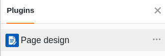
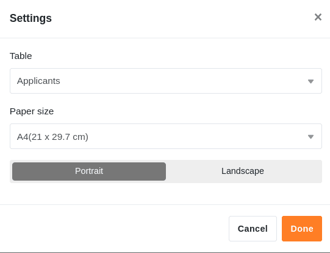
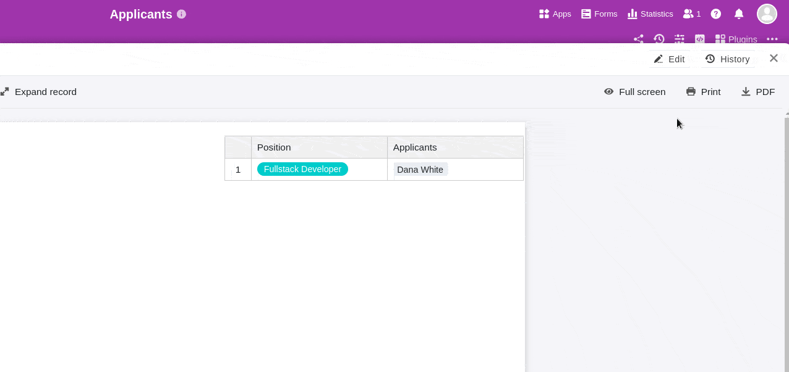
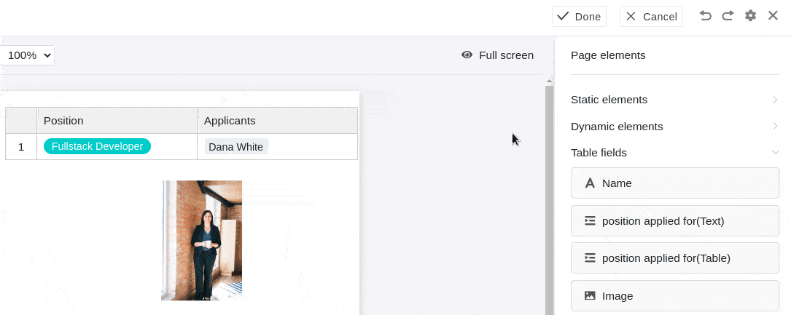
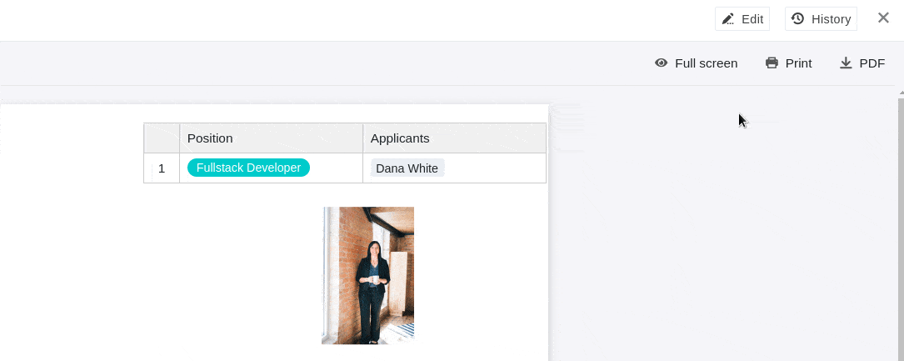
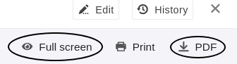
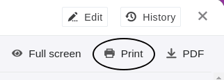
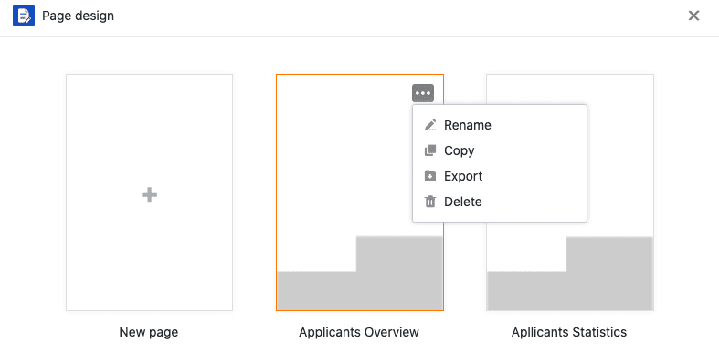
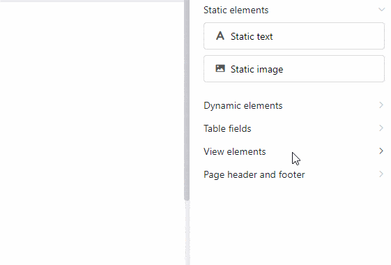
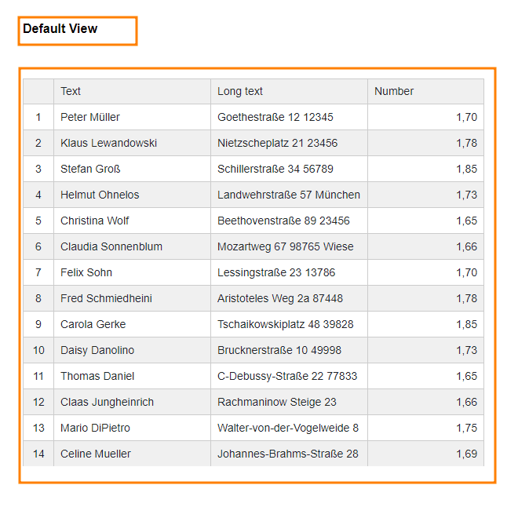

Das **Seitendesign-Plugin** bietet Ihnen eine Vielzahl an Möglichkeiten, die Informationen einer Tabelle unter anderem in Form von personalisierten Anschreiben, Visitenkarten und Rundbriefen zu visualisieren. Sie können mithilfe von **statischen Elementen** Seiten-Layouts erstellen, die durch **dynamische Elemente** und **Tabellenfelder** ergänzt werden.

Lesen Sie im Artikel [Aktivieren eines Plugins in einer Base](https://seatable.io/docs/arbeiten-mit-plugins/aktivieren-eines-plugins-in-einer-base/), wie Sie das Seitendesign-Plugin aktivieren und Ihrer Toolbar hinzufügen können.

## Eine neue Seite hinzufügen

1. Öffnen Sie das **Seitendesign-Plugin**.
   3. Klicken Sie auf die **neue Seite mit dem Plus-Symbol**.
   5. Wählen Sie die Option **Leere Seite erstellen** aus.
   7. Hier können Sie folgende **Einstellungen** vornehmen: - Wählen Sie die **Tabelle**, aus der Sie Daten verwenden möchten. - Entscheiden Sie sich für eine **Papiergröße**. - Legen Sie für das Seiten-Layout **Hochformat** oder **Querformat** fest.
   



## Eine Vorlage speichern und bearbeiten

Wenn Sie eine neue Seite angelegt haben, können Sie diese über die Schaltfläche  **Fertig** als **Vorlage speichern**. Diese können Sie wieder bearbeiten, nachdem Sie an der gleichen Stelle auf die Schaltfläche  **Bearbeiten** geklickt haben.



Per Klick auf die **Pfeil-Symbole**  und  können Sie einzelne Bearbeitungsschritte rückgängig machen oder wiederherstellen.

Außerhalb des Bearbeitungsmodus können Sie die gespeicherten  **Versionen** Ihrer Vorlage ansehen und wiederherstellen.

Über die Schaltfläche  **Vollbild** können Sie sich das Seitendesign über Ihren gesamten Bildschirm anzeigen lassen. Wenn Sie ein Dokument als PDF auf Ihrem Gerät speichern möchten, klicken Sie auf  **PDF**, geben Sie den **Namen der Exportdatei** ein und bestätigen Sie mit **Exportieren**.

Klicken Sie auf  **Drucken**, um den **aktuellen Eintrag** oder **alle Einträge der Ansicht** zu drucken. Sobald Sie mit **Drucken** bestätigen, öffnet sich das übliche Fenster, in dem Sie die Druckeinstellungen auf Ihrem Gerät vornehmen.

## Die Seitendesign-Übersicht

In der **Seitendesign-Übersicht**, die Sie über den **Zurück-Pfeil**  in der oberen linken Ecke erreichen, sehen Sie alle Ihre gespeicherten Vorlagen. Wenn Sie dort mit dem Mauszeiger über ein Dokument fahren und auf die erscheinenden **drei Punkte** klicken, öffnet sich ein Drop-down-Menü mit den Optionen **Umbenennen**, **Kopieren**, **Exportieren** und **Löschen**.



## Seitenelemente

Die **Seitenelemente** bieten Ihnen die Möglichkeit, **standardisierte Layouts** zu gestalten. Sie haben die Auswahl zwischen folgenden Elementen:

- Statische Elemente
- Dynamische Elemente
- Tabellenfelder
- Ansichtselemente
- Kopf- und Fußzeile

## Aktivieren der Elemente

Sie aktivieren ein Element, indem Sie das jeweilige Feld **per Drag-and-Drop** in die Seite einbetten. Danach können Sie das Element ebenso auf der Seite verschieben, indem Sie es mit der Maus anklicken und ziehen.

## Auswählen und Einstellen der Elemente

Ein auf der Seite eingefügtes Element wählen Sie aus, indem Sie es mit der **rechten Maustaste** anklicken. Im Panel rechts neben der Seite sehen Sie verschiedene **Einstellungsmöglichkeiten** je nach ausgewähltem Element. Mehr zu den jeweiligen Optionen erfahren Sie in den verlinkten Hilfe-Artikeln zu den folgenden Elementen.

## Statische Elemente

Es gibt [statische Bilder](https://seatable.io/docs/seitendesign-plugin/statisches-bild/) und [statische Texte](https://seatable.io/docs/seitendesign-plugin/statischer-text/). Bei diesen Elementen müssen Sie **manuell** Texte oder Bilder einpflegen. Die Informationen der Elemente bleiben gleich, auch wenn sich die Einträge der Tabelle verändern.

## Dynamische Elemente

[Dynamische Elemente](https://seatable.io/docs/seitendesign-plugin/dynamische-elemente/) verändern sich aufgrund von bestimmten Kriterien, jedoch unabhängig von Einträgen in der Tabelle. Diese Felder sind **vorausgefüllt** und passen ihre Inhalte **automatisch** an. Es gibt drei dynamische Elemente: **Aktuelles Datum**, **Vorlagenname** und **Aktueller Benutzer**.

## Tabellenfelder

Als [Tabellenfelder](https://seatable.io/docs/seitendesign-plugin/tabellenfelder/) listet das Seitendesign-Plugin **alle Spalten der Tabelle** auf, aus denen Sie Daten in die Seite einbauen können. Der Inhalt der Felder hängt von den Zeilen der Tabelle ab und ändert sich je nach Eintrag.

## Ansichtselemente

Außerdem haben Sie zwei **Ansichtselemente** zur Auswahl. Das Element **Alle Einträge der Ansicht** erlaubt es Ihnen, den gesamten Tabellenausschnitt, der unter der Ansicht definiert wurde, in die Seite einzubetten. Der **Ansichtsname** enthält nur den Namen der ausgewählten Ansicht.

## Kopf- und Fußzeile

Darüber hinaus können Sie Ihren Seiten [Kopf- und Fußzeilen](https://seatable.io/docs/seitendesign-plugin/kopf-und-fusszeile/) hinzufügen. In diese Seitenbereiche können Sie statische und dynamische Elemente wie zum Beispiel die **Seitenzahl** einbetten.
