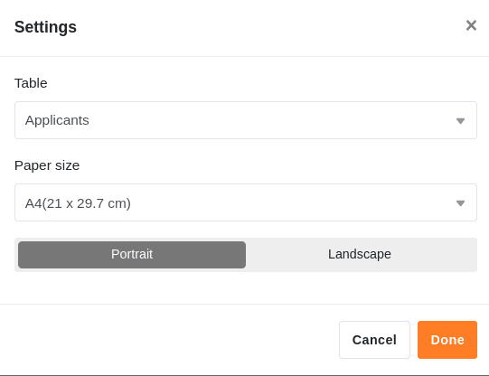
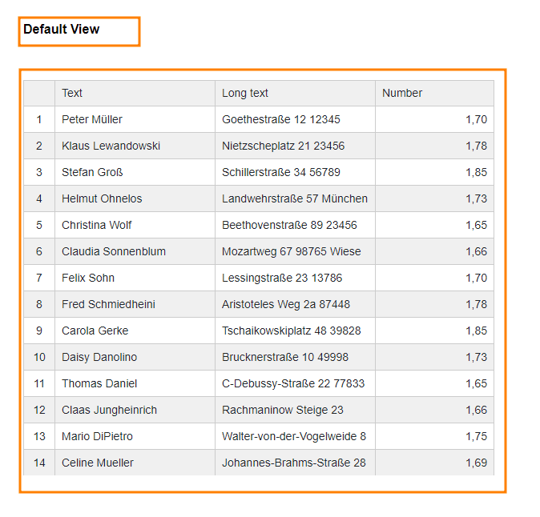

El **complemento de diseño de páginas** le ofrece una amplia gama de opciones para visualizar la información de una tabla en forma de cartas de presentación personalizadas, tarjetas de visita y boletines informativos, entre otras cosas. Puede utilizar **elementos estáticos** para crear diseños de página que se complementen con **elementos dinámicos** y **campos de tabla**.

Lea el artículo [Activar un Plugin en una Base](https://seatable.io/es/docs/arbeiten-mit-plugins/aktivieren-eines-plugins-in-einer-base/) para aprender a activar el Plugin de Diseño de Página y añadirlo a su barra de herramientas.

## Añadir una nueva página

1. Abra el **plug-in de diseño de páginas**.

3. Haga clic en la **nueva página con el símbolo más**.

5. Seleccione la opción **Crear página en blanco**.

7. Aquí encontrará lo siguiente **Ajustes** hacer:

    - Seleccione la **tabla** de la que desea utilizar los datos.
    - Decide el **tamaño del papel**.
    - Establezca el diseño de página en **vertical** u **horizontal**.

    



## Guardar y editar una plantilla

Cuando haya creado una nueva página, puede **guardarla** como plantilla mediante el botón  **Hecho**. Puede volver a editarlo pulsando el botón  **Editar** en el mismo lugar.



Haciendo clic en los **símbolos de flecha**  y  puede deshacer o rehacer pasos de edición individuales.

Fuera del modo de edición, puede ver y restaurar las **versiones** guardadas  **de** su plantilla.

Utilice el botón  **Pantalla completa** para mostrar el diseño de la página en toda la pantalla. Si desea guardar un documento como PDF en su dispositivo, haga clic en  **PDF**, introduzca el **nombre del archivo de exportación** y confirme con **Exportar**.

Haga clic en  **Imprimir** para imprimir la **entrada actual** o **todas las entradas de la vista**. En cuanto confirme con **Imprimir**, se abrirá la ventana habitual en la que deberá realizar los ajustes de impresión en su máquina.

## Resumen del diseño de la página

En la **vista general del diseño de página**, a la que se accede a través de la **flecha hacia atrás**  situada en la esquina superior izquierda, puede ver todas las plantillas guardadas. Si pasas el puntero del ratón por encima de un documento y haces clic en los **tres puntos** que aparecen, se abre un menú desplegable con las opciones **Renombrar**, **Copiar**, **Exportar** y **Eliminar**.



## Elementos laterales

Los **elementos de página** le ofrecen la posibilidad de diseñar **diseños estandarizados**. Puede elegir entre los siguientes elementos:

- Elementos estáticos
- Elementos dinámicos
- Campos de la tabla
- Ver elementos
- Encabezado y pie de página

## Activación de los elementos

Se activa un elemento incrustando el campo correspondiente en la página **mediante arrastrar y soltar**. Después, también puede mover el elemento en la página haciendo clic en él y arrastrándolo con el ratón.

## Seleccionar y fijar los elementos

Para seleccionar un elemento insertado en la página, haga clic sobre él con el **botón derecho del ratón**. En el panel situado a la derecha de la página verá varias **opciones de configuración** en función del elemento seleccionado. Puede obtener más información sobre las respectivas opciones en los artículos de ayuda enlazados para los siguientes elementos.

## Elementos estáticos

Hay [imágenes estáticas](https://seatable.io/es/docs/seitendesign-plugin/statisches-bild/) y [textos estáticos](https://seatable.io/es/docs/seitendesign-plugin/statischer-text/). Para estos elementos hay que introducir textos o imágenes **manualmente**. La información de los elementos sigue siendo la misma aunque cambien las entradas de la tabla.

## Elementos dinámicos

Los [elementos dinámicos](https://seatable.io/es/docs/seitendesign-plugin/dynamische-elemente/) cambian en función de determinados criterios, pero independientemente de las entradas de la tabla. Estos campos se **rellenan previamente** y ajustan **automáticamente** su contenido. Hay tres elementos dinámicos: **Fecha actual**, **Nombre de la plantilla** y **Usuario actual**.

## Campos de la tabla

Como [campos de tabla](https://seatable.io/es/docs/seitendesign-plugin/tabellenfelder/), el complemento de diseño de páginas enumera **todas las columnas de la** tabla a partir de las cuales puede incluir datos en la página. El contenido de los campos depende de las filas de la tabla y cambia en función de la entrada.

## Ver elementos

También puede elegir entre dos **elementos de vista**. El elemento **Todas las entradas de la** vista permite incrustar en la página toda la sección de la tabla definida en la vista. El **nombre de la** vista sólo contiene el nombre de la vista seleccionada.

## Encabezado y pie de página

Además, puede añadir [encabezados y pies de página](https://seatable.io/es/docs/seitendesign-plugin/kopf-und-fusszeile/) a sus páginas. En estas áreas de página puede incrustar elementos estáticos y dinámicos, como el **número de página**.
