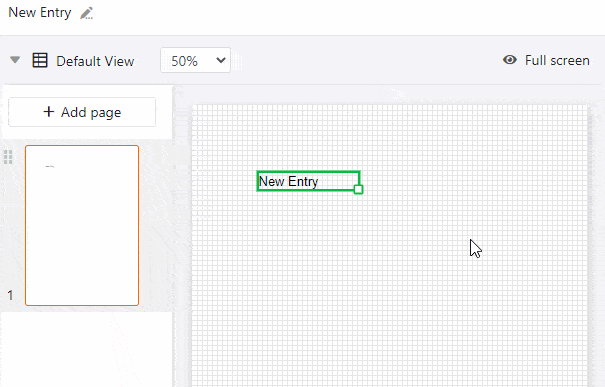

**Dynamic elements** change based on certain criteria, but are independent of the entries in your table. These fields are **pre-filled** and **automatically** adjust their entries.

### The following dynamic elements exist:

- Current date
- Template name
- Current user

The **settings** you can make for dynamic elements are the same as for static text elements. You can therefore read detailed explanations of all the setting options in the [Static text](https://seatable.io/en/docs/seitendesign-plugin/statischer-text/) article.

If necessary, read the [Page Design Plugin Guide]() see what other elements and features the **Page Design Plugin** has in store for you.

## Current date

The **current date** automatically adjusts to today without you having to set it manually. This allows you to create personalized cover letters, for example, without the possibility of an outdated date creeping in as an error.

The only additional setting compared to static text elements is the **format setting**. Here you can choose from the regionally different notations for dates.

## Template name

The **name of the template**, i.e. the page design you are currently editing, adjusts automatically. If you have changed the name of the template, the change in this field will be applied automatically.

## Current user

In the **Current User** field, your own name appears if you are currently making changes to the template through your account. As soon as another **team member** accesses the template in the Page Design plug-in, their name is displayed.

