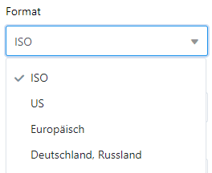
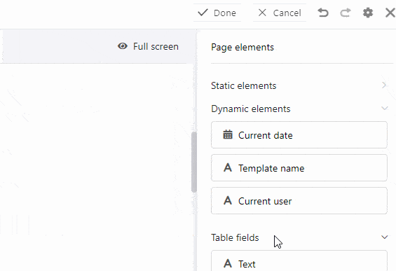

**Os elementos dinâmicos** mudam de acordo com determinados critérios, mas são independentes das entradas na sua tabela. Estes campos são **pré-preenchidos** e ajustam **automaticamente** as suas entradas.

### Existem os seguintes elementos dinâmicos:

- Data actual
- Nome do modelo
- Utilizador actual

As **definições** que pode fazer para elementos dinâmicos são as mesmas que para elementos de texto estático. Pode, portanto, ler explicações detalhadas de todas as opções de definição no [texto estático](https://seatable.io/pt/docs/seitendesign-plugin/statischer-text/) do artigo.

Se necessário, leia o artigo [Instruções para o plugin de desenho de página](https://seatable.io/pt/docs/seitendesign-plugin/anleitung-zum-seitendesign-plugin/) para descobrir que outros elementos e funções o **plugin de desenho de página** tem guardado para si.

## Data actual

A **data actual** ajusta-se automaticamente ao dia de hoje sem que tenha de a definir manualmente. Isto permite-lhe criar cartas de apresentação personalizadas, por exemplo, sem que uma data desactualizada se intrometa como um erro.

A única configuração adicional em comparação com elementos de texto estático é a **configuração do formato**. Aqui pode escolher entre as notações regionalmente diferentes para as datas.

## Nome do modelo

O **nome do modelo**, ou seja, o desenho da página que está actualmente a editar, ajusta-se automaticamente. Se tiver alterado o nome do modelo, a alteração neste campo é automaticamente adoptada.

## Utilizador actual

O seu próprio nome aparece no campo **Utilizador actual** se estiver actualmente a fazer alterações ao modelo através da sua conta. Assim que outro **membro da equipa** chama o modelo no plug-in de design da página, o seu nome é exibido.

