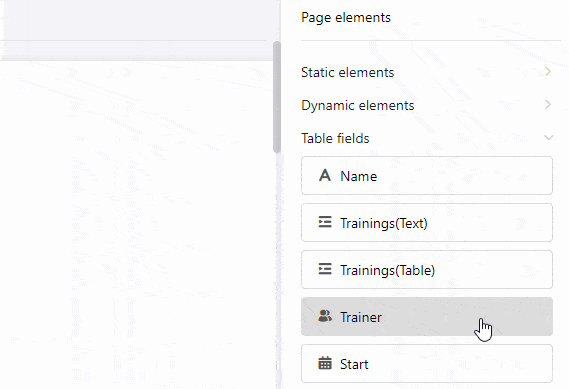
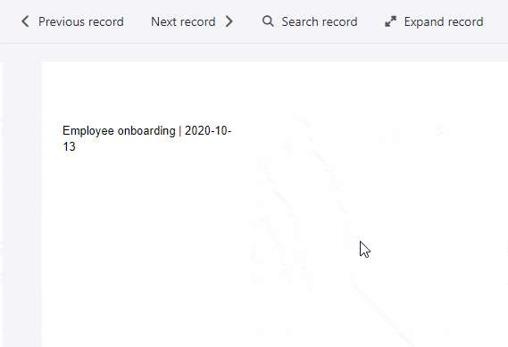

Beim [Seitendesign-Plugin](https://seatable.io/docs/seitendesign-plugin/anleitung-zum-seitendesign-plugin/) ist es wichtig, den Unterschied zwischen Einträgen und Seiten zu verstehen. Während zusätzliche **Seiten** ein Dokument unabhängig von den Inhalten der Tabelle erweitern, bilden die **Einträge** unterschiedliche Datensätze aus den Zeilen der Tabelle ab.

## Einträge

Ein **Eintrag** bezieht sich im Seitendesign-Plugin auf eine **Zeile** der ausgewählten Tabelle. Dies wird deutlich, wenn Sie [Tabellenfelder](https://seatable.io/docs/seitendesign-plugin/tabellenfelder/) verwenden, die Daten aus den Spalten einer Tabelle abrufen: Wenn Sie über die Navigationsoptionen **Vorheriger Eintrag** und **Nächster Eintrag** zwischen den Einträgen wechseln, werden in den Tabellenfeldern automatisch Daten aus anderen Zeilen angezeigt.

Beispielsweise möchten Sie die Einträge aus der Textspalte "Name" von einer Tabelle in eine Seite einfügen, um einen Rundbrief personalisieren zu können.

Dazu ziehen Sie das Tabellenfeld "Name" auf die Seite, sodass die Informationen aus der Namensspalte automatisch auf der Seite abgebildet werden.

Durch die Verwendung der Navigatoren **Vorheriger/Nächster Eintrag** können Sie nun zwischen den Zeilen springen, um die Informationen abwechselnd aus allen Zeilen der Tabelle im Layout der Seite angezeigt zu bekommen.

 

## Seiten

**Seiten** können Sie hinzufügen, um das Dokument zu erweitern und eine **mehrseitige Vorlage** zu erstellen. Klicken Sie dazu auf den Button **Seite hinzufügen**.

Über einen **Rechtsklick** können Sie ein Drop-down-Menü aufrufen, welches Ihnen zusätzliche Optionen bietet.

Um zwischen den Seiten zu **wechseln**, klicken Sie in der Seiten-Leiste einfach die entsprechende **Seiten-Miniatur** an. Sie können die **Reihenfolge der Seiten** ändern, indem Sie die Maustaste auf den **sechs Punkten**  gedrückt halten und die Seiten-Miniatur **verschieben**.
