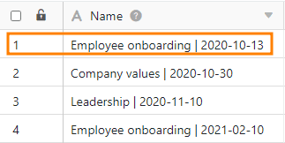

In the [page design plugin](https://seatable.io/en/docs/seitendesign-plugin/anleitung-zum-seitendesign-plugin/), it is important to understand the difference between entries and pages. While additional **pages** extend a document independently from the contents of the table, **entries** map different records from the rows of the table.

## Entries

An **entry** in the page design plugin refers to one of the **row** of the selected table. This becomes clear when you use [table fields](https://seatable.io/en/docs/seitendesign-plugin/tabellenfelder/) that retrieve data from the columns of a table: When you switch between entries using the **Previous Entry** and **Next Entry** navigation options, the table fields automatically display data from other rows .

For example, you want to insert the entries from the "Name" text column from a table into a page to personalize a newsletter.

To do this, drag the Name table field onto the page so that the information from the Name column is automatically mapped onto the page.

By using the **Previous/Next Entry** navigators, you can now jump between the rows to get the information displayed alternately from all rows of the table in the layout of the page.

  

## Pages

You can add **pages** to expand the document and create a **multi-page template**. To do that click the **Add Page** button.

**Right-click to** bring up a drop-down menu that gives you additional options.

To **switch** between pages, simply click the corresponding page **thumbnail** in the page bar. You can change the **order of the pages** by holding down the mouse button on the **six dots**  and **moving the** page thumbnail.
