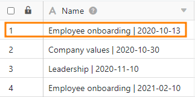
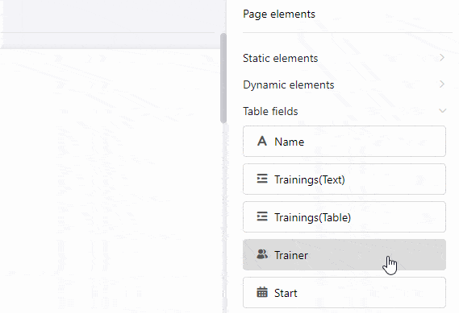
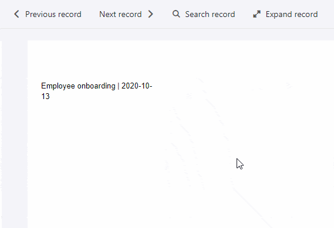
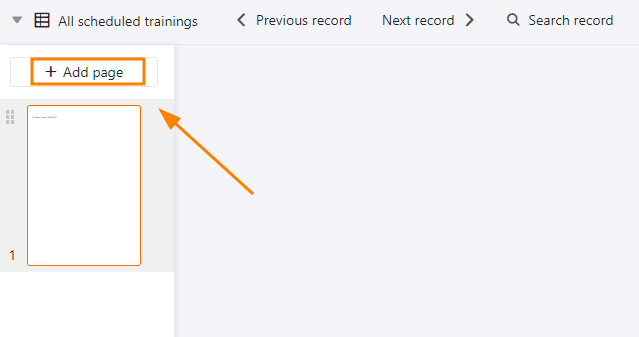
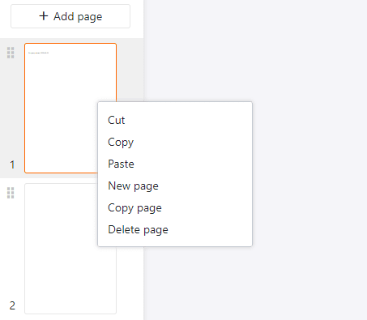

При использовании [плагина дизайна страниц]() важно понимать разницу между записями и страницами. В то время как дополнительные **страницы** расширяют документ независимо от содержимого таблицы, **записи** отображают различные записи из строк таблицы.

## Записи

**Запись** относится к **строке** выбранной таблицы в плагине дизайна страницы. Это становится ясно, когда вы используете [поля таблицы](https://seatable.io/ru/docs/seitendesign-plugin/tabellenfelder/), которые извлекают данные из столбцов таблицы: Когда вы переключаетесь между записями с помощью навигационных опций **Предыдущая запись** и **Следующая запись**, в полях таблицы автоматически отображаются данные из других строк.

Например, вы хотите вставить записи из текстового столбца "Имя" из таблицы на страницу, чтобы иметь возможность персонализировать рассылку.

Для этого перетащите поле таблицы "Имя" на страницу, чтобы информация из колонки "Имя" автоматически отобразилась на странице.

Используя навигаторы **Previous/Next Entry**, теперь можно переходить между строками, чтобы информация отображалась поочередно из всех строк таблицы в макете страницы.

  

## Страницы

Вы можете добавлять **страницы** для расширения документа и создания **многостраничного шаблона**. Для этого нажмите на кнопку **Добавить страницу**.

**Щелкните правой кнопкой мыши, чтобы** открыть выпадающее меню, предлагающее дополнительные опции.

Чтобы **переключаться** между страницами, просто нажмите на **миниатюру** соответствующей страницы на панели страниц. Вы можете изменить **порядок страниц**, удерживая кнопку мыши на **шести точках**  и **перемещая** миниатюру страницы.
