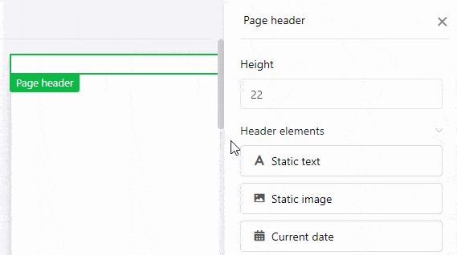

Puede insertar **encabezados y pies de página** como áreas especiales en una página y rellenarlas **con varios elementos**, cuyo contenido y disposición decidirá usted mismo. Con los encabezados y pies de página tiene la posibilidad de insertar **números de página** y bloquear varios elementos al mismo tiempo.



## Opciones de configuración

Sólo puede variar la **altura de** los encabezados y pies de página, ya que éstos siempre se extienden por **todo el ancho de la página**. En el campo **Altura**, introduzca el valor numérico deseado o modifíquelo utilizando las **teclas de flecha** o desplazándose con la **rueda del ratón**.

También puede cambiar la altura directamente en la página **haciendo clic con el botón derecho del ratón** en la cabecera o el pie de página y **arrastrando** el pequeño **cuadrado** situado en la esquina inferior derecha del marco.

## Elementos de cabecera y pie de página

Puede insertar los siguientes elementos en los encabezados y pies de página:

### Elementos estáticos:

- [Texto estático](https://seatable.io/es/docs/seitendesign-plugin/statischer-text/)
- [Imagen estática](https://seatable.io/es/docs/seitendesign-plugin/statisches-bild/)

### Elementos dinámicos:

- [Fecha actual](https://seatable.io/es/docs/seitendesign-plugin/dynamische-elemente/)
- Número de página
- [Nombre de la plantilla](https://seatable.io/es/docs/seitendesign-plugin/dynamische-elemente/)
- [Usuario actual](https://seatable.io/es/docs/seitendesign-plugin/dynamische-elemente/)



## Bloquear y eliminar

Puede **bloquear** o **eliminar** encabezados y pies de página seleccionando la opción correspondiente. Si bloquea un encabezado o un pie de página, también se bloquearán **todos los elementos** que haya insertado previamente en esta zona. Lo mismo ocurre con el borrado, por el que también se borran todos los elementos de una cabecera o pie de página.

