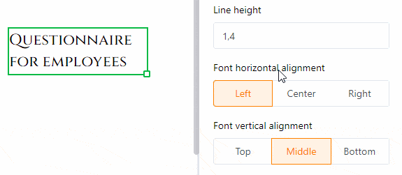

Der **statische Text** bietet Ihnen die Möglichkeit, **Textelemente** wie Überschriften oder Fließtext in eine Seite einzubinden. Das ist sehr nützlich, um **Vorlagen für Dokumente** zu erstellen, die Sie später mit Daten aus Ihrer Tabelle personalisieren können.

Im Gegensatz zu Texten, die aus Textspalten Ihrer Tabelle stammen, verändert sich ein statischer Text nicht und bleibt unabhängig von den Einträgen in der Tabelle gleich. Allerdings müssen Sie den entsprechenden **Text manuell einfügen** und **formatieren**.

Lesen Sie im Artikel [Anleitung zum Seitendesign-Plugin]() nach, welche anderen Elemente und Funktionen das **Seitendesign-Plugin** für Sie bereithält.

## Position und Größe des Textelements verändern

Sie können durch Eingabe der **X-** und **Y-Koordinaten** die Position des Textelements auf der Seite bestimmen. Alternativ können Sie das Textelement auch einfach **per Drag-and-Drop** an die gewünschte Stelle verschieben.

 

Die Felder **Breite** und **Höhe** verändern die Größe des Textrahmens. Alternativ können Sie die **Größe** auch direkt auf der Seite verändern, indem Sie mit der **rechten Maustaste** auf das Bild klicken und am kleinen **Quadrat** an der rechten unteren Ecke des Rahmens **ziehen**.

Bei der **Drehung** stellen Sie den Winkel ein, in dem Sie das Bild um seinen linken oberen Eckpunkt drehen können. Mit dieser Funktion haben Sie die Möglichkeit, **vertikale Schriftzüge** (bei 90 oder 270 Grad) zu erstellen.

Sobald Sie **mehrere Textelemente** verwenden, werden diese in **Ebenen** übereinandergelegt. Wenn Sie die **Reihenfolge** der Ebenen ändern möchten, können Sie dies über die Einstellungen tun. Klicken Sie auf die verschiedenen Schaltflächen, um den Text entweder **eine Ebene nach vorne/hinten** oder gleich ganz **in den Vordergrund/Hintergrund** zu verschieben.

## Texteinstellungen

Geben Sie den Text entweder in das **Textfeld** bei den Einstellungen oder in den **Textrahmen** direkt auf der Seite ein. Sie können einen Textrahmen auf der Seite jederzeit auswählen, indem Sie ihn mit der **rechten Maustaste** anklicken.

Stellen Sie die **Schriftart**, die **Schriftgröße** und die **Schriftstärke** ein.

Sie können die **Zeilenhöhe** sowie die **horizontale** und **vertikale Ausrichtung** des Textes in den entsprechenden Feldern anpassen.

Ändern Sie die **Textfarbe**, indem Sie den Hexadezimal-Farbcode eintragen oder auf das Farbfeld klicken. Die **Hintergrundfarbe** können Sie auf die gleiche Weise anpassen, wenn Sie die Option **Ausgefüllt** auswählen.

Erhöhen Sie den **Innenabstand des Textes**, um den mit Text gefüllten Bereich innerhalb des Rahmens zu verkleinern.

## Rahmeneinstellungen

Fügen Sie dem Text einen **vollständigen Rahmen** hinzu, indem Sie die **Regler** für alle Seiten des Rechtecks aktivieren. Sie können dem Text **einzelne Konturen** geben, wenn Sie nur die Regler für bestimmte Seiten aktivieren. Legen Sie die **Rahmenfarbe** fest, indem Sie den Hexadezimal-Farbcode eintragen oder auf das Farbfeld klicken. Um die **Rahmendicke** anzupassen, stellen Sie einfach den Zahlenwert ein.

Mit dem **Rahmenradius** können Sie die **Ecken** des Rahmens so lange **abrunden**, bis ein **Kreisbogen** entsteht.

## Element sperren, duplizieren und löschen

Sie können ein Element – in diesem Fall einen statischen Text – mit einem Klick **sperren**, **duplizieren** oder **löschen**, indem Sie die entsprechenden Optionen auswählen.

