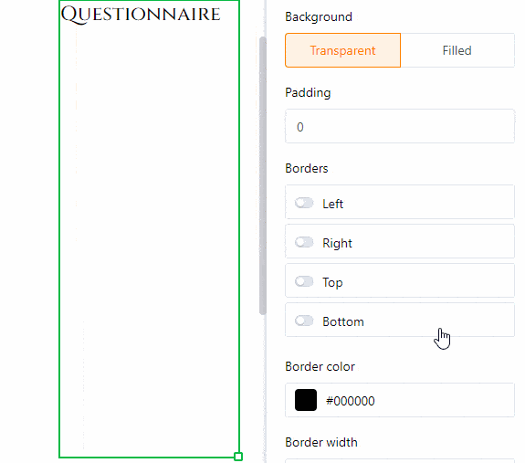
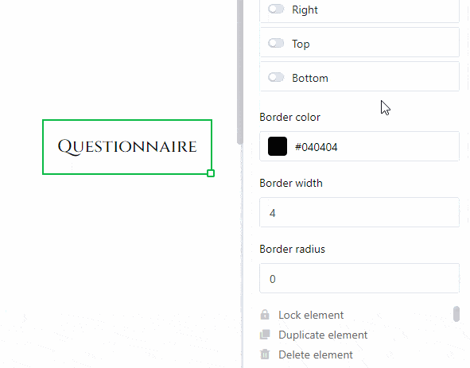

**Статический текст** предлагает вам возможность включить в страницу такие **текстовые элементы**, как заголовки или основной текст. Это очень полезно для создания **шаблонов документов**, которые впоследствии можно персонализировать с помощью данных из таблицы.

В отличие от текстов, которые поступают из текстовых колонок вашей таблицы, статический текст не изменяется и остается неизменным независимо от записей в таблице. Однако **вставлять** и **форматировать** соответствующий **текст нужно вручную**.

Прочитайте статью [Руководство по плагину Page Design](), чтобы узнать, какие еще элементы и функции предлагает вам **плагин Page Design**.

## Изменение положения и размера текстового элемента

Вы можете определить положение текстового элемента на странице, введя **координаты** **X** и **Y**. Кроме того, можно просто **перетащить** текстовый элемент в нужное место.

  

Поля **Ширина** и **Высота** изменяют размер текстовой рамки. Кроме того, **размер** можно изменить прямо на странице, **щелкнув правой кнопкой мыши** на изображении и **перетащив** маленький **квадратик** в правом нижнем углу рамки.

С помощью функции **вращения** задается угол, на который можно повернуть изображение вокруг его верхней левой угловой точки. С помощью этой функции у вас есть возможность создавать **вертикальные надписи** (под углом 90 или 270 градусов).

Как только вы используете **несколько текстовых элементов**, они накладываются друг на друга в виде **слоев**. Если вы хотите изменить **порядок** слоев, вы можете сделать это через настройки. Нажимайте на различные кнопки, чтобы переместить текст на **один уровень вперед/назад** или полностью **на передний/задний план**.

## Настройки текста

Введите текст либо в **текстовое поле** в настройках, либо в **текстовую рамку** непосредственно на странице. Вы можете в любой момент выделить текстовый фрейм на странице, щелкнув по нему **правой кнопкой мыши**.

Установите **шрифт**, **размер шрифта** и **вес шрифта**.

В соответствующих полях можно настроить **высоту строки**, а также **горизонтальное** и **вертикальное выравнивание** текста.

Измените **цвет текста**, введя шестнадцатеричный код цвета или нажав на поле цвета. **Цвет фона** можно настроить таким же образом, если выбрать опцию " **Заливка"**.

Увеличьте **внутренний интервал текста**, чтобы уменьшить область, заполненную текстом внутри рамки.

## Настройки кадра

Добавьте **полную рамку** к тексту, активировав **ползунки** для всех сторон прямоугольника. Вы можете придать тексту **индивидуальные очертания**, активировав ползунки только для определенных сторон. Установите **цвет рамки**, введя шестнадцатеричный код цвета или нажав на поле цвета. Чтобы настроить **толщину рамки**, просто установите числовое значение.

С помощью **радиуса рамки** можно **скруглять** **углы** рамки до образования **дуги**.

## Блокировка, дублирование и удаление элемента

Вы можете **заблокировать**, **дублировать** или **удалить** элемент - в данном случае статический текст - одним щелчком мыши, выбрав соответствующие опции.

