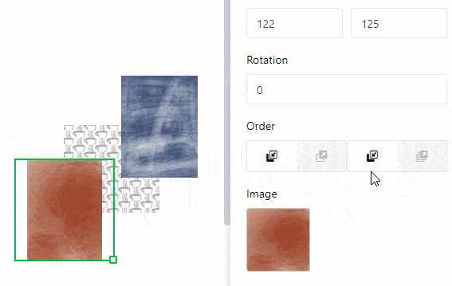

A **static image** gives you the ability to include **image files** such as logos, graphics, or background images in a page to create a basic page layout. Unlike images that come from [image columns]() in your table, a static image does not change and remains the same regardless of the entries in the table. However, you must **manually upload** the appropriate image file.

Read the [Page Design Plugin Guide](https://seatable.io/en/docs/seitendesign-plugin/anleitung-zum-seitendesign-plugin/) article [to](https://seatable.io/en/docs/seitendesign-plugin/anleitung-zum-seitendesign-plugin/) see what other elements and features the **Page Design Plugin** has in store for you.

## Change position and size of the image

You can determine the position of the image on the page by entering the **X** and **Y coordinates**. Alternatively, you can simply **drag and drop** the image to the desired location.

  

Use the **Width** and **Height** fields to resize the image. For **Rotation**, set the angle at which the image is rotated around its upper left corner point. Alternatively, you can resize the **image** directly on the page by **right-clicking** the image and **dragging** the small **square** at the bottom right corner of the frame.

As soon as you use **multiple images**, they will be **layered**. If you want to change the **order of** the layers, you can do so via the settings. Click on the different buttons to move the image either **one layer forward/backward** or completely **to the foreground/background**.

## Image settings

To **insert** a **file into the image frame**, click on the field with the **document icon** under **Image** or **double-click** directly in the image frame on the page. In the window that opens, select an image file from your device and upload it.

Use the **Fit**, **Fill**, and **Stretch** fill modes to choose how to fit the image into the frame.

Especially when using PNG files with a transparent background, it can be useful if you fill the **background** with a **color** in the settings. However, this also works for other file formats. Click **Filled** and choose a background color by entering the hexadecimal color code or clicking the color field.

Increase the **inner distance of the image** to reduce the image inside the frame.

## Frame settings

Add a **full frame** to the image by activating the **sliders** for all sides of the rectangle. You can give the image **individual outlines** by activating the sliders for specific sides only. Set the **frame color** by entering the hexadecimal color code or clicking the color box. To adjust the **frame thickness**, simply set the numerical value.

Use the **frame radius** to **round** the **corners of** the image frame until an **arc** is formed.

## Lock, duplicate and delete element

You can **lock**, **duplicate** or **delete** an element - in this case a static image - with one click by selecting the appropriate options.

