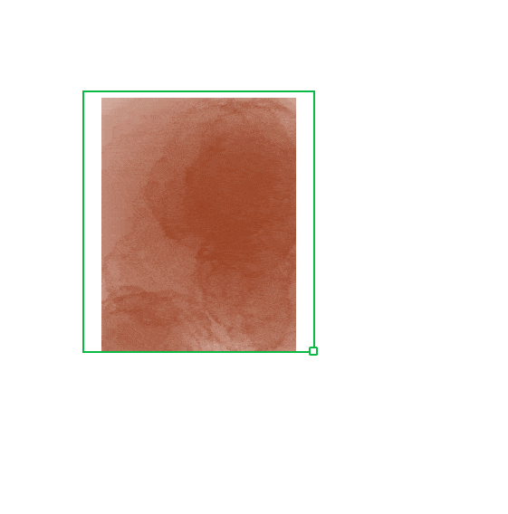
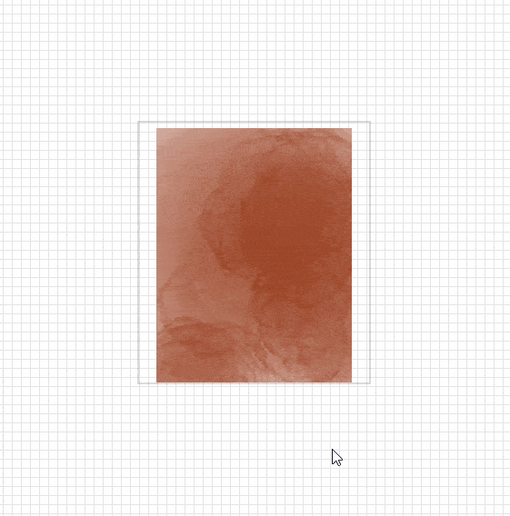
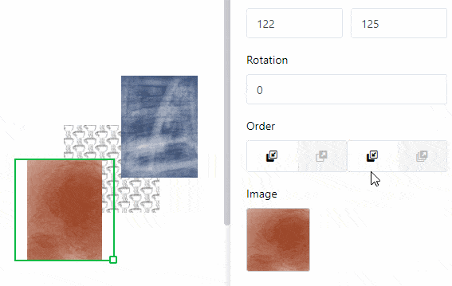
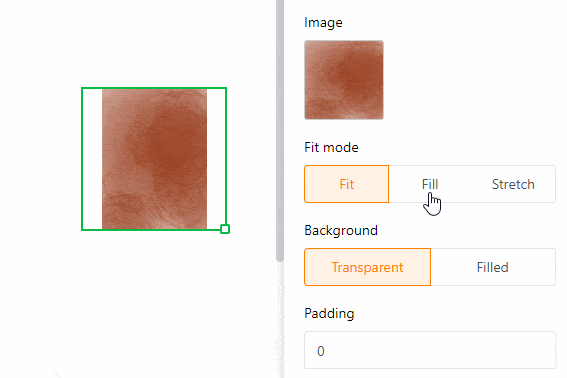
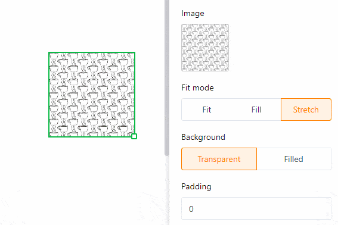
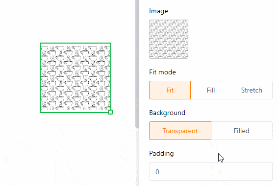
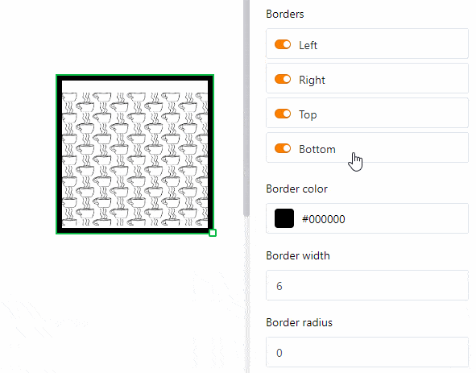
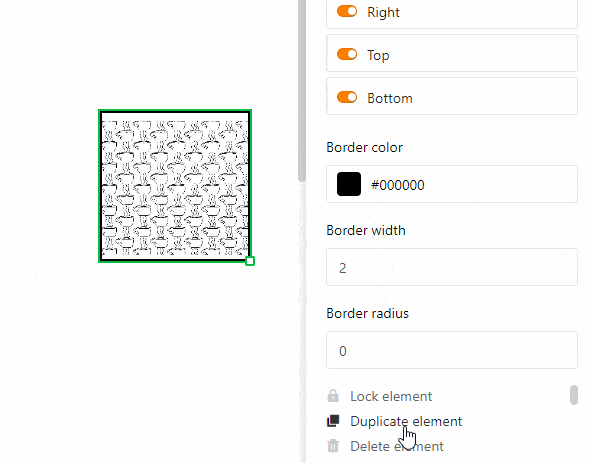

Una imagen **estática** le ofrece la posibilidad de incluir **archivos de imagen** como logotipos, gráficos o imágenes de fondo en una página para crear un diseño de página básico. A diferencia de las imágenes que proceden de las [columnas de imágenes]() de su tabla, una imagen estática no cambia y se mantiene igual independientemente de las entradas de la tabla. Sin embargo, debe **cargar manualmente** el archivo de imagen correspondiente.

Lea el artículo [Guía](https://seatable.io/es/docs/seitendesign-plugin/anleitung-zum-seitendesign-plugin/) del **plugin de diseño de** páginas [para](https://seatable.io/es/docs/seitendesign-plugin/anleitung-zum-seitendesign-plugin/) descubrir qué otros elementos y funciones le reserva el **plugin de diseño de páginas**.

## Cambiar la posición y el tamaño de la imagen

Puede determinar la posición de la imagen en la página introduciendo las **coordenadas** **X** e **Y**. También puede **arrastrar y soltar** la imagen en la posición deseada.

  

Utilice los campos **Anchura** y **Altura** para cambiar el tamaño de la imagen. Para la **rotación**, establezca el ángulo con el que se gira la imagen alrededor de su punto de esquina superior izquierdo. También puede cambiar el **tamaño de** la imagen directamente en la página haciendo clic en ella con el **botón derecho del ratón** y **arrastrando** el pequeño **cuadrado** situado en la esquina inferior derecha del marco.

En cuanto se utilizan **varias imágenes**, se superponen en **capas**. Si desea cambiar el **orden de** las capas, puede hacerlo a través de los ajustes. Haz clic en los distintos botones para desplazar la imagen **una capa hacia delante/atrás** o completamente **hacia el primer plano/fondo**.

## Ajustes de imagen

Para **insertar** un **archivo en el** marco de la imagen, haga clic en el campo con el **símbolo del documento** bajo **Imagen** o **haga doble clic** directamente en el marco de la imagen en la página. En la ventana que se abre, selecciona un archivo de imagen de tu dispositivo y cárgalo.

Utilice los **modos de** relleno **Ajustar**, **Rellenar** y **Estirar** para elegir cómo ajustar la imagen al marco.

Especialmente cuando se utilizan archivos PNG con fondo transparente, puede ser útil rellenar el **fondo** con un **color** en los ajustes. Sin embargo, esto también funciona para otros formatos de archivo. Haga clic en **Relleno** y seleccione un color de fondo introduciendo el código de color hexadecimal o haciendo clic en el campo de color.

Aumente la **distancia interior de la imagen** para reducir la imagen dentro del encuadre.

## Ajustes del marco

Añade un **marco completo** a la imagen activando los **controles deslizantes** de todos los lados del rectángulo. Puede dar a la imagen **contornos individuales** activando sólo los controles deslizantes de determinados lados. Defina el **color del marco** introduciendo el código de color hexadecimal o haciendo clic en el cuadro de color. Para ajustar el **grosor del marco**, basta con ajustar el valor numérico.

Con el **radio** del marco puedes **redondear** las **esquinas** del marco hasta formar un **arco**.

## Bloquear, duplicar y eliminar elementos

Puede **bloquear**, **duplicar** o **eliminar** un elemento -en este caso una imagen estática- con un solo clic seleccionando las opciones correspondientes.

