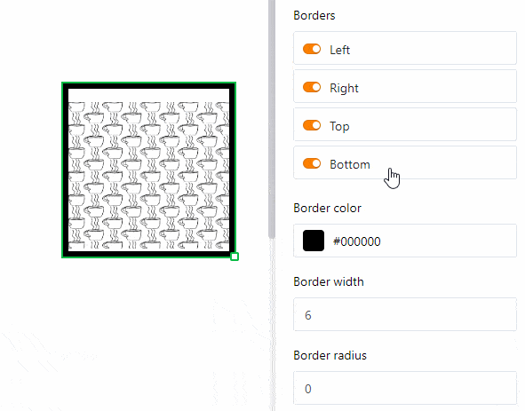

Uma **imagem estática** oferece-lhe a possibilidade de incluir **ficheiros de imagem** como logótipos, gráficos ou imagens de fundo numa página para criar uma apresentação básica da página. Ao contrário das imagens provenientes de [colunas de imagens](https://seatable.io/pt/docs/dateien-und-bilder/die-bild-spalte/) na sua tabela, uma imagem estática não se altera e permanece a mesma, independentemente das entradas na tabela. No entanto, é necessário **carregar manualmente** o ficheiro de imagem correspondente.

Leia o artigo [Page Design Plugin Guide para](https://seatable.io/pt/docs/seitendesign-plugin/anleitung-zum-seitendesign-plugin/) descobrir que outros elementos e funções o **Page Design Plugin** tem reservado para si.

## Alterar a posição e o tamanho da imagem

Pode determinar a posição da imagem na página, introduzindo as **coordenadas** **X** e **Y**. Em alternativa, pode simplesmente **arrastar e largar** a imagem para a posição desejada.

  

Utilize os campos **Largura** e **Altura** para alterar o tamanho da imagem. Para a **rotação**, definir o ângulo em que a imagem é rodada em torno do ponto superior esquerdo do seu canto. Em alternativa, pode alterar o **tamanho** da imagem directamente na página, clicando na imagem com o **botão direito do rato** e **arrastando** o pequeno **quadrado** no canto inferior direito da moldura.

Assim que se utilizam **várias imagens**, estas são sobrepostas em **camadas**. Se quiser alterar a **ordem das** camadas, pode fazê-lo através das definições. Clique nos vários botões para mover a imagem ou **uma camada para a frente/trás** ou completamente **para o primeiro plano/fundo**.

## Definições da imagem

Para **inserir** um **ficheiro na moldura da fotografia**, clicar no campo com o **símbolo do documento** em **Picture** ou **fazer duplo clique** directamente na moldura da página. Na janela que se abre, seleccione um ficheiro de imagem do seu dispositivo e carregue-o.

Utilize os **modos de Encaixe**, **Enchimento** e **Esticamento** para escolher como encaixar a imagem na moldura.

Especialmente quando se utilizam ficheiros PNG com fundo transparente, pode ser útil se se preencher o **fundo** com uma **cor** nas definições. No entanto, isto também funciona para outros formatos de ficheiro. Clicar em **Preenchido** e seleccionar uma cor de fundo introduzindo o código de cor hexadecimal ou clicando no campo de cor.

Aumentar a **distância interna da imagem** para reduzir a imagem dentro da moldura.

## Configurações da moldura

Adicionar uma **moldura completa** à imagem activando as **barras deslizantes** para todos os lados do rectângulo. Pode dar à imagem **contornos individuais** apenas activando os cursores para certos lados. Definir a **cor da moldura**, introduzindo o código de cor hexadecimal ou clicando na caixa de cores. Para ajustar a **espessura da moldura**, basta definir o valor numérico.

Com o **raio da moldura** pode **arredondar** os **cantos da** moldura da imagem até que se forme um **arco**.

## Bloquear, duplicar e apagar elemento

Pode **bloquear**, **duplicar** ou **apagar** um elemento - neste caso uma imagem estática - com um clique, seleccionando as opções apropriadas.

