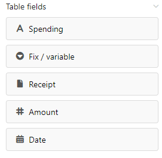

**Tabellenfelder** enthalten die Einträge aus einer Spalte Ihrer Tabelle. Daher listet das [Seitendesign-Plugin](https://seatable.io/docs/seitendesign-plugin/anleitung-zum-seitendesign-plugin/) bei den Tabellenfeldern **alle Spalten** der Tabelle auf, aus denen Sie Daten in die Seite einbauen können.

Da es an der Anzahl und am Typ der Spalten liegt, welche Tabellenfelder Sie zur Auswahl haben, verfügen Sie je nach Tabelle über unterschiedliche Möglichkeiten. Der Inhalt der auf einer Seite eingefügten Tabellenfelder hängt von den **Einträgen** in der Tabelle ab und ändert sich **automatisch** je nach Zeile.

## Einträge

Ein [Eintrag](https://seatable.io/docs/seitendesign-plugin/eintraege-und-seiten/) bezieht sich im Seitendesign-Plugin auf eine **Zeile** der ausgewählten Tabelle. Wenn Sie über die Navigationsoptionen **Vorheriger Eintrag** und **Nächster Eintrag** zwischen den Einträgen wechseln, werden in den Tabellenfeldern automatisch Daten aus anderen Zeilen angezeigt.

 

Dies macht deutlich: Mithilfe von Tabellenfeldern können Sie in Ihrer Vorlage schnell Informationen aus den jeweiligen Datensätzen darstellen und verschiedene Versionen eines Dokuments erstellen. Über die Schaltfläche  **Eintrag erweitern** können Sie zudem die **Zeilendetails** öffnen, um den jeweiligen Eintrag in der Tabelle zu bearbeiten.

## Anwendungsbeispiel

Die **Spalten** der Tabelle "Budget Book" sollen im Seitendesign-Plugin als **Tabellenfelder** dargestellt werden.

Erstellen Sie im Plugin eine **neue Seite** oder öffnen Sie ein **gespeichertes Seitendesign**. Lesen Sie in der [Anleitung zum Seitendesign-Plugin](https://seatable.io/docs/seitendesign-plugin/anleitung-zum-seitendesign-plugin/) nach, wie das geht. Die Spalten der Tabelle stehen Ihnen nun bei den **Seitenelementen** als Tabellenfelder zur Verfügung.

Ziehen Sie die Tabellenfelder **per Drag-and-Drop** an die gewünschten Stellen auf der Seite. Die Tabellenfelder sind **automatisch** mit den Spalten-Informationen eines Eintrags ausgefüllt.

