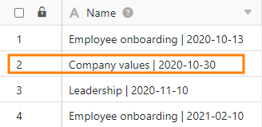
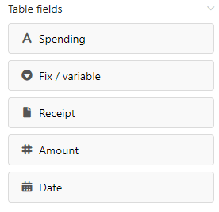
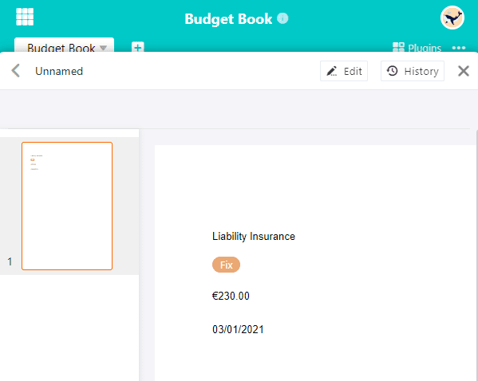

Los **campos de tabla** contienen las entradas de una columna de la tabla. Por lo tanto, el [plugin de diseño de páginas](https://seatable.io/es/docs/seitendesign-plugin/anleitung-zum-seitendesign-plugin/) enumera **todas las columnas de** la tabla a partir de las cuales se pueden incluir datos en la página en los campos de la tabla.

Dado que depende del número y tipo de columnas que los campos de la tabla que tiene que elegir, usted tiene diferentes opciones dependiendo de la tabla. El contenido de los campos de tabla insertados en una página depende de las **entradas** de la tabla y cambia **automáticamente** en función de la fila.

## Entradas

Una [entrada](https://seatable.io/es/docs/seitendesign-plugin/eintraege-und-seiten/) se refiere a una **fila de** la tabla seleccionada en el complemento de diseño de página. Si pasa de una entrada a otra mediante las opciones de navegación **Entrada anterior** y **Entrada siguiente**, los datos de otras filas se muestran automáticamente en los campos de la tabla.

  

Esto lo deja claro: con la ayuda de los campos de tabla, puede mostrar rápidamente información de los respectivos registros de su plantilla y crear diferentes versiones de un documento. Con el botón  **Expandir entrada**, también puede abrir los **detalles de la fila para** editar la entrada correspondiente en la tabla.

## Ejemplo de aplicación

Las **columnas de** la tabla "Libro de presupuesto" deben mostrarse como **campos de tabla** en el complemento de diseño de página.

Cree una **nueva página** en el plugin o abra un **diseño de página guardado**. Lea las [instrucciones del complemento de diseño de páginas para](https://seatable.io/es/docs/seitendesign-plugin/anleitung-zum-seitendesign-plugin/) saber cómo hacerlo. Las columnas de la tabla están ahora disponibles como campos de tabla en los **elementos de la página**.

**Arrastre y suelte** los campos de la tabla en los lugares deseados de la página. Los campos de la tabla se rellenan **automáticamente** con la información de la columna de una entrada.

