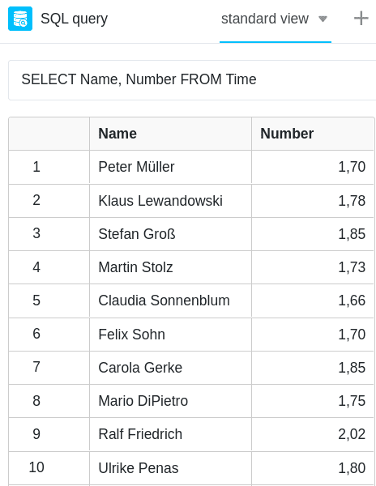

The SQL query plugin is perfectly suited for the direct **execution of SQL commands** and is therefore primarily interesting for users who already have experience with databases.

A big advantage of the plugin is that it accesses both the normal backend and the [Big Data backend](https://seatable.io/en/docs/big-data/potenzial-big-data/) in the course of the database query.



## Application examples

### The SQL command SELECT

Probably the most commonly used SQL command is the **SELECT** command, which is used to query entries. A simple query of the _Name_ and _Number_ columns from the _Time_ table would look like this:

```
SELECT Name, Number FROM Time
```

After entering the command, the database is searched for the **defined values** and the results are automatically displayed in tabular form.



### Transfer of the results as a new table

Using the **Export to new table** function you can export the found data to a new table within the same Base.


### The SQL command DELETE

**DELETE** is another frequently used command that is used to quickly **delete entries**. For example, the following command deletes all data from the _Time_ table.

```
DELETE FROM Time
```

After entering the command, **all** entries are deleted from the **Time** table. However, you can restore the rows via the [base log](https://seatable.io/en/docs/historie-und-versionen/historie-und-logs/#base-log).


## Overview of supported SQL commands

SeaTable supports not all, but most of the SQL commands. For a complete list and more details, see the [SeaTable Programming Manual](https://seatable.github.io/seatable-scripts/python/sql/).
