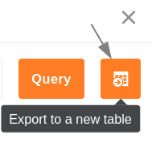

Le plug-in de requête SQL est parfaitement adapté à l'**exécution** directe **de commandes SQL** et est donc intéressant en premier lieu pour les utilisateurs qui ont déjà de l'expérience avec les bases de données.

L'un des grands avantages du plugin réside dans le fait qu'il accède aussi bien au backend normal qu'au [backend Big Data]() au cours de l'interrogation de la base de données.

{{< warning  headline="Particulièrement utile pour les grandes quantités de données"  text="L'accès direct aux données SeaTable par commande SQL n'a pas beaucoup de sens pour les petites quantités de données. Les possibilités de créer une vue et de définir les filtres, tris et regroupements correspondants permettront à la plupart des utilisateurs d'atteindre plus rapidement leur objectif. La requête SQL est particulièrement pertinente pour les grandes quantités de données et vous devriez déjà connaître la syntaxe SQL." />}}

## Exemples d'application

### La commande SQL SELECT

La commande **SQL** la plus utilisée est sans doute la commande **SELECT**, qui sert à interroger des entrées. Une simple requête sur les colonnes _Name_ et _Number_ de la table _Time_ ressemblerait à ceci :

```
SELECT Nom, Numéro FROM Heure
```

Une fois la commande saisie, la base de données est parcourue à la recherche des **valeurs définies** et les résultats sont automatiquement affichés sous forme de tableau.


### Transfert des résultats dans un nouveau tableau

La fonction **Exporter vers une nouvelle table** permet d'exporter les données trouvées dans une nouvelle table au sein de la même base.




### La commande SQL DELETE

**DELETE** est une autre commande fréquemment utilisée pour **supprimer** rapidement **des entrées**. Par exemple, la commande suivante supprime toutes les données de la table _Time_.

```
DELETE FROM Time
```

Après l'entrée de la commande, **toutes les** entrées de la table **Time** sont supprimées. Vous pouvez toutefois restaurer les lignes via le [journal de base](#base-log).


## Aperçu des commandes SQL prises en charge

SeaTable ne supporte pas toutes les commandes SQL, mais une grande partie d'entre elles. Pour une liste complète et plus de détails, consultez le [Manuel de programmation SeaTable](https://developer.seatable.com/scripts/).
