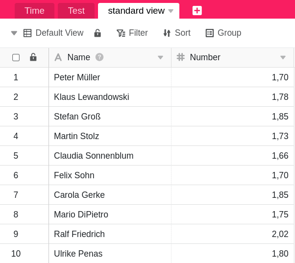

Плагин SQL-запросов отлично подходит для прямого **выполнения команд SQL** и поэтому в первую очередь интересен пользователям, которые уже имеют опыт работы с базами данных.

Большим преимуществом плагина является то, что в процессе запроса к базе данных он обращается как к обычному бэкенду, так и к [бэкенду Big Data]().



## Примеры применения

### Команда SQL SELECT

Вероятно, наиболее часто используемой командой SQL является команда **SELECT**, которая используется для запроса записей. Простой запрос столбцов _Name_ и _Number_ из таблицы _Time_ будет выглядеть следующим образом:

```
SELECT Имя, Номер FROM Время
```

После ввода команды выполняется поиск **заданных значений** в базе данных, а результаты автоматически отображаются в виде таблицы.


### Передача результатов в виде новой таблицы

С помощью функции **Экспорт в новую таблицу** можно экспортировать найденные данные в новую таблицу в рамках той же базы.




### Команда SQL DELETE

**DELETE** - это еще одна часто используемая команда, которая применяется для быстрого **удаления записей**. Например, следующая команда удаляет все данные из таблицы _Time_.

```
DELETE FROM Time
```

После ввода команды **все** записи удаляются из таблицы **Time**. Однако строки можно восстановить через [базовый журнал](#base-log).


## Обзор поддерживаемых команд SQL

SeaTable поддерживает не все, но большинство команд SQL. Полный список и более подробную информацию можно найти в [Руководстве по программированию SeaTable](https://seatable.github.io/seatable-scripts/python/sql/).
