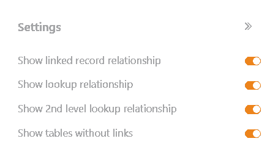
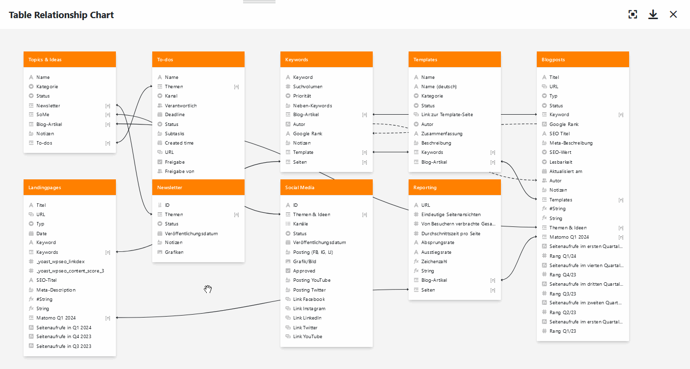

Besonders wenn sich viele Tabellen mit Dutzenden Spalten in einer Base befinden, verliert man schnell den Überblick, wie diese miteinander in Beziehung stehen. Mithilfe des Tabellenbeziehungen-Plugins können Sie sichtbar machen, welche Tabellen über welche Spalten miteinander verknüpft sind.

Wie Sie das Plugin in einer Base aktivieren, erfahren Sie [hier](
).

## Funktionsweise des Plugins

Wenn Sie das Tabellenbeziehungen-Plugin eingerichtet und geöffnet haben, sehen Sie zunächst **alle Tabellen**, die sich in der Base befinden. Unter den farbig hinterlegten Tabellennamen sind **alle Spalten** aufgelistet, die in den jeweiligen Tabellen angelegt sind.

Um die Tabellenbeziehungen zu visualisieren, werden Ihnen nicht nur **durchgezogene Linien** für _direkte_ Verbindungen über [Verknüpfungsspalten](), sondern auch **gestrichelte Linien** für _indirekte_ Verbindungen über Linkformel-Spalten (z. B. [Lookups](https://seatable.io/docs/verknuepfungen/die-lookup-funktion/)) angezeigt.

## Einstellungsmöglichkeiten einer Tabellenbeziehungen-Grafik

Standardmäßig ist beim ersten Öffnen des Tabellenbeziehungen-Plugins bereits eine Grafik mit allen Tabellenbeziehungen angelegt. Wenn Sie eine weitere Grafik erstellen möchten, klicken Sie auf  **Neue Tabellenbeziehung hinzufügen**. Daraufhin öffnet sich ein Eingabefeld, in das Sie den gewünschten **Namen** tippen.

Um die **Reihenfolge der Grafiken zu ändern**, halten Sie die linke Maustaste an der **Greiffläche**  gedrückt und ziehen eine Grafik **per Drag-and-Drop** an die gewünschte Stelle. Darüber hinaus können Sie die Grafiken **umbenennen**, **duplizieren** oder **löschen**.



Über die **Einstellungen**, die Sie per Klick auf das **Zahnrad-Symbol**  erreichen, können Sie Folgendes für die Grafik festlegen, indem Sie die **Regler (de-)aktivieren**:

- Möchten Sie **Verknüpfungen zu anderen Einträgen** (direkte Verbindungen) anzeigen?
- Möchten Sie **Formeln für Verknüpfungen** (indirekte Verbindungen) anzeigen?
- Möchten Sie **zweistufige Formeln für Verknüpfungen** anzeigen (z. B. eine Lookup-Formel, die Werte aus der Lookup-Spalte einer anderen Tabelle bezieht)?
- Möchten Sie **Tabellen ohne Verknüpfungen** anzeigen?

## Tabellen in einer Grafik verschieben

Sie können die verschiedenen Tabellen in der Grafik beliebig **per Drag-and-Drop verschieben**. Halten Sie dazu die linke Maustaste gedrückt, ziehen Sie die Tabelle an die gewünschte Stelle und lassen Sie los.

