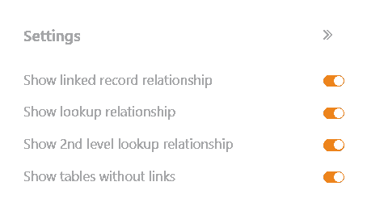

Especialmente cuando hay muchas tablas con docenas de columnas en una base, es fácil perder la pista de cómo se relacionan entre sí. Puedes utilizar el complemento de relaciones entre tablas para visualizar qué tablas están vinculadas entre sí a través de qué columnas.

Puede encontrar información sobre cómo activar el plugin en una base [aquí]().

## Funcionamiento del plugin

Una vez que haya configurado y abierto el plugin de relaciones entre tablas, verá en primer lugar **todas** las tablas de la base. **Todas las columnas** que se crean en las respectivas tablas aparecen bajo los nombres de tabla coloreados.

Para visualizar las relaciones de la tabla, no sólo verá **líneas continuas** para los enlaces _directos_ a través de [columnas]() de enlace, sino también **líneas discontinuas** para los enlaces _indirectos_ a través de columnas de fórmulas de enlace (por ejemplo, [búsquedas]()).

## Configuración de opciones para un gráfico de relaciones de tabla

Por defecto, se crea un gráfico con todas las relaciones de tabla cuando se abre el plugin de relaciones de tabla por primera vez.  Si desea crear otro gráfico, haga clic en **Añadir nueva** relación de tabla. Se abrirá un campo de entrada en el que podrá introducir el **nombre** deseado.

 Para **cambiar** el **orden de los** gráficos, mantenga pulsado el botón izquierdo del ratón sobre la **superficie de agarre** y **arrastre y suelte** un gráfico en la posición deseada. También puede **renombrar**, **duplicar** o **eliminar** los gráficos.



 En los **ajustes**, a los que puede acceder haciendo clic en el **símbolo de la rueda dentada**, puede especificar lo siguiente para el gráfico **(des)activando** los **controles deslizantes**:

- ¿Desea mostrar **enlaces a otras entradas** (conexiones directas)?
- ¿Desea visualizar **fórmulas de enlaces** (enlaces indirectos)?
- ¿Desea mostrar **fórmulas de dos niveles para los enlaces** (por ejemplo, una fórmula de búsqueda que toma valores de la columna de búsqueda de otra tabla)?
- ¿Desea mostrar **tablas sin enlaces**?

## Mover tablas en un gráfico

Puede desplazar las distintas tablas del gráfico según sus necesidades mediante la **función de arrastrar y soltar**. Para ello, mantenga pulsado el botón izquierdo del ratón, arrastre la tabla a la posición deseada y suéltelo.

