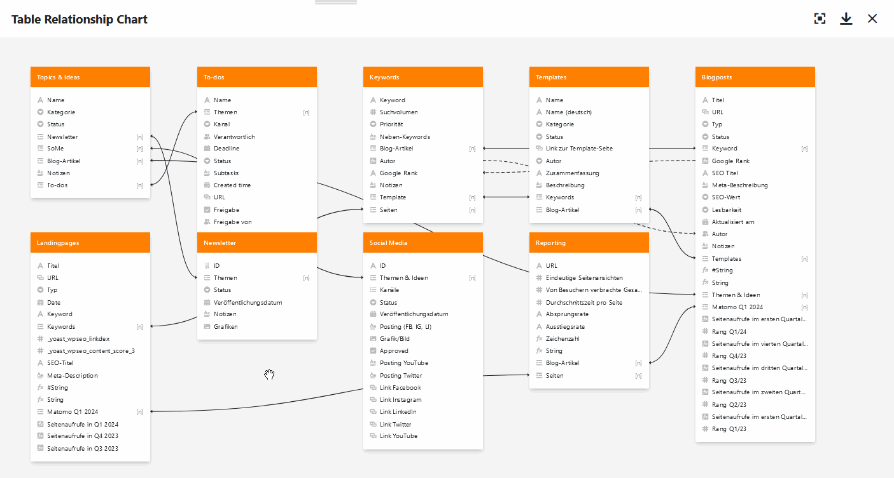

Surtout lorsque de nombreux tableaux avec des dizaines de colonnes se trouvent dans une base, on perd rapidement la vue d'ensemble de la manière dont ils sont reliés entre eux. Le plug-in Relations entre les tableaux permet de voir quels tableaux sont reliés entre eux et par quelles colonnes.

Pour savoir comment activer le plugin dans une base, [cliquez ici]().

## Fonctionnement du plugin

Lorsque vous avez configuré et ouvert le plug-in Relations entre les tableaux, vous voyez d'abord **tous les tableaux** qui se trouvent dans la base. Sous les noms de tableau en couleur sont listées **toutes les colonnes** qui ont été créées dans les tableaux respectives.

Pour visualiser les liens des tableaux, vous verrez non seulement **des lignes pleines** pour les liens _directs_ via les [colonnes de liens](), mais aussi des **lignes en pointillés** pour les liens _indirects_ via les colonnes de formules de liens (par exemple [les lookups]().

## Options de paramétrage d'un graphique de relations entre tableaux

Par défaut, un graphique avec toutes les relations entre les tableaux est déjà créé lors de la première ouverture du plugin relations entre les tableaux. Si vous souhaitez créer un autre graphique, cliquez sur  **Ajouter une nouvelle relation de tableaux**. Un champ de saisie s'ouvre alors, dans lequel vous tapez le **nom** souhaité.

Pour modifier l'**ordre des graphiques**, il suffit de maintenir le bouton gauche de la souris enfoncé sur la **zone de préhension**  et de **glisser-déposer** un graphique à l'endroit souhaité. En outre, vous pouvez **renommer**, **dupliquer** ou **supprimer** les graphiques.



Les **paramètres**, auxquels vous accédez en cliquant sur l'**icône en forme de roue dentée** , vous permettent de définir les éléments suivants pour le graphique en **(dés)activant** les **curseurs**:

- Souhaitez-vous afficher **les liens vers d'autres entrées** (liens directs) ?
- Souhaitez-vous afficher **des formules pour les liens** (liens indirects) ?
- Souhaitez-vous afficher **des formules à deux niveaux pour les liens** (par exemple, une formule de recherche qui obtient des valeurs à partir de la colonne de recherche d'un autre tableau) ?
- Vous souhaitez afficher **des tableaux sans liens**?

## Déplacer des tableaux dans un graphique

Vous pouvez **déplacer** les différents tableaux dans le graphique à votre guise **par glisser-déposer**. Pour ce faire, maintenez le bouton gauche de la souris enfoncé, faites glisser le tableau à l'endroit souhaité et relâchez.

