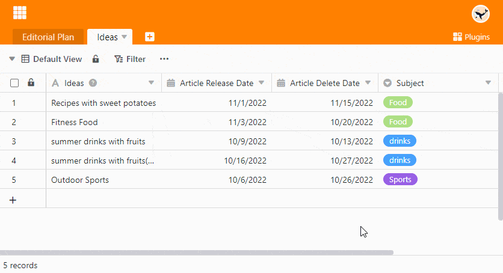

The **Timeline plugin** allows you to display different time spans in the form of a **timeline**. This is very useful, for example, if you want to see whether appointments **overlap**. Accordingly, you can use the Timeline plugin for vacation and project planning or booking (meeting) rooms, among other things.

Read the article [Activating a Plugin in a base]() to find out how to activate the Timeline plugin.

## Function of the timeline plugin

The timeline plugin maps **time spans**. Therefore, for this representation you need **two** [date columns]() in a table that define the **beginning** and the **end of** a time frame.

## How to use the timeline plugin

1. Activate and open the **timeline plugin**.
2. Place the **Settings**  of the timeline:
    - Table and view
    - Block color and label
    - Start and end date
    - The period of time that the representation should cover
3. Double-click on one of the entries to open the **row details**.

## Effect of grouping and sorting

Since the timeline plugin is based on the views of the table, [sorting]() entries also affect the display in the timeline. For grouped views, you have the option of displaying the data in a **swimlane** diagram by activating the **Display as swimlane mode** slider.

## Create multiple timelines

As you can see in the video above, you can also create **multiple timelines** in one base. To do this, proceed as follows:

1. Click the **plus icon** to the right of the title of your first timeline.
2. Give the timeline a **name** and confirm with **Submit**.
3. Define in the **settings**  to which [table view]() and which [date columns]() the new timeline should refer to.
