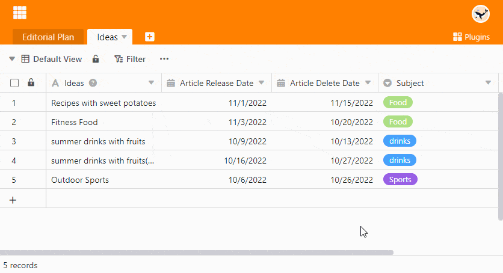
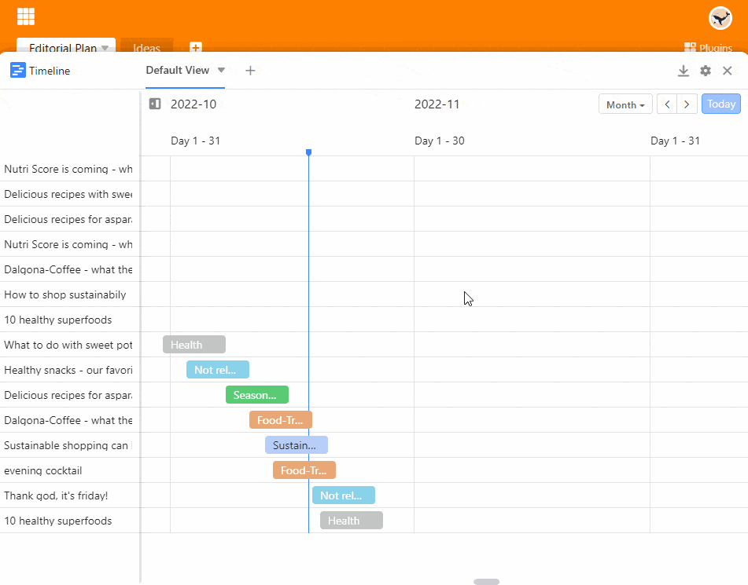

Le **plug-in Timeline** vous permet d'afficher différentes périodes de temps sous la forme d'une **ligne de temps**. Cela est par exemple très utile lorsque vous souhaitez voir si des rendez-vous **se chevauchent**. En conséquence, vous pouvez utiliser le plugin Timeline entre autres pour la planification des vacances et des projets ou la réservation de salles (de réunion).

Lisez l'article [Activer un plugin dans une base]() pour savoir comment activer le plugin Timeline.

## Fonctionnement du plug-in Timeline

Le plugin Timeline représente **des périodes de temps**. C'est pourquoi vous avez besoin, pour cette représentation, **de deux** [colonnes de dates]() dans un tableau qui définissent le **début** et la **fin** d'un cadre temporel.

## Comment utiliser le plugin de ligne de temps

1. Activez et ouvrez le **plugin de ligne de temps**.
2. Placez les **Réglages**  de la ligne de temps :
    - Tableau et vue
    - Couleur et libellé du bloc
    - Date de début et de fin
    - la période que doit couvrir la présentation
3. Double-cliquez sur l'une des entrées pour ouvrir les **détails de la ligne**.

## Effet du regroupement et du tri

Comme le plugin ligne de temps est basé sur les vues du tableau, le [tri]() des entrées ont également un effet sur l'affichage dans la ligne de temps. Dans le cas de vues groupées, vous avez la possibilité d'afficher les données dans un diagramme en ligne flottante en activant le curseur **Display as swimlane mode**.

## Créer plusieurs timelines

Comme on peut le voir dans la vidéo ci-dessus, il est également possible de créer **plusieurs timelines** dans une base. Pour ce faire, procédez comme suit :

1. Cliquez sur l'**icône +** à droite du titre de votre première ligne de temps.
2. Donnez un **nom** à la ligne de temps et confirmez en cliquant sur **Envoyer**.
3. Dans les **paramètres** , déterminez à quelle [vue du tableau]() et à quelles [colonnes de dates]() la nouvelle ligne de temps doit se référer.
