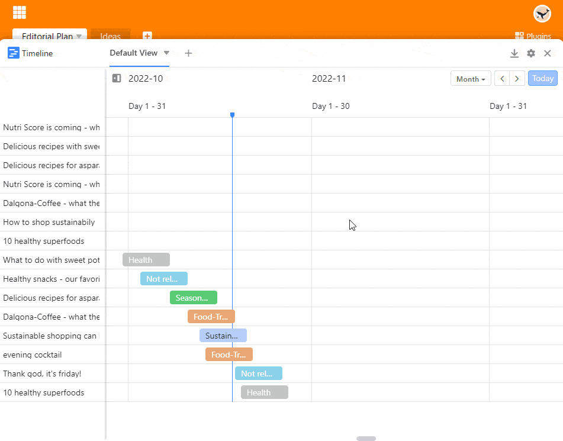

O **plugin da linha temporal** permite exibir diferentes intervalos de tempo sob a forma de uma **linha temporal**. Isto é muito útil, por exemplo, se quiser ver se as nomeações **se sobrepõem**. Assim, pode utilizar o plugin da linha do tempo para planeamento de férias e de projectos ou para reservar (reuniões) salas, entre outras coisas.

Leia o artigo [Activando um Plugin numa Base]() para saber como activar o Plugin da Linha do Tempo.

## Função do plug-in da linha do tempo

O plug-in da linha do tempo mostra **os períodos de tempo**. Por conseguinte, para esta representação são necessárias **duas** [colunas de datas]() numa tabela que definam o **início** e o **fim de** um período de tempo.

## Como utilizar o plug-in da linha do tempo

1. Activar e abrir o **plug-in da linha do tempo**.
2. Coloque o **Definições**  da linha do tempo:
    - Tabela e vista
    - Cor do bloco e rotulagem
    - Data de início e fim
    - O período de tempo a ser coberto pela representação
3. Faça duplo clique sobre uma das entradas para abrir os **detalhes da fila**.

## Efeito de agrupamento e classificação

Uma vez que o plug-in da linha temporal se baseia nas vistas da tabela, a [ordenação]() entradas também afectam a visualização na linha temporal. Para vistas agrupadas, tem a opção de exibir os dados num diagrama de **faixa de rodagem** activando o **Mostrador como** selector de **modo de faixa de rodagem**.

## Criar múltiplas linhas de tempo

Como se pode ver no vídeo acima, também se podem criar **várias linhas de tempo** numa base. Para o fazer, proceder da seguinte forma:

1. Clique no **símbolo de mais** à direita do título da sua primeira linha temporal.
2. Dar um **nome** à linha do tempo e confirmar com **Submeter**.
3. Nas **definições** , defina a [vista de tabela]() e as [colunas de data]() a que a nova cronologia se deve referir.
