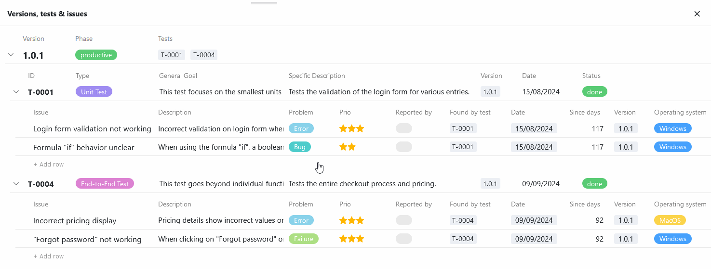

Das **Tree-Plugin** ermöglicht die kompakte **hierarchische Darstellung** verknüpfter Datensätze. Das heißt, Sie können Daten, die in verschiedenen, [miteinander verknüpften Tabellen](https://seatable.io/docs/verknuepfungen/wie-man-tabellen-in-seatable-miteinander-verknuepft/) liegen, auf unterschiedlichen Ebenen in einem Baumdiagramm visualisieren. Gerade bei großen Datenmengen wie Finanzdaten oder Projektdaten, schafft das Plugin daher einen strukturierten Überblick.

Wie Sie das Plugin in einer Base aktivieren, erfahren Sie [hier](
).

## Funktionsweise des Plugins

Um das Tree-Plugin sinnvoll nutzen zu können, müssen Sie in Ihrer Base eine durchdachte **Baumstruktur** mit hierarchischen Ebenen anlegen: In der Finanzbuchhaltung könnten dies beispielsweise die Abteilungen auf der ersten Ebene, die Kostenstellen auf der zweiten Ebene und die Ausgaben auf der dritten Ebene sein. Dementsprechend müssen die Abteilungen, Kostenstellen und Ausgaben in drei verschiedenen Tabellen erfasst sein, die miteinander verknüpft sind. Jede Ausgabe ist einer Kostenstelle zugeordnet, die wiederum einer Abteilung untergeordnet ist.

Wie die Datensätze voneinander abhängen bzw. welche Tabellen sich auf welcher Ebene befinden, definieren Sie über die **Levels**. Aktuell können Sie im Tree-Plugin bis zu drei Ebenen, das heißt Daten aus drei Tabellen darstellen.

## Einstellungsmöglichkeiten eines Baumdiagramms

Standardmäßig ist beim ersten Öffnen des Tree-Plugins bereits ein Baumdiagramm mit Tabelleneinträgen angelegt. Wenn Sie ein weiteres Baumdiagramm erstellen möchten, klicken Sie auf  **Baum hinzufügen**. Daraufhin öffnet sich ein Eingabefeld, in das Sie den gewünschten **Namen** tippen.

Um die **Reihenfolge der Diagramme zu ändern**, halten Sie die linke Maustaste an der **Greiffläche**  gedrückt und ziehen ein Diagramm **per Drag-and-Drop** an die gewünschte Stelle. Darüber hinaus können Sie die Diagramme **umbenennen**, **duplizieren** oder **löschen**.



## Wie Sie ein Baumdiagramm im Tree-Plugin anlegen

Über die **Einstellungen**, die Sie per Klick auf das **Zahnrad-Symbol**  erreichen, können Sie Folgendes für das Baumdiagramm festlegen:

- **Level 1**: Klicken Sie in das erste Feld, um in der Drop-down-Liste die **Tabelle** auszuwählen, deren Einträge auf der übergeordneten Ebene des Diagramms erscheinen sollen. Im zweiten Feld wählen Sie die gewünschte **Ansicht** dieser Tabelle. Wenn Sie in der Ansicht (unabhängig vom Plugin) beispielsweise [Spalten ausblenden](https://seatable.io/docs/ansichtsoptionen/ausblenden-und-verschieben-von-spalten/), sind diese auch nicht im Baumdiagramm sichtbar.
- **Level 2**: Klicken Sie in das Feld, um in der Drop-down-Liste die Tabelle auszuwählen, deren verknüpfte Datensätze auf der zweiten Ebene des Baumdiagramms erscheinen sollen. Die Datensätze sind anschließend unter den übergeordneten Einträgen gruppiert.
- **Level 3**: Optional können Sie auf einer dritten Ebene verknüpfte Datensätze anzeigen, die den Datensätzen auf der mittleren Ebene untergeordnet sind. Klicken Sie dazu in das Feld und wählen Sie die entsprechende Tabelle in der Drop-down-Liste aus.

Auf Level 2 und 3 haben Sie die Möglichkeit, Einträge innerhalb ihrer Gruppe **alphabetisch zu sortieren**. Aktivieren Sie dazu den Regler **A-Z** rechts über dem Auswahlfeld.

## Anwendungsbeispiel für das Tree-Plugin

Ein gutes Beispiel für die Anwendung des Tree-Plugins ist ein [Bugtracker](https://seatable.io/vorlage/hlbtvqrtscqmhx3adh5asg/). Dort können Sie in drei verschiedenen Tabellen die Versionen einer Software, die durchgeführten Tests und die dabei gefundenen Softwarefehler erfassen. Mithilfe eines Baumdiagramms können Sie nun all diese Daten in einer Übersicht visualisieren.

Sobald Sie in den Einstellungen die verknüpften Tabellen ausgewählt haben, können Sie die gruppierten Einträge im Baumdiagramm ansehen und öffnen. Zunächst werden Ihnen allerdings nur die Einträge auf der ersten Ebene (hier: Software-Versionen) angezeigt. Um die darunterliegenden Datensätze auszuklappen, klicken Sie auf den **Drop-down-Pfeil** links vor dem Eintrag.

Um abgeschnittene Einträge oder große Lücken zwischen den Werten zu vermeiden, können Sie nach Belieben **die Spaltenbreite anpassen**. Halten Sie dazu die linke Maustaste auf der Begrenzungslinie zwischen zwei Spalten gedrückt und ziehen Sie den Cursor nach links oder rechts.

## Einträge im Tree-Plugin hinzufügen, öffnen und bearbeiten

Um einen neuen Eintrag im Tree-Plugin hinzuzufügen, klicken Sie auf **\+ Zeile hinzufügen**. Die angelegte Zeile wird automatisch mit dem übergeordneten Eintrag verknüpft und entsprechend gruppiert. Anschließend können Sie die **Zeilendetails** des neuen Eintrags öffnen und wie gewünscht ausfüllen.

Ebenso lassen sich bestehende Einträge direkt im Tree-Plugin öffnen und bearbeiten. Die Daten werden natürlich auch in den zugrundeliegenden Tabellen gespeichert, sobald Sie das Fenster mit den Zeilendetails schließen.
