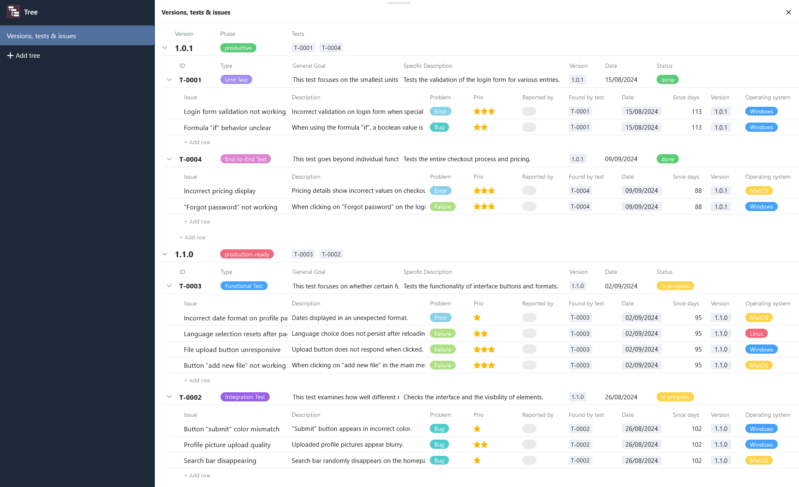
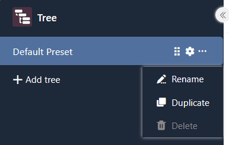
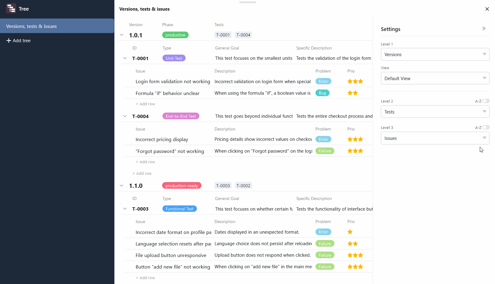
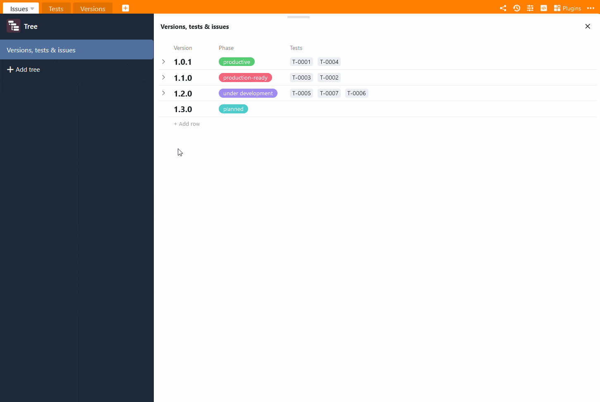
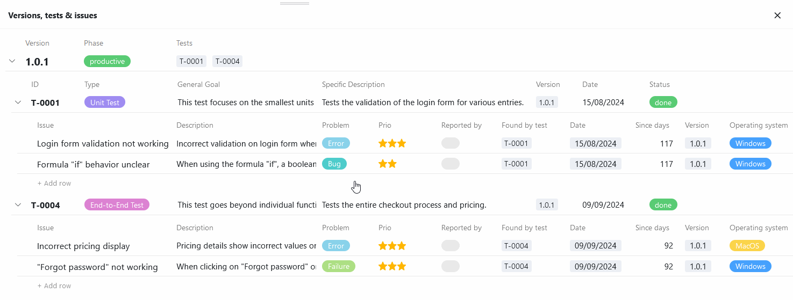
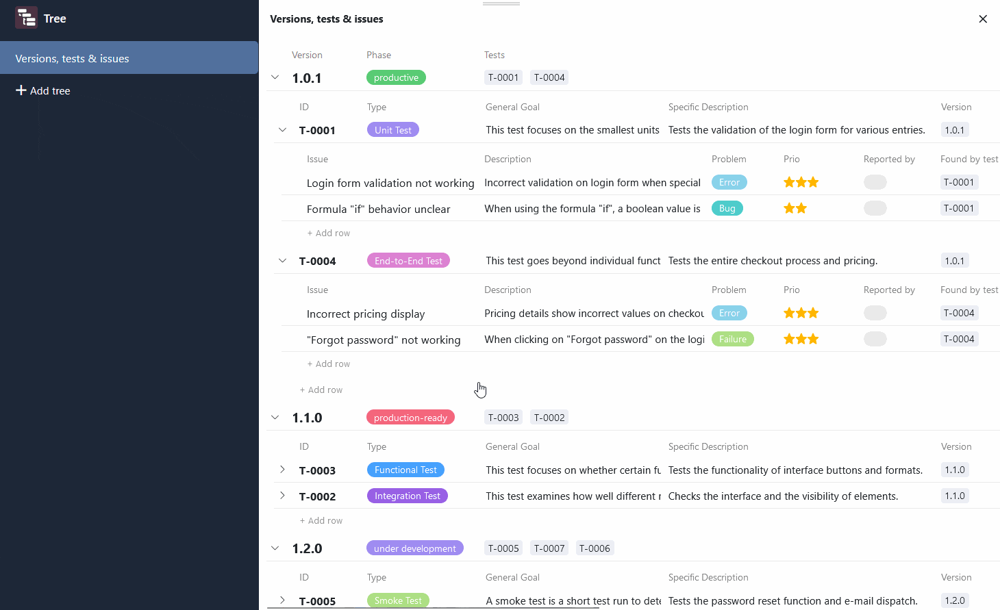

The **Tree plugin** enables the compact **hierarchical display** of linked data records. This means that you can visualize data that is located in different, [linked tables](https://seatable.io/en/docs/verknuepfungen/wie-man-tabellen-in-seatable-miteinander-verknuepft/) at different levels in a tree diagram. The plugin therefore provides a structured overview, especially for large amounts of data such as financial data or project data.

You can find out how to activate the plugin in a base [here](https://seatable.io/en/docs/plugins/aktivieren-eines-plugins-in-einer-base/).

## How the plugin works

In order to use the Tree plugin effectively, you need to create a well-thought-out **tree structure** with hierarchical levels in your base: In financial accounting, for example, this could be the departments on the first level, the cost centers on the second level and the expenses on the third level. Accordingly, the departments, cost centers and expenses must be recorded in three different tables that are linked to each other. Each expense is assigned to a cost center, which in turn is subordinate to a department.

You use the **levels** to define how the data records depend on each other and which tables are on which level. You can currently display up to three levels, i.e. data from three tables, in the Tree plugin.

## Setting options for a tree diagram

By default, a tree diagram with table entries is already created when you open the Tree plugin for the first time. If you want to create another tree diagram, click on  **Add tree**. This opens an input field in which you can enter the desired **name**.

To **change** the **order of the diagrams**, hold down the left mouse button on the **gripping area**  and **drag and drop** a diagram to the desired position. You can also **rename**, **duplicate** or **delete** the diagrams.



## How to create a tree diagram in the Tree plugin

You can define the following for the tree diagram via the **settings**, which you can access by clicking on the **cogwheel symbol** :

- **Level 1**: Click in the first field to select the **table** from the drop-down list whose entries are to appear on the higher level of the diagram. In the second field, select the desired **view** of this table. If you [hide columns]() in the view (independently of the plugin), for example, they will not be visible in the tree diagram.
- **Level 2**: Click in the field to select the table in the drop-down list whose linked data records are to appear on the second level of the tree diagram. The data records are then grouped under the parent entries.
- **Level 3**: Optionally, you can display linked data records on a third level that are subordinate to the data records on the middle level. To do this, click in the field and select the corresponding table from the drop-down list.

On levels 2 and 3, you have the option of **sorting** entries **alphabetically** within their group. To do this, activate the **A-Z** slider on the right above the selection field.

## Application example for the Tree plugin

A good example of the use of the Tree plugin is a [bug tracker](https://seatable.io/en/vorlage/hlbtvqrtscqmhx3adh5asg/). There you can record the versions of a software, the tests carried out and the software errors found in three different tables. Using a tree diagram, you can now visualize all this data in an overview.

As soon as you have selected the linked tables in the settings, you can view and open the grouped entries in the tree diagram. Initially, however, only the entries on the first level (here: software versions) are displayed. To expand the underlying data records, click on the **drop-down arrow** to the left of the entry.

To avoid truncated entries or large gaps between the values, you can **adjust the column width** as required. To do this, hold down the left mouse button on the boundary line between two columns and drag the cursor to the left or right.

## Add, open and edit entries in the Tree plugin

To add a new entry in the Tree plugin, click on **\+ Add row** . The created row is automatically linked to the parent entry and grouped accordingly. You can then open the **line details** of the new entry and fill them in as required.

Existing entries can also be opened and edited directly in the Tree plugin. The data is of course also saved in the underlying tables as soon as you close the window with the row details.
