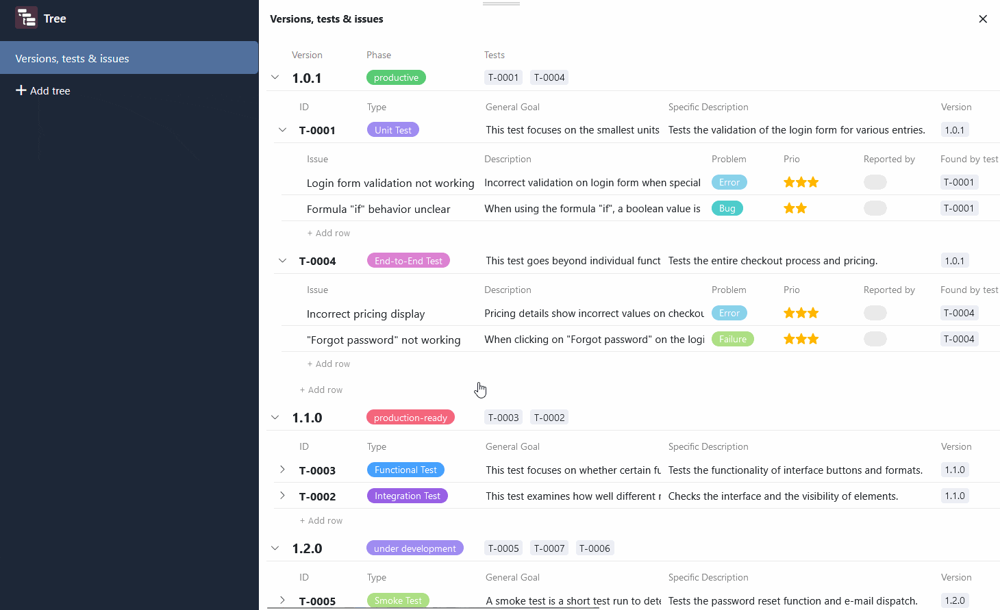

El **complemento Árbol** permite la **visualización jerárquica** compacta de registros de datos enlazados. Esto significa que puede visualizar datos que se encuentran en varias [tablas vinculadas]() a diferentes niveles en un diagrama de árbol. De este modo, el plugin ofrece una visión general estructurada, especialmente para grandes cantidades de datos, como datos financieros o datos de proyectos.

Puede encontrar información sobre cómo activar el plugin en una base [aquí](https://seatable.io/es/docs/plugins/aktivieren-eines-plugins-in-einer-base/).

## Funcionamiento del plugin

Para utilizar el plugin Árbol de forma eficaz, necesita crear una **estructura de árbol** bien pensada con niveles jerárquicos en su base: En contabilidad financiera, por ejemplo, podrían ser los departamentos en el primer nivel, los centros de coste en el segundo y los gastos en el tercero. En consecuencia, los departamentos, los centros de coste y los gastos deben registrarse en tres tablas diferentes vinculadas entre sí. Cada gasto se asigna a un centro de costes, que a su vez está subordinado a un departamento.

Los **niveles** se utilizan para definir cómo dependen unos registros de datos de otros y qué tablas se encuentran en cada nivel. Actualmente puede mostrar hasta tres niveles, es decir, datos de tres tablas, en el complemento Árbol.

## Opciones de un diagrama de árbol

Por defecto, se crea un diagrama de árbol con entradas de tabla cuando se abre el plugin de Árbol por primera vez.  Si desea crear otro diagrama de árbol, haga clic en **Añadir árbol**. Se abre un campo de entrada en el que puede introducir el **nombre** deseado.

 Para **cambiar** el **orden de los diagramas**, mantenga pulsado el botón izquierdo del ratón en la **zona de agarre** y **arrastre y suelte** un diagrama en la posición deseada. También puede **renombrar**, **duplicar** o **borrar** los diagramas.



## Cómo crear un diagrama de árbol en el plugin Árbol

 Puede definir lo siguiente para el diagrama de árbol a través de los **ajustes**, a los que puede acceder haciendo clic en el **símbolo de la rueda dentada**:

- **Nivel 1**: Haga clic en el primer campo para seleccionar la **tabla** de la lista desplegable cuyas entradas deben aparecer en el nivel superior del diagrama. En el segundo campo, seleccione la **vista** deseada de esta tabla. Si [oculta columnas]() en la vista (independientemente del plugin), por ejemplo, no serán visibles en el diagrama de árbol.
- **Nivel 2**: Haga clic en el campo para seleccionar la tabla en la lista desplegable cuyos registros de datos vinculados deben aparecer en el segundo nivel del diagrama de árbol. A continuación, los registros de datos se agrupan bajo las entradas de nivel superior.
- **Nivel 3**: Opcionalmente, puede mostrar registros de datos vinculados en un tercer nivel que estén subordinados a los registros de datos del nivel intermedio. Para ello, haga clic en el campo y seleccione la tabla correspondiente en la lista desplegable.

En los niveles 2 y 3, tiene la opción de **ordenar** las entradas **alfabéticamente** dentro de su grupo. Para ello, active el control deslizante **A-Z** situado a la derecha, encima del campo de selección.

## Ejemplo de aplicación del plugin Árbol

Un buen ejemplo del uso del plugin Tree es un [rastreador de errores](). En él puedes registrar las versiones de un software, las pruebas realizadas y los errores de software encontrados en tres tablas diferentes. Mediante un diagrama de árbol, ahora puedes visualizar todos estos datos en una vista general.

Una vez seleccionadas las tablas vinculadas en los ajustes, puede ver y abrir las entradas agrupadas en el diagrama de árbol. Inicialmente, sin embargo, sólo se muestran las entradas del primer nivel (aquí: versiones de software). Para ampliar los registros de datos subyacentes, haga clic en la **flecha desplegable** situada a la izquierda de la entrada.

Para evitar entradas truncadas o grandes huecos entre los valores, puede **ajustar el ancho de columna** según sea necesario. Para ello, mantenga pulsado el botón izquierdo del ratón en la línea divisoria entre dos columnas y arrastre el cursor hacia la izquierda o la derecha.

## Añadir, abrir y editar entradas en el plugin Árbol

Para añadir una nueva entrada en el complemento Árbol, haga clic en **\+ Añadir línea**. La línea creada se vincula automáticamente a la entrada padre y se agrupa en consecuencia. A continuación, puede abrir los **detalles de la línea** de la nueva entrada y rellenarlos según sea necesario.

Las entradas existentes también pueden abrirse y editarse directamente en el complemento Árbol. Por supuesto, los datos también se guardan en las tablas subyacentes en cuanto se cierra la ventana con los detalles de la fila.
