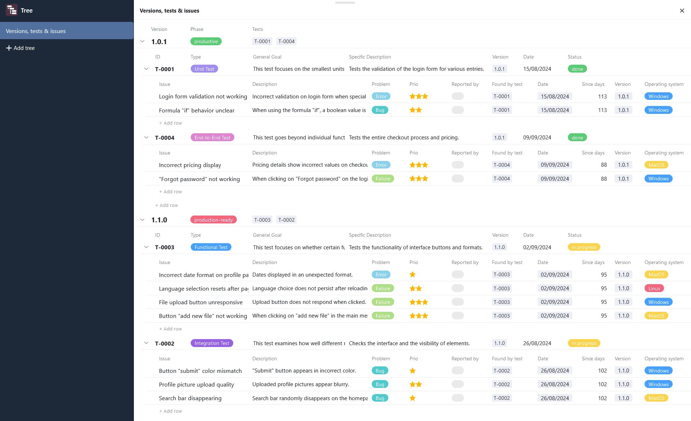
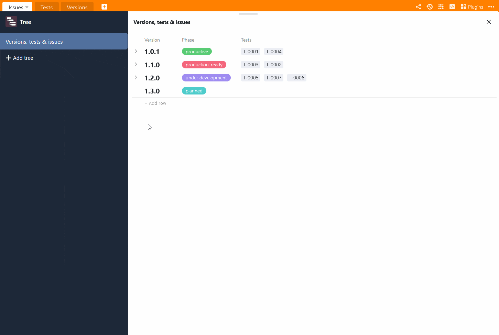

Le **plug-in Tree** permet une **représentation hiérarchique** compacte des ensembles de données liés. Cela signifie que vous pouvez visualiser les données qui se trouvent dans différents [tableaux liés entre eux à]() différents niveaux dans un diagramme en arborescence. Le plugin permet donc d'obtenir une vue d'ensemble structurée, en particulier pour les grandes quantités de données telles que les données financières ou les données de projet.

Pour savoir comment activer le plugin dans une base, [cliquez ici](https://seatable.io/fr/docs/plugins/aktivieren-eines-plugins-in-einer-base/).

## Fonctionnement du plugin

Pour pouvoir utiliser le plug-in Tree de manière judicieuse, vous devez créer dans votre base une **arborescence** bien pensée avec des niveaux hiérarchiques : Dans la comptabilité financière, cela pourrait être par exemple les départements au premier niveau, les centres de coûts au deuxième niveau et les dépenses au troisième niveau. En conséquence, les départements, les centres de coûts et les dépenses doivent être saisis dans trois tableaux différents, qui sont liés entre eux. Chaque dépense est associée à un centre de coûts, qui est lui-même subordonné à un service.

Les **niveaux** vous permettent de définir comment les enregistrements dépendent les uns des autres ou quelles tables se trouvent à quel niveau. Actuellement, le plugin Tree vous permet de représenter jusqu'à trois niveaux, c'est-à-dire des données provenant de trois tableaux.

## Possibilités de réglage d'un diagramme en arbre

Par défaut, lorsque vous ouvrez le plugin Tree pour la première fois, un diagramme en arborescence avec des entrées de tableau est déjà créé. Si vous souhaitez créer un autre diagramme en arbre, cliquez sur  **Ajouter un arbre**. Un champ de saisie s'ouvre alors, dans lequel vous saisissez le **nom** souhaité.

Pour modifier l'**ordre des diagrammes**, maintenez le bouton gauche de la souris enfoncé sur la **zone de préhension**  et faites **glisser** un diagramme vers l'emplacement souhaité. En outre, vous pouvez **renommer**, **dupliquer** ou **supprimer** les diagrammes.



## Comment créer un graphique en arbre dans le plugin Tree

Les **paramètres**, auxquels vous accédez en cliquant sur l'**icône en forme de roue dentée** , vous permettent de définir les éléments suivants pour l'arborescence :

- **Niveau 1**: Cliquez dans le premier champ pour sélectionner dans la liste déroulante le **tableau** dont les entrées doivent apparaître au niveau supérieur du graphique. Dans le deuxième champ, sélectionnez la **vue** souhaitée de ce tableau. Si vous [masquez des colonnes]() dans la vue (indépendamment du plugin), par exemple, elles ne seront pas non plus visibles dans l'arborescence.
- **Niveau 2**: Cliquez dans le champ pour sélectionner dans la liste déroulante la table dont les enregistrements liés doivent apparaître au deuxième niveau de l'arborescence. Les enregistrements sont ensuite regroupés sous les entrées de niveau supérieur.
- **Niveau 3**: En option, vous pouvez afficher à un troisième niveau des enregistrements liés qui sont subordonnés aux enregistrements du niveau intermédiaire. Pour ce faire, cliquez dans le champ et sélectionnez la table correspondante dans la liste déroulante.

Aux niveaux 2 et 3, vous avez la possibilité de **trier** les entrées **par ordre alphabétique** au sein de leur groupe. Pour ce faire, activez le curseur **A-Z** à droite au-dessus du champ de sélection.

## Exemple d'utilisation du plug-in Tree

Un bon exemple d'utilisation du plug-in Tree est un [bugtracker](https://seatable.io/fr/modele/hlbtvqrtscqmhx3adh5asg/). Vous pouvez y saisir, dans trois tableaux différents, les versions d'un logiciel, les tests effectués et les erreurs logicielles trouvées. À l'aide d'un diagramme en arborescence, vous pouvez maintenant visualiser toutes ces données dans une vue d'ensemble.

Dès que vous avez sélectionné les tableaux liés dans les paramètres, vous pouvez consulter et ouvrir les entrées groupées dans l'arborescence. Dans un premier temps, seuls les enregistrements du premier niveau (ici : versions logicielles) sont affichés. Pour déployer les enregistrements inférieurs, cliquez sur la **flèche déroulante** à gauche de l'entrée.

Pour éviter les entrées tronquées ou les grands espaces entre les valeurs, vous pouvez **adapter la largeur des colonnes** à votre gré. Pour ce faire, maintenez le bouton gauche de la souris enfoncé sur la ligne de délimitation entre deux colonnes et faites glisser le curseur vers la gauche ou la droite.

## Ajouter, ouvrir et modifier des entrées dans le plug-in Tree

Pour ajouter une nouvelle entrée dans le plugin Tree, cliquez sur **\+ Ajouter une ligne**. La ligne créée est automatiquement liée à l'entrée parent et regroupée en conséquence. Vous pouvez ensuite ouvrir les **détails de** la **ligne de** la nouvelle entrée et les remplir comme vous le souhaitez.

De même, les entrées existantes peuvent être ouvertes et modifiées directement dans le plug-in Tree. Les données sont bien sûr aussi enregistrées dans les tableaux sous-jacents dès que vous fermez la fenêtre avec les détails des lignes.
