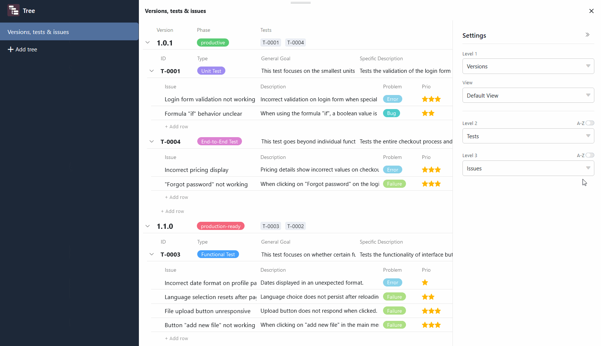

O **plugin Tree** permite a **visualização hierárquica** compacta de registos de dados ligados. Isto significa que é possível visualizar dados que estão localizados em várias [tabelas ligadas](https://seatable.io/pt/docs/verknuepfungen/wie-man-tabellen-in-seatable-miteinander-verknuepft/) em diferentes níveis num diagrama de árvore. O plugin fornece, portanto, uma visão geral estruturada, especialmente para grandes quantidades de dados, como dados financeiros ou dados de projectos.

Pode descobrir como ativar o plugin numa base [aqui](https://seatable.io/pt/docs/plugins/aktivieren-eines-plugins-in-einer-base/).

## Como funciona o plugin

Para utilizar o Tree plugin de forma eficaz, é necessário criar uma **estrutura em árvore** bem pensada com níveis hierárquicos na sua base: Na contabilidade financeira, por exemplo, podem ser os departamentos no primeiro nível, os centros de custo no segundo nível e as despesas no terceiro nível. Por conseguinte, os departamentos, os centros de custo e as despesas devem ser registados em três tabelas diferentes, ligadas entre si. Cada despesa é atribuída a um centro de custo, que, por sua vez, está subordinado a um departamento.

Os **níveis** são utilizados para definir a forma como os registos de dados dependem uns dos outros e que tabelas estão em que nível. Atualmente, é possível apresentar até três níveis, ou seja, dados de três tabelas, no plugin Árvore.

## Definir opções para um diagrama em árvore

Por defeito, já é criado um diagrama de árvore com entradas de tabela quando o plugin Árvore é aberto pela primeira vez.  Se pretender criar outro diagrama em árvore, clique em **Adicionar árvore**. Isto abre um campo de entrada no qual pode introduzir o **nome** pretendido.

 Para **alterar a ordem dos diagramas**, mantenha premido o botão esquerdo do rato na **área de agarrar** e arraste **e largue** um diagrama para a posição pretendida. Também é possível **renomear**, **duplicar** ou **eliminar** os diagramas.



## Como criar um diagrama de árvore no plugin Árvore

 Pode definir o seguinte para o diagrama em árvore através das **definições**, às quais pode aceder clicando no **símbolo da roda dentada**:

- **Nível 1**: Clique no primeiro campo para selecionar a **tabela** da lista pendente cujas entradas devem aparecer no nível superior do diagrama. No segundo campo, selecione a **vista** pretendida para esta tabela. Se [ocultar colunas](https://seatable.io/pt/docs/ansichtsoptionen/ausblenden-und-verschieben-von-spalten/) na vista (independentemente do plugin), por exemplo, estas não serão visíveis no diagrama de árvore.
- **Nível 2**: Clique no campo para selecionar a tabela na lista pendente cujos registos de dados ligados devem aparecer no segundo nível do diagrama em árvore. Os registos de dados são então agrupados sob as entradas pai.
- **Nível 3**: Opcionalmente, pode exibir registos de dados ligados num terceiro nível que estão subordinados aos registos de dados no nível intermédio. Para tal, clique no campo e selecione a tabela correspondente na lista pendente.

Nos níveis 2 e 3, tem a opção de **ordenar** as entradas **por ordem alfabética** dentro do seu grupo. Para tal, active o cursor **A-Z**, à direita, por cima do campo de seleção.

## Exemplo de aplicação para o plugin Árvore

Um bom exemplo da utilização do plugin Tree é um [registo de erros](https://seatable.io/pt/vorlage/hlbtvqrtscqmhx3adh5asg/). Nele pode registar as versões de um software, os testes efectuados e os erros de software encontrados em três tabelas diferentes. Utilizando um diagrama de árvore, pode agora visualizar todos estes dados numa vista geral.

Uma vez selecionadas as tabelas ligadas nas opções, é possível visualizar e abrir as entradas agrupadas no diagrama em árvore. No entanto, inicialmente, só são exibidas as entradas do primeiro nível (aqui: versões de software). Para expandir os registos de dados subjacentes, clicar na **seta pendente** à esquerda da entrada.

Para evitar entradas truncadas ou grandes intervalos entre os valores, é possível **ajustar a largura da coluna** conforme necessário. Para tal, mantenha premido o botão esquerdo do rato na linha de fronteira entre duas colunas e arraste o cursor para a esquerda ou para a direita.

## Adicionar, abrir e editar entradas no plugin Árvore

Para adicionar uma nova entrada no plug-in Árvore, clique em **\+ Adicionar linha**. A linha criada é automaticamente ligada à entrada principal e agrupada em conformidade. Pode então abrir os **detalhes** da **linha** da nova entrada e preenchê-los conforme necessário.

As entradas existentes também podem ser abertas e editadas diretamente no plugin Árvore. Os dados também são guardados nas tabelas subjacentes assim que se fecha a janela com os detalhes da linha.
