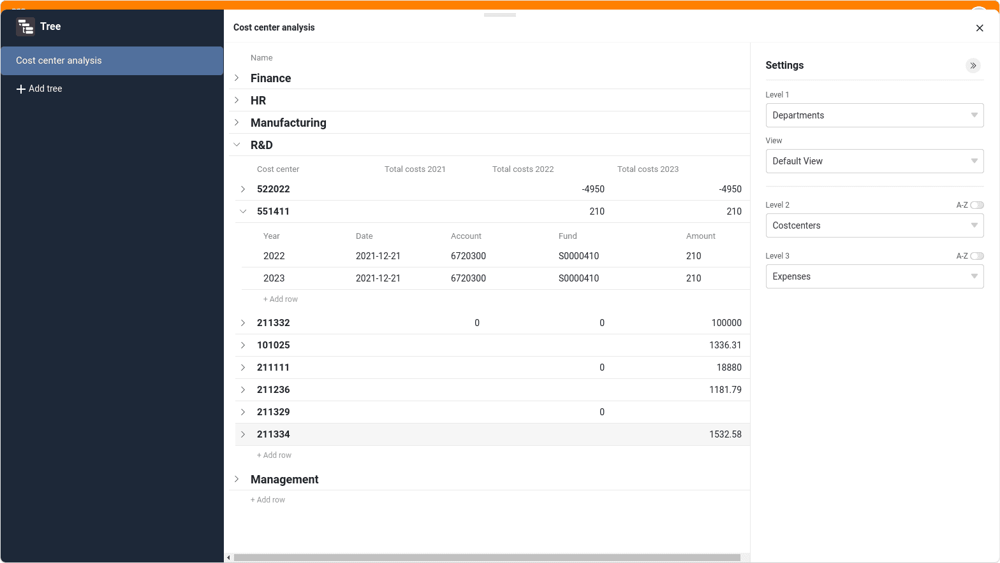

**Плагин Tree** позволяет компактно **иерархически визуализировать** связанные записи данных. Это означает, что вы можете визуализировать данные, находящиеся в различных [связанных таблицах]() на разных уровнях в виде древовидной диаграммы. Таким образом, плагин обеспечивает структурированный обзор, особенно для больших объемов данных, таких как финансовые данные или данные по проектам.

О том, как активировать плагин в базе, вы можете узнать [здесь](https://seatable.io/ru/docs/plugins/aktivieren-eines-plugins-in-einer-base/).

## Как работает плагин

Чтобы эффективно использовать плагин Tree, необходимо создать в базе хорошо продуманную **древовидную структуру** с иерархическими уровнями: Например, в финансовом учете это могут быть отделы на первом уровне, центры затрат на втором уровне и расходы на третьем уровне. Соответственно, отделы, центры затрат и расходы должны быть записаны в трех разных таблицах, связанных друг с другом. Каждый расход относится к центру затрат, который, в свою очередь, подчиняется отделу.

С помощью **уровней** вы определяете, как записи данных зависят друг от друга и какие таблицы находятся на том или ином уровне. В настоящее время в плагине Tree можно отобразить до трех уровней, то есть данные из трех таблиц.

## Настройка параметров древовидной диаграммы

По умолчанию при первом открытии плагина Tree уже создана древовидная диаграмма с табличными записями.  Если вы хотите создать другую древовидную диаграмму, нажмите на кнопку **Добавить дерево**. Откроется поле ввода, в котором вы можете ввести желаемое **имя**.

 Чтобы **изменить порядок расположения диаграмм**, удерживайте левую кнопку мыши в **области захвата** и **перетащите** диаграмму в нужное место. Вы также можете **переименовывать**, **дублировать** или **удалять** диаграммы.



## Как создать древовидную диаграмму в плагине Tree

 Вы можете задать следующие параметры для древовидной диаграммы через **настройки**, доступ к которым можно получить, нажав на **символ шестеренки**:

- **Уровень 1**: Щелкните в первом поле, чтобы выбрать из раскрывающегося списка **таблицу**, записи которой должны появиться на более высоком уровне диаграммы. Во втором поле выберите желаемый **вид** этой таблицы. Если вы, например, [скроете столбцы]() в представлении (независимо от плагина), они не будут видны на древовидной диаграмме.
- **Уровень 2**: Щелкните в поле, чтобы выбрать в раскрывающемся списке таблицу, связанные записи данных которой должны появиться на втором уровне древовидной диаграммы. Затем записи данных будут сгруппированы под родительскими записями.
- **Уровень 3**: По желанию вы можете отобразить связанные записи данных на третьем уровне, которые подчиняются записям данных на среднем уровне. Для этого щелкните в поле и выберите соответствующую таблицу из раскрывающегося списка.

На уровнях 2 и 3 у вас есть возможность **сортировать** записи **в алфавитном порядке** внутри группы. Для этого активируйте ползунок **A-Z** справа над полем выбора.

## Пример применения плагина Tree

Хорошим примером использования плагина Tree является [система отслеживания ошибок](). В трех разных таблицах вы можете записать версии программного обеспечения, проведенные тесты и найденные ошибки. Используя древовидную диаграмму, вы можете наглядно представить все эти данные.

После выбора связанных таблиц в настройках вы можете просматривать и открывать сгруппированные записи на древовидной диаграмме. Однако первоначально отображаются только записи первого уровня (здесь: версии программного обеспечения). Чтобы развернуть записи данных, расположенных ниже, щелкните на **раскрывающейся стрелке** слева от записи.

Чтобы избежать усеченных записей или больших пробелов между значениями, вы можете **настроить ширину столбцов** по своему усмотрению. Для этого зажмите левую кнопку мыши на границе между двумя столбцами и перетащите курсор влево или вправо.

## Добавление, открытие и редактирование записей в плагине "Дерево

Чтобы добавить новую запись в плагин Дерево, нажмите **\+ Добавить строку**. Созданная строка автоматически связывается с родительской записью и соответствующим образом группируется. Затем вы можете открыть **сведения о строке** новой записи и заполнить их по мере необходимости.

Существующие записи также можно открывать и редактировать непосредственно в плагине Tree. Разумеется, данные также сохраняются в таблицах, как только вы закрываете окно с данными о строке.
