The **whiteboard plugin** gives you the freedom to graphically visualize processes and structures that you cannot display with the previous plugins. You can also freely sketch layouts and mockups. For the design, you have various **elements** such as squares, ellipses and arrows as well as **tools** such as pen, eraser and the text tool to choose from.

You can find out how to activate the plugin in a base [here]().



## Setting options for a whiteboard drawing

By default, a drawing with a blank canvas is already created when you open the whiteboard plugin for the first time. If you would like to create another drawing, click on  **Add drawing**. This opens an input field in which you can enter the desired **name**.

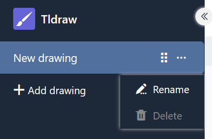

To **change** the **order of the drawings**, hold down the left mouse button on the **gripping surface**  and **drag and drop** the drawing to the desired position. You can also **rename** and **delete** the drawings.



## Available tools

Various tools and elements are available in the **toolbar** below the canvas.

### Selection tool

You can use this tool to select an element that you want to edit, copy, move or delete. As soon as the element is selected, its respective setting options appear on the left.

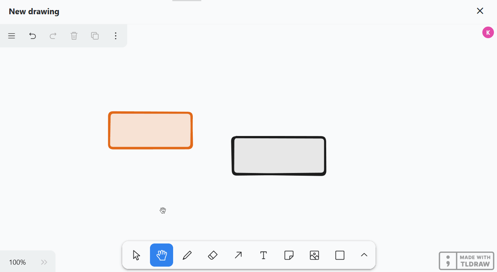

### Hand tool

Use the hand tool to move the canvas without changing anything on the elements. This also works with the selection tool as soon as you hold down the space bar, or with the mouse wheel in a vertical direction.

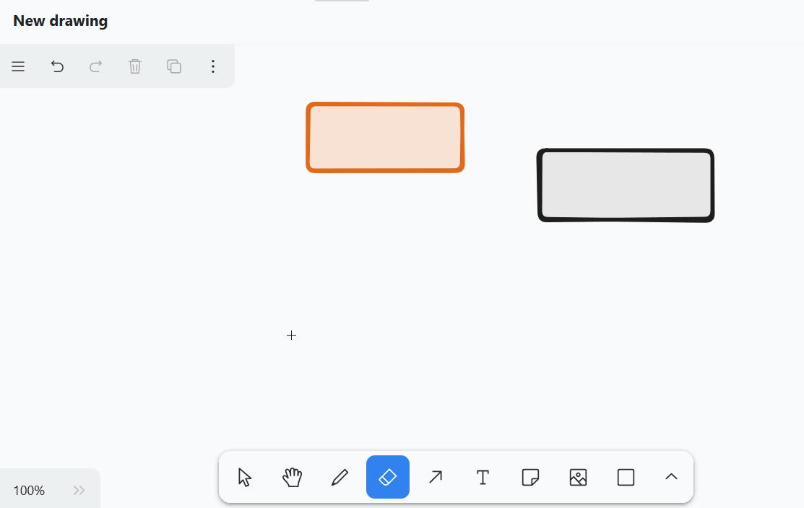

### Drawing tool (pen)

Hold down the left mouse button to draw different lines and shapes freehand. Each time you release the pen, a new element is created that you can select separately and adjust as required.

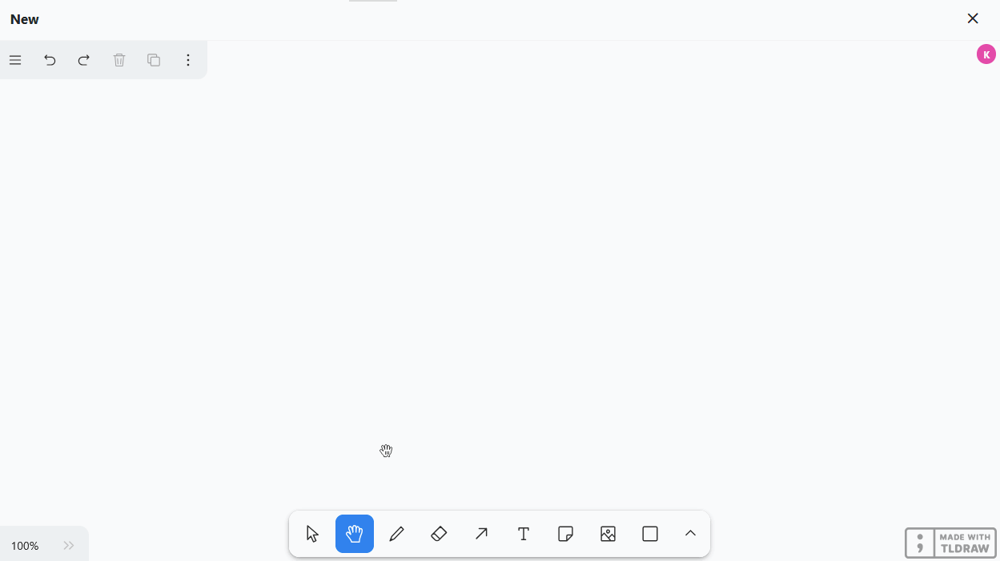

You can choose between **12 colors**, set the **opacity** on the slider and select the **fill mode**. You can also decide whether the strokes should be drawn, dashed, dotted or solid. The **line width** (S, M, L, XL) can also be adjusted.

### Eraser

You can use this tool to erase several elements on the canvas in one go. Hold down the left mouse button while moving the eraser over the elements to be erased.

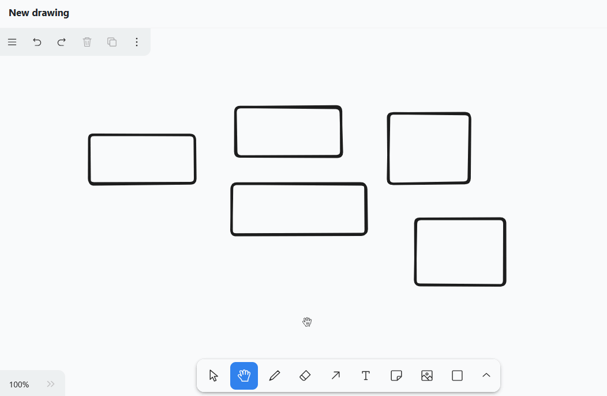

### Arrow tool

Create **arrows** to relate different elements on the canvas to each other. You have the same setting options for arrows as for drawn lines and shapes, but you can also choose from **8 arrowheads**. To **bend** the arrow, drag its center point.

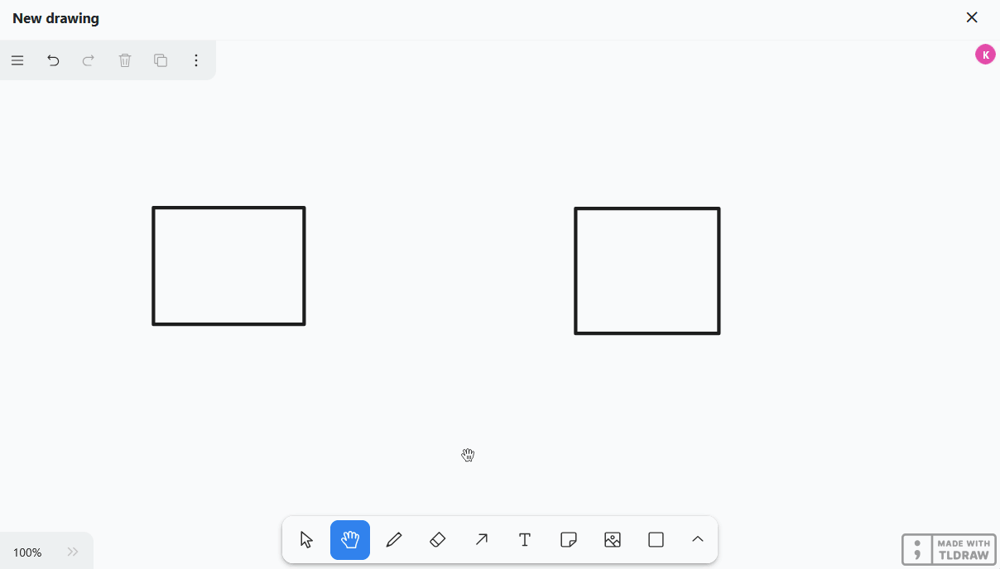

### Text tool

Would you like to place a text or lettering on your canvas? Then simply insert a text element with this tool! Once you have entered the letters, you can set the **font color**, **transparency**, **font size**, **font type** and **text alignment**.

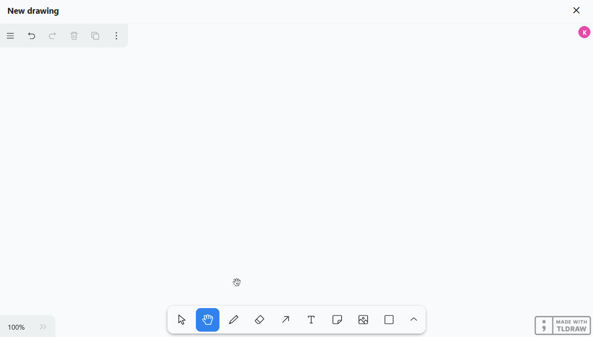

### Hint tool

With this tool, you can easily place **notes** on your canvas to highlight important information. Simply click on the canvas where you want to place the note. A **text field** is already integrated into the element that appears so that you can start writing straight away.

### Image tool

You can use the image tool to insert **images** from your device into the drawing. To do this, select the desired image file in your device's folder system and confirm with a click.

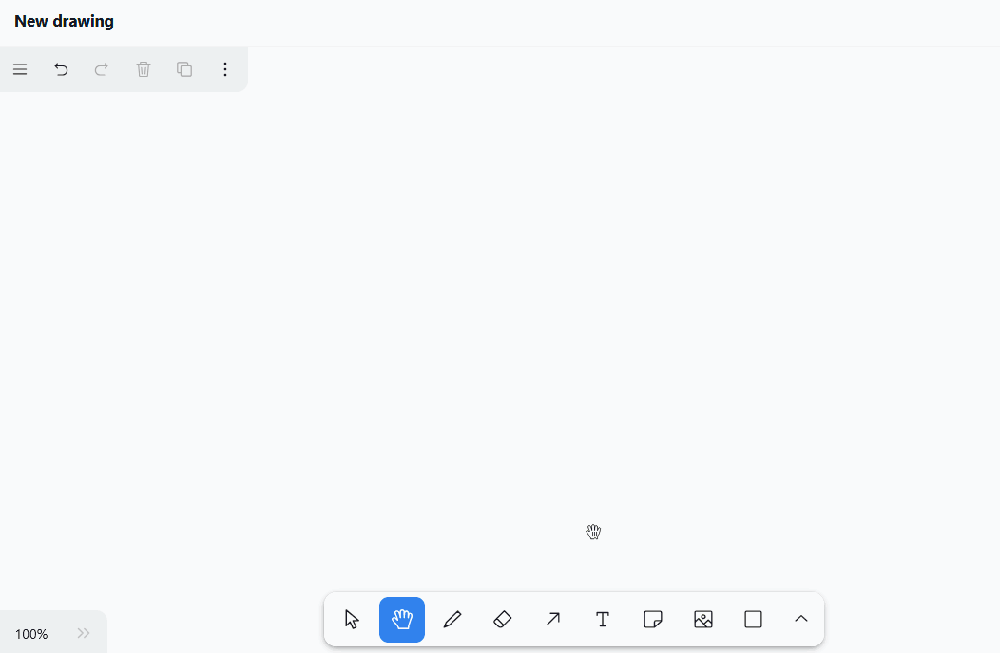

**Mold tool**

You can use this tool to add a variety of **shapes** to your drawing. Select the tool, hold down the left mouse button on the canvas and drag the shape.

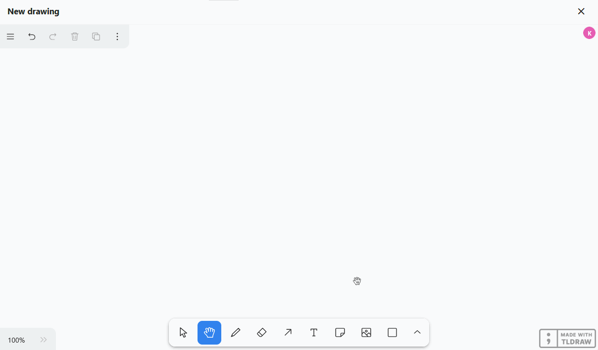

You have 20 shapes to choose from, including

- Rectangles, diamonds, parallelograms and trapezoids
- Triangles, pentagons, hexagons and octagons
- Ellipses and ovals
- Stars, clouds and hearts
- Arrows
- Checkboxes

You can also choose between **12 colors**, set the **opacity** on the slider and change the **fill mode**. You can also decide whether the **outlines** should be drawn, dashed, dotted or solid. The **line width** (S, M, L, XL) can also be adjusted.



### Line tool

This tool creates **lines** that connect two points. You can choose between **12 colors**, set the **opacity** on the slider and decide whether the lines should be drawn, dashed, dotted or solid. The **line width** (S, M, L, XL) can also be adjusted. Drag the center point of the line to create a **corner** or **curve**.

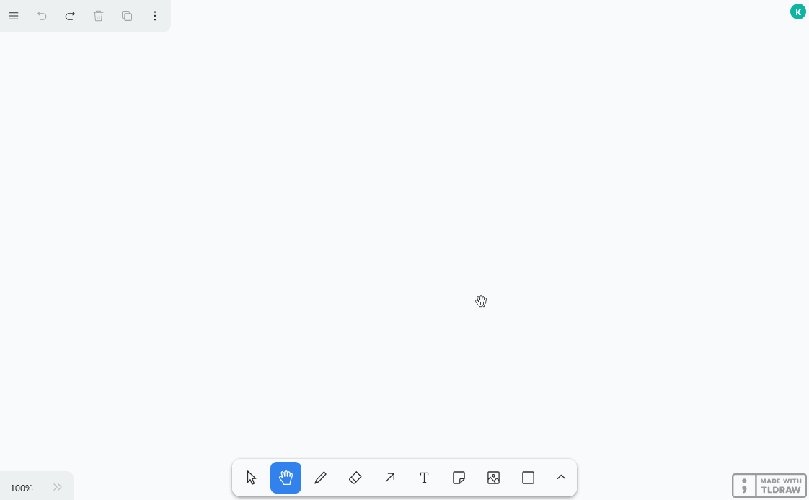

### Marker

You can use this tool to permanently mark certain areas on the canvas, as you would with a **highlighter**. You can set the **color**, **transparency** and **size** of the marker.

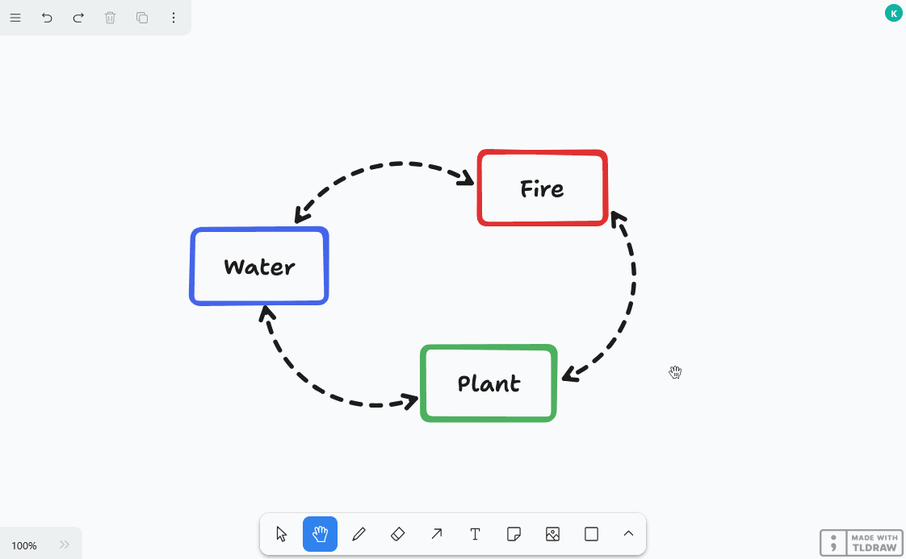

### Laser pointer

This tool is particularly useful for **presentations**. Use the laser pointer to highlight the areas on the screen that you are currently talking about. It creates a red line that disappears again in a matter of seconds.

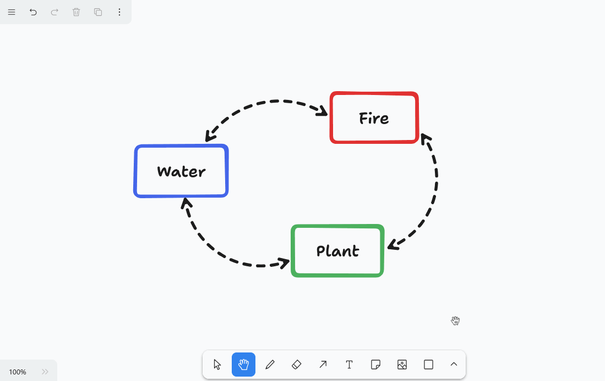

### Frame tool

Use the frame tool to **group** individual elements. As soon as the elements in a frame are combined into a group, you can move, copy, lock and delete them together.

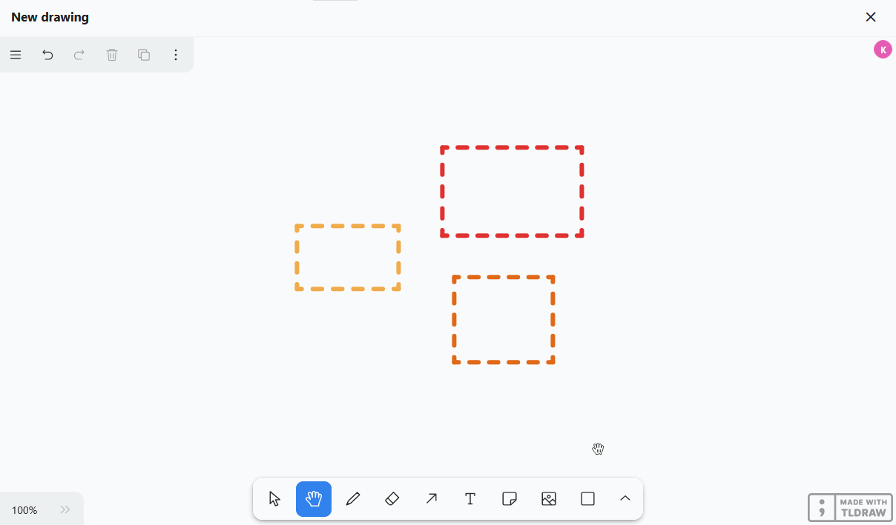

## Edit elements

You can use the various elements to perform certain actions, which we will now look at in detail.

### Insert text into elements

You can **insert text** into shapes such as rectangles and ellipses as standard. To do this, double-click on the corresponding element and enter the desired text. You then have the same setting options as with the text tool.

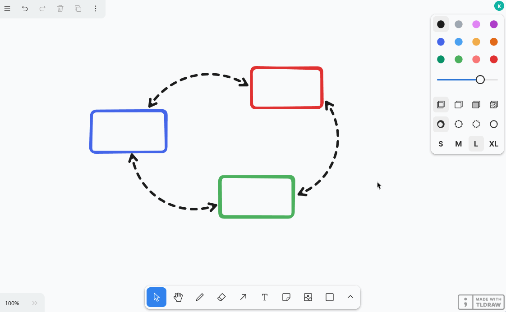

### Move, rotate, enlarge or reduce elements

Use the **selection tool** to click on the element that you want to adjust. Move the mouse over the appropriate **grab point** on the element and drag with the left mouse button pressed to move, rotate, enlarge or reduce the element.

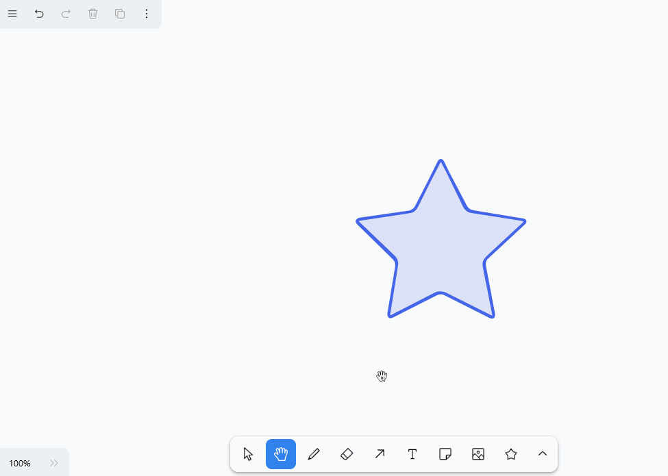

You can also change the **zoom level** of the canvas in the bottom left-hand corner. However, this only changes the size of the visible section and not the size of the elements.

### Duplicate, cut, copy and paste elements

There are three ways to duplicate an element: You can either click on the **Duplicate symbol** or right-click on the element and select **Duplicate** or you can use the **Shortcut** +.

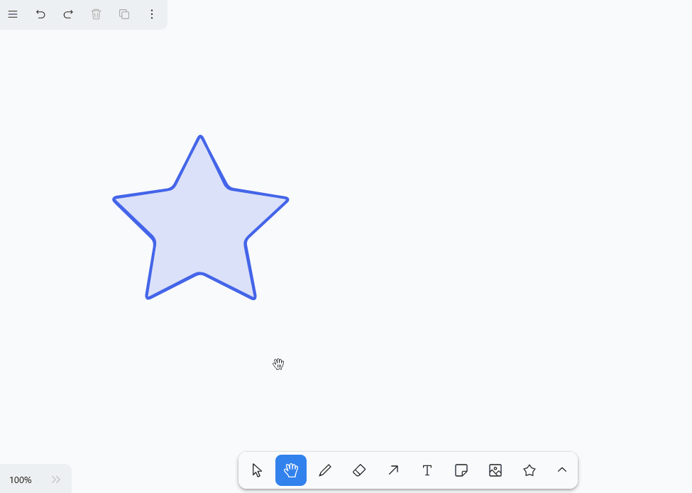

To cut, copy or paste an element, you can right-click on the element and select the desired element in the **Context menu** select the appropriate option or use the familiar **Shortcuts** +, + and + use. You can also copy an element to the clipboard as an image file (PNG or SVG).

### Move elements to the foreground or background

As several elements can overlap on the canvas, you can move each element one level forwards or backwards or completely into the foreground or background. To do this, either click on the **three dots** and one of the **four arrow symbols** at the top left-hand edge or right-click on the element and select the desired option in the **context menu**.

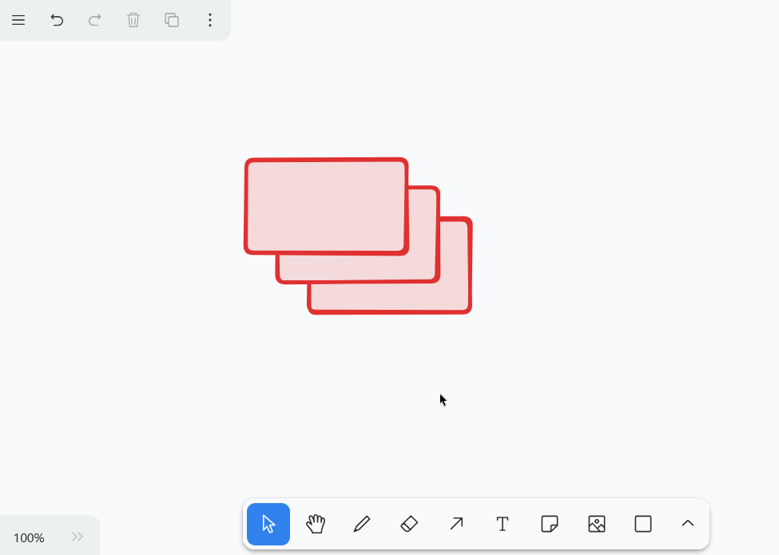

### Link elements

Would you like to add elements (e.g. buttons, images or text) to your drawing that link to specific websites? Then simply link the elements by inserting a URL. To do this, either click on the **three dots** and the **chain symbol** at the top left-hand edge or right-click on the element before selecting **Edit link** in the context menu.

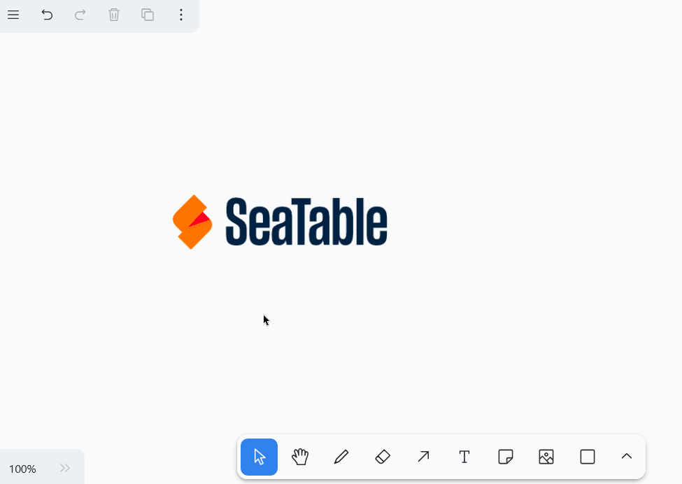

As soon as the element is linked, a **link icon** appears at the top right of the element. Click on it to open the URL. Of course, you can edit the URL later in the same way or delete it from the input field.

### Locking elements

If you want to work on the canvas without accidentally moving or changing certain elements, you can lock the elements. To do this, right-click on the element and select the **Lock** option. To **unlock** locked elements, proceed in the same way.

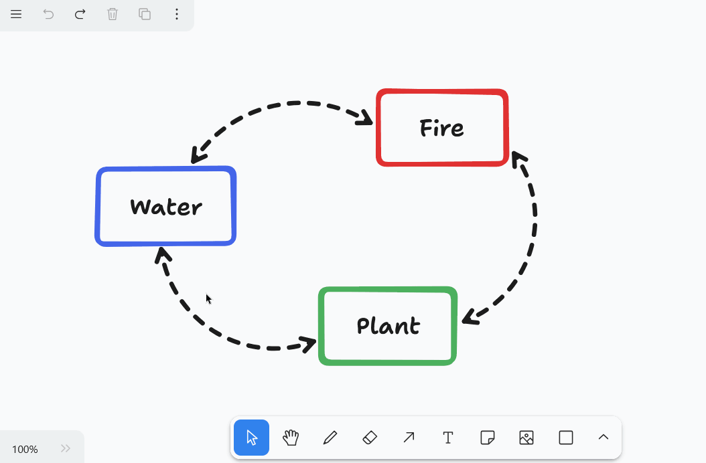

### Delete elements

If you want to delete an element, there are several options: You can either click on the **Trash icon** or right-click on the element and select **Delete** or use the buttons  or .

To quickly and accurately remove several elements from the canvas, you can also use the **eraser** from the toolbar.



You can use the arrow icons at the top left-hand edge to select only the last steps. **undo** or **Restore**. You can also use the familiar shortcuts + and ++ use.

## Screen settings

In the whiteboard plugin, you can make settings for the entire canvas in addition to the settings for the individual elements. To do this, use the burger menu (the three horizontal lines) in the top left-hand corner. We will introduce you to some useful functions below.

- If you want to show a grid to align the elements on the canvas precisely, select **Show grid**.
- If you also activate **Always align with other elements**, intelligent guides appear to align the elements with each other.

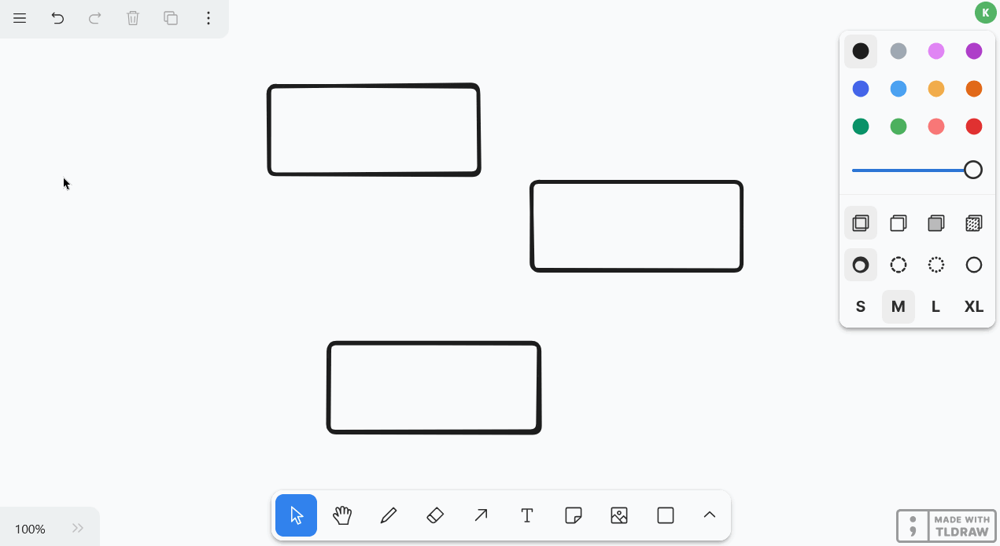

- In **focus mode**, the toolbar and all icons and menus on the canvas are hidden. When selecting elements, the element settings do not open either, so you can click across the canvas and arrange elements without being disturbed.
- With **Select all**, you can select all elements on the canvas at the same time. This is useful, for example, if you want to lock all elements before a presentation so that you cannot accidentally change anything. You can then easily **unlock them all** again.

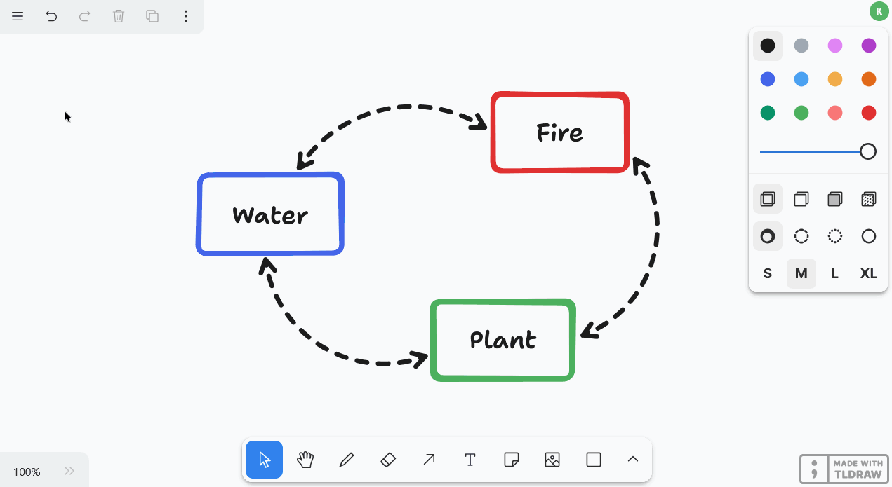

### Set language

To make your work as easy as possible, the whiteboard plugin offers you a much wider choice of languages than the SeaTable user interface. Click on the burger menu (the three horizontal lines), set your **language** and all labels will be translated.

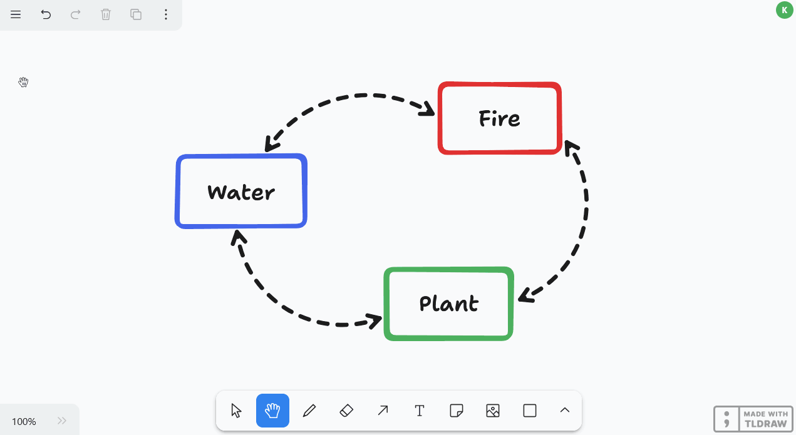

### Switch between light and dark mode

You can also specify whether you want to use the whiteboard in **light or dark mode**. To do this, click on the burger menu (the three horizontal lines) and select the desired mode at the bottom of the settings.

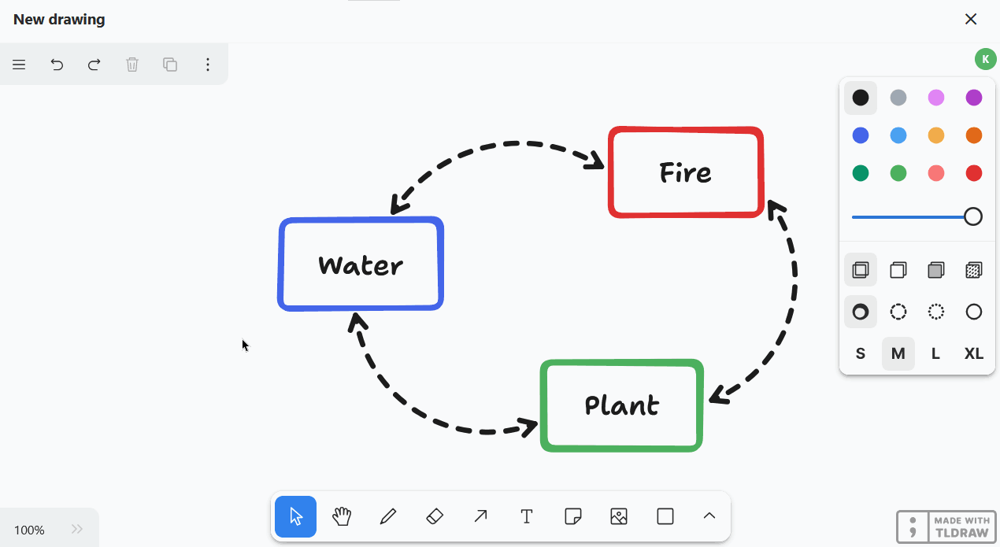

### List of all shortcuts

You can find a clear list of all shortcuts by clicking on the burger menu (the three horizontal lines) and then on **Keyboard shortcuts**.

## Export elements

You can save a drawing to your hard disk by exporting the elements from a canvas. To do this, click on the burger menu (the three horizontal lines) and select **Export all as**. You can use the slider to specify whether the background should be **transparent**. As soon as you click on **SVG** or **PNG**, the corresponding image file will be downloaded. You can also select individual elements and export them as PNG or SVG.

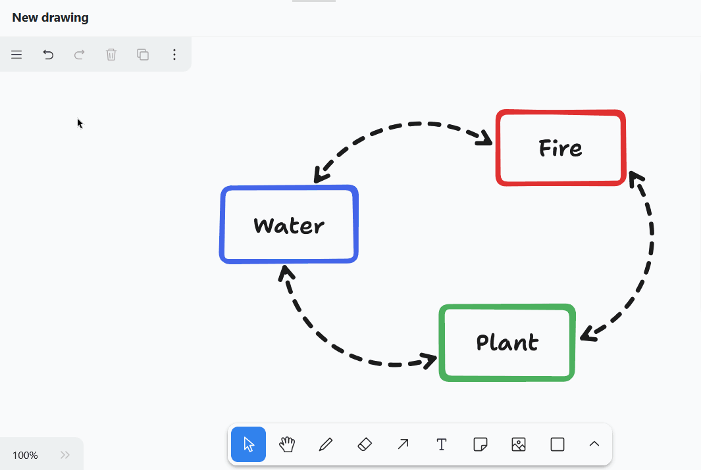


