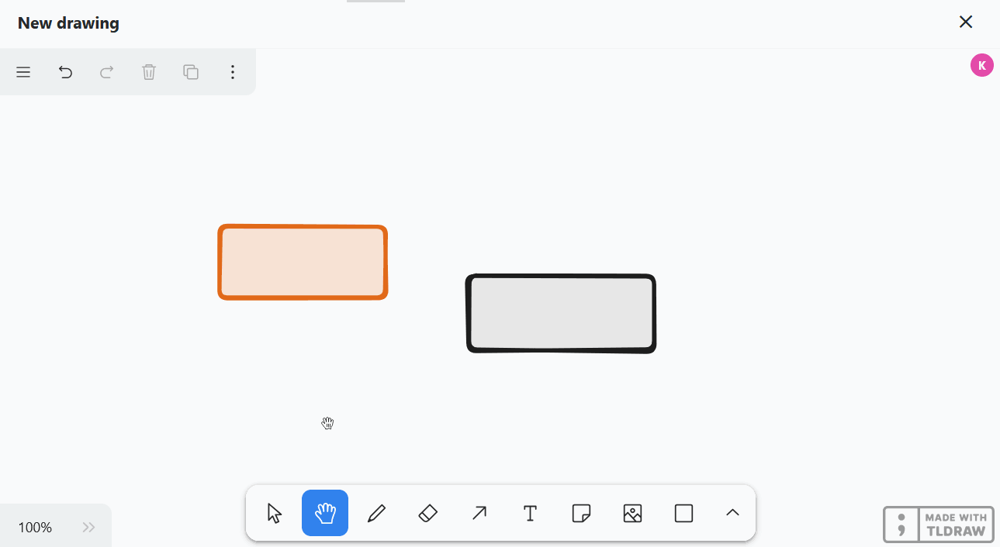
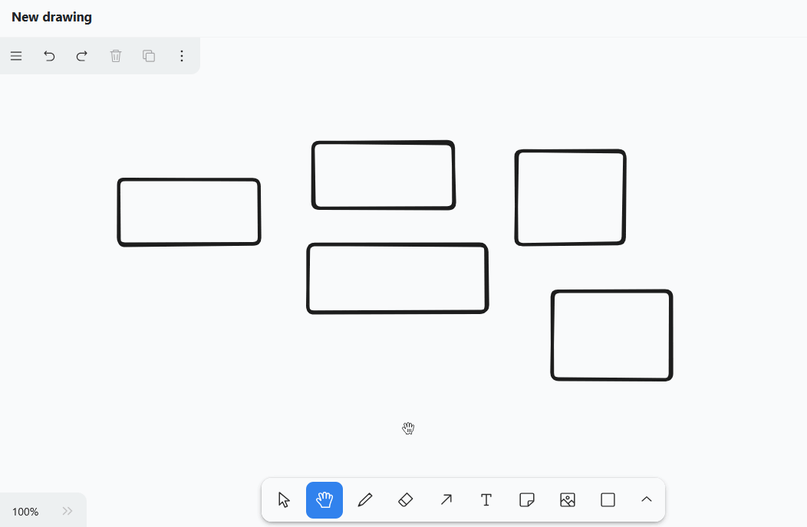

El **plugin de pizarra blanca** te da la libertad de visualizar gráficamente procesos y estructuras que no puedes mostrar con los plugins anteriores. También puedes esbozar libremente diseños y maquetas. Para el diseño, dispones de varios **elementos** como cuadrados, elipses y flechas, así como de **herramientas** como el bolígrafo, el borrador y la herramienta de texto.

Puede encontrar información sobre cómo activar el plugin en una base [aquí](https://seatable.io/es/docs/plugins/aktivieren-eines-plugins-in-einer-base/).

{{< warning  headline="No confundir con el antiguo plugin de pizarra blanca"  text="Hay otro **plugin** de **pizarra blanca** en SeaTable **(obsoleto)** que se basa en el proyecto de código abierto Excalidraw. La sustitución del plugin se ha hecho necesaria porque el antiguo plugin de pizarra no soportaba la colaboración y resultó ser propenso a errores cuando era utilizado por varios usuarios al mismo tiempo. Como parte del lanzamiento de la versión 6.0 en verano de 2025, eliminaremos el antiguo plugin de SeaTable Cloud." />}}

## Configurar las opciones de un dibujo de pizarra

Por defecto, se crea un dibujo con un lienzo en blanco cuando abre el complemento de pizarra por primera vez.  Si desea crear otro dibujo, haga clic en **Añadir dibujo**. Se abrirá un campo de entrada en el que podrá introducir el **nombre** que desee.

Para **cambiar el orden de los dibujos**, mantenga pulsado el botón izquierdo del ratón en la **superficie de agarre**  y **arrastre y suelte** el dibujo en la posición deseada. También puede **renombrar** y **borrar** los dibujos.



## Herramientas disponibles

En la **barra de herramientas** situada debajo del lienzo hay varias herramientas y elementos disponibles.

### Herramienta de selección

Puede utilizar esta herramienta para seleccionar un elemento que desee editar, copiar, mover o eliminar. Una vez seleccionado el elemento, aparecerán a la izquierda las opciones de configuración correspondientes.

### Herramienta manual

Utilice la herramienta de mano para mover el lienzo sin cambiar nada en los elementos. Esto también funciona con la herramienta de selección en cuanto mantienes pulsada la barra espaciadora, o con la rueda del ratón en dirección vertical.

### Herramienta de dibujo (bolígrafo)

Mantenga pulsado el botón izquierdo del ratón para dibujar diferentes líneas y formas a mano alzada. Cada vez que suelte el lápiz, se creará un nuevo elemento que podrá seleccionar por separado y personalizar como desee.

Puede elegir entre **12 colores**, fijar la **opacidad** en el control deslizante y seleccionar el **modo de relleno**. También puedes decidir si los trazos deben ser dibujados, discontinuos, punteados o sólidos. También se puede ajustar la **anchura del trazo** (S, M, L, XL).

### Borrador

Puede utilizar esta herramienta para borrar varios elementos del lienzo de una sola vez. Mantenga pulsado el botón izquierdo del ratón mientras mueve la goma de borrar sobre los elementos que desea borrar.

### Herramienta de flecha

Crea **flechas** para relacionar entre sí distintos elementos del lienzo. Dispone de las mismas opciones de configuración para las flechas que para las líneas y formas dibujadas, pero además puede elegir entre **8 puntas de flecha**. Para **doblar** la flecha, arrastre su punto central.

### Herramienta de texto

¿Quieres colocar un texto o una letra en tu lienzo? Entonces, ¡simplemente inserta un elemento de texto con esta herramienta! Una vez introducidas las letras, puedes configurar el **color de la fuente**, la **transparencia**, el **tamaño de la fuente**, el **tipo de letra** y la **alineación del texto**.

### Herramienta de sugerencias

Con esta herramienta, puedes colocar fácilmente **notas** en el lienzo para resaltar información importante. Sólo tienes que hacer clic en el lienzo donde quieras colocar la nota. En el elemento que aparece ya hay integrado un **campo de texto** para que puedas empezar a escribir directamente.

### Herramienta de imagen

Puede utilizar la herramienta de imagen para insertar **imágenes** de su dispositivo en el dibujo. Para ello, seleccione el archivo de imagen deseado en el sistema de carpetas de su dispositivo y confirme con un clic.

**Herramienta de moldeo**

Puedes utilizar esta herramienta para añadir diversas **formas** a tu dibujo. Seleccione la herramienta, mantenga pulsado el botón izquierdo del ratón sobre el lienzo y arrastre la forma.

Tienes 20 formas para elegir, entre ellas

- Rectángulos, rombos, paralelogramos y trapecios
- Triángulos, pentágonos, hexágonos y octógonos
- Elipses y óvalos
- Estrellas, nubes y corazones
- Flechas
- Casillas de verificación

También puede elegir entre **12 colores**, fijar la **opacidad** en el control deslizante y cambiar el **modo de relleno**. También puedes decidir si los **contornos** deben ser dibujados, discontinuos, punteados o sólidos. También se puede ajustar la **anchura del trazo** (S, M, L, XL).



### Herramienta de línea

Esta herramienta crea **líneas** que conectan dos puntos. Puede elegir entre **12 colores**, ajustar la **opacidad** en el control deslizante y decidir si las líneas deben ser dibujadas, discontinuas, punteadas o sólidas. También se puede ajustar la **anchura de la línea** (S, M, L, XL). Arrastra el punto central de la línea para crear una **esquina** o **curva**.

### Marcador

Puedes utilizar esta herramienta para marcar de forma permanente determinadas zonas del lienzo, como harías con un **rotulador**. Puedes configurar el **color**, la **transparencia** y el **tamaño** del marcador.

### Puntero láser

Esta herramienta es especialmente útil para las **presentaciones**. Utiliza el puntero láser para resaltar las zonas de la pantalla sobre las que estás hablando en ese momento. Crea una línea roja que vuelve a desaparecer en cuestión de segundos.

### Herramienta marco

Utilice la herramienta de marco para **agrupar** elementos individuales. En cuanto los elementos de un marco se hayan combinado en un grupo, podrás moverlos, copiarlos, bloquearlos y eliminarlos juntos.

## Editar elementos

Puede utilizar los distintos elementos para realizar determinadas acciones, que ahora veremos en detalle.

### Insertar texto en elementos

Puede **insertar texto** en formas como rectángulos y elipses de forma estándar. Para ello, haga doble clic en el elemento correspondiente e introduzca el texto deseado. A continuación, dispondrá de las mismas posibilidades de ajuste que con la herramienta de texto.

### Mover, girar, ampliar o reducir elementos

Utilice la **herramienta de selección** para hacer clic en el elemento que desea ajustar. Mueva el ratón sobre el **punto de agarre** adecuado del elemento y arrástrelo con el botón izquierdo del ratón pulsado para mover, girar, ampliar o reducir el elemento.

También puede cambiar el **nivel de zoom** del lienzo en la esquina inferior izquierda. Sin embargo, esto sólo cambia el tamaño de la sección visible y no el de los elementos.

### Duplicar, cortar, copiar y pegar elementos

Hay tres formas de duplicar un elemento: Puede hacer clic en el icono **Símbolo duplicado** o haga clic con el botón derecho en el elemento y seleccione **Duplicar** o puede utilizar la función **Atajo** +.

Para cortar, copiar o pegar un elemento, puede hacer clic con el botón derecho del ratón sobre el elemento y seleccionar el elemento deseado en el menú **Menú contextual** seleccione la opción adecuada o utilice el conocido **Atajos** +, + y + utilizar. También puede copiar un elemento en el portapapeles como archivo de imagen (PNG o SVG).

### Mover elementos al primer o segundo plano

Como varios elementos pueden superponerse en el lienzo, puede desplazar cada elemento un nivel hacia delante o hacia atrás o completamente hacia el primer o el segundo plano. Para ello, haz clic en los **tres puntos** y en uno de los **cuatro símbolos de flecha** del borde superior izquierdo o haz clic con el botón derecho del ratón en el elemento y selecciona la opción deseada en el **menú contextual**.

### Elementos de enlace

¿Quiere añadir a su dibujo elementos (botones, imágenes o texto) que enlacen a sitios web concretos? Entonces sólo tienes que enlazar los elementos insertando una URL. Para ello, haga clic en los **tres puntos** y el **símbolo de la cadena** en el borde superior izquierdo o haga clic con el botón derecho del ratón en el elemento y seleccione **Editar enlace** en el menú contextual.

En cuanto el elemento esté enlazado, aparecerá un **icono de enlace** en la parte superior derecha del elemento. Haga clic en él para abrir la URL. Por supuesto, puede editar la URL más tarde de la misma manera o eliminarla del campo de entrada.

### Elementos de cierre

Si quieres trabajar en el lienzo sin mover o cambiar accidentalmente determinados elementos, puedes bloquearlos. Para ello, haga clic con el botón derecho del ratón sobre el elemento y seleccione la opción **Bloquear**. Para **desbloquear** elementos bloqueados, proceda del mismo modo.

### Eliminar elementos

Si desea eliminar un elemento, tiene varias opciones: Puede hacer clic en el icono **Icono de la papelera** o haga clic con el botón derecho en el elemento y seleccione **Borrar** o utilice los botones  o .

Para eliminar con rapidez y precisión varios elementos del lienzo, también puedes utilizar la **goma de borrar** de la barra de herramientas.



Puede utilizar los iconos de flecha del borde superior izquierdo sólo para seleccionar los últimos pasos. **deshacer** o **Restaurar**. También puedes utilizar los conocidos atajos + y ++ utilizar.

## Ajustes de pantalla

En el plugin de la pizarra, puedes realizar ajustes para todo el lienzo además de los ajustes para los elementos individuales. Para ello, utilice el menú hamburguesa (las tres líneas horizontales) situado en la esquina superior izquierda. A continuación te presentamos algunas funciones útiles.

- Si desea mostrar una cuadrícula para alinear con precisión los elementos en el lienzo, seleccione **Mostrar cuadrícula**.
- Si además activa **Alinear siempre con otros elementos**, aparecerán guías inteligentes para alinear los elementos entre sí.

- En el **modo de enfoque**, la barra de herramientas y todos los iconos y menús del lienzo están ocultos. Al seleccionar elementos, tampoco se abren los ajustes de elementos, por lo que puedes hacer clic por todo el lienzo y organizar elementos sin que te molesten.
- Con **Seleccionar todo**, puede seleccionar todos los elementos del lienzo al mismo tiempo. Esto es útil, por ejemplo, si quieres bloquear todos los elementos antes de una presentación para que no puedas cambiar nada accidentalmente. Después puedes volver a **desbloquearlos** fácilmente.

### Establecer idioma

Para facilitarle al máximo su trabajo, el plugin de pizarra blanca le ofrece un número de idiomas a elegir muy superior al de la interfaz de usuario de SeaTable. Haga clic en el menú hamburguesa (las tres líneas horizontales), configure su **idioma** y todo el etiquetado se traducirá.

### Cambiar entre modo claro y oscuro

También puedes especificar si quieres utilizar la pizarra en **modo claro u oscuro**. Para ello, haz clic en el menú de la hamburguesa (las tres líneas horizontales) y selecciona el modo deseado en la parte inferior de los ajustes.

### Lista de todos los accesos directos

Puedes encontrar una lista clara de todos los atajos haciendo clic en el menú hamburguesa (las tres líneas horizontales) y luego en **Atajos de teclado**.

## Elementos de exportación

Puedes guardar un dibujo en tu disco duro exportando los elementos de un lienzo. Para ello, haga clic en el menú de la hamburguesa (las tres líneas horizontales) y seleccione **Exportar todo como**. Puedes utilizar el control deslizante para especificar si el fondo debe ser **transparente**. En cuanto haga clic en **SVG** o **PNG**, se descargará el archivo de imagen correspondiente. También puede seleccionar elementos individuales y exportarlos como PNG o SVG.


