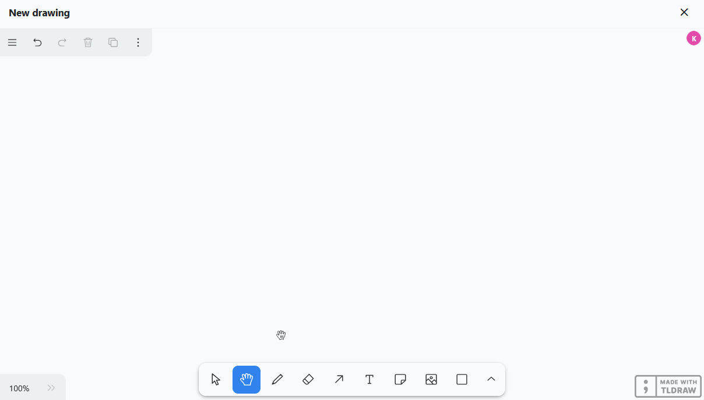
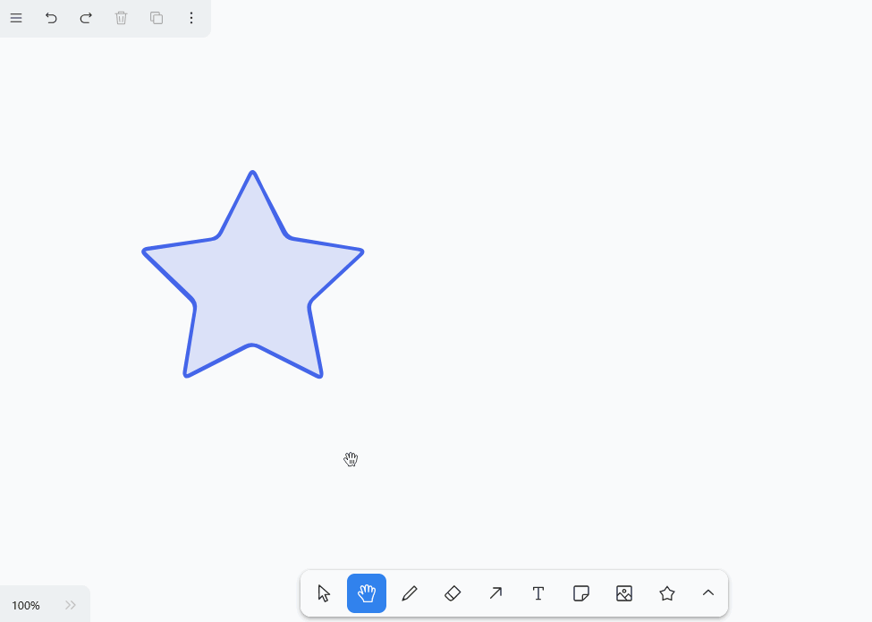
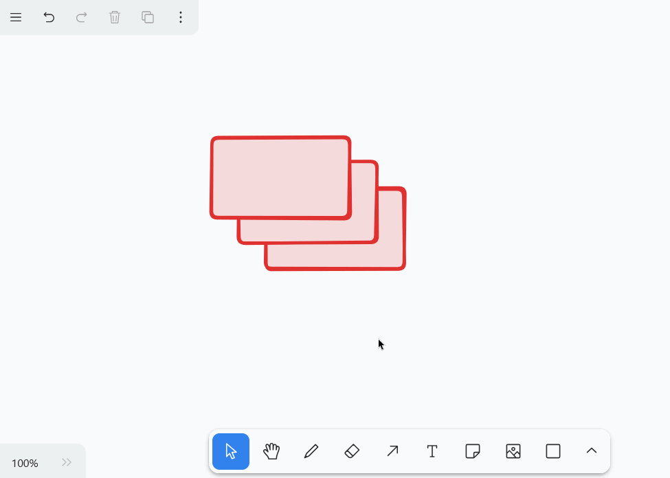
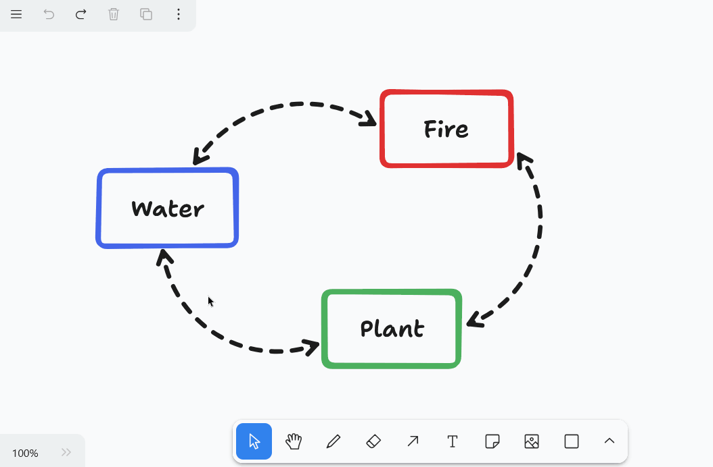
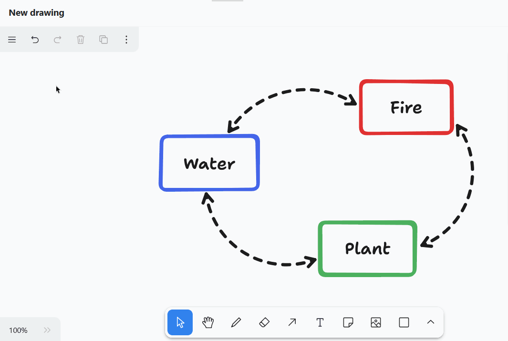

Le **plug-in Whiteboard** vous donne la liberté de visualiser graphiquement des processus et des structures que vous ne pouvez pas représenter avec les plug-ins précédents. De même, vous pouvez esquisser librement des mises en page et des mockups. Pour la conception, vous avez le choix entre différents **éléments** tels que des carrés, des ellipses et des flèches ainsi que **des outils** tels que le stylo, la gomme et l'outil de texte.

Pour savoir comment activer le plugin dans une base, [cliquez ici]().



SeaTable contient un autre **plug-in de tableau blanc (obsolète)**, basé sur le projet open source Excalidraw. Le remplacement de ce plug-in était devenu nécessaire, car l'ancien plug-in de tableau blanc ne prenait pas en charge la collaboration et s'avérait sujet à des dysfonctionnements lorsque plusieurs utilisateurs l'utilisaient simultanément. Dans le cadre de la version 6.0 prévue pour l'été 2025, nous supprimerons l'ancien plugin de SeaTable Cloud.



## Possibilités de réglage d'un dessin sur tableau blanc

Par défaut, un dessin avec un canevas vide est déjà créé lors de la première ouverture du plugin de tableau blanc. Si vous souhaitez créer un autre dessin, cliquez sur  **Ajouter un dessin**. Un champ de saisie s'ouvre alors, dans lequel vous tapez le **nom** souhaité.

Pour modifier l'**ordre des dessins**, il suffit de maintenir le bouton gauche de la souris enfoncé sur la **surface de préhension**  et **de glisser-déposer** le dessin à l'endroit souhaité. En outre, vous pouvez **renommer** et **supprimer** les dessins.



## Outils disponibles

Dans la **barre d'outils** située sous le canevas, vous disposez de différents outils et éléments.

### Outil de sélection

Cet outil vous permet de sélectionner un élément que vous souhaitez modifier, copier, déplacer ou supprimer. Une fois l'élément sélectionné, ses options de configuration respectives apparaissent à gauche.

### Outillage à main

Utilisez l'outil Main pour déplacer le canevas sans rien changer aux éléments. Cela fonctionne également avec l'outil Sélection, dès que vous maintenez la barre d'espacement enfoncée, ou avec la molette de la souris dans le sens vertical.

### Outil de dessin (stylo)

Maintenez le bouton gauche de la souris enfoncé pour dessiner à main levée différentes lignes et formes. Chaque fois que vous posez le crayon, un nouvel élément apparaît, que vous pouvez sélectionner séparément et adapter à votre guise.

Vous avez le choix entre **12 couleurs**, vous pouvez régler l'**opacité** sur le curseur et choisir le **mode de remplissage**. Décidez également si les traits doivent être dessinés, en pointillés, en points ou continus. Vous pouvez également adapter l'**épaisseur des traits** (S, M, L, XL).

### Gomme

Cet outil permet d'effacer d'un seul coup plusieurs éléments sur le canevas. Maintenez le bouton gauche de la souris enfoncé tout en passant la gomme sur les éléments à effacer.

### Outil flèche

Créez **des flèches** pour mettre en relation différents éléments sur le canevas. Vous disposez pour les flèches des mêmes options de réglage que pour les lignes et les formes dessinées, mais vous pouvez en outre choisir parmi **8 pointes de flèches**. Pour **courber** la flèche, faites glisser son centre.

### Outil texte

Vous souhaitez placer un texte ou une inscription sur votre toile ? Alors, insérez simplement un élément de texte à l'aide de cet outil ! Une fois que vous avez saisi les lettres, vous pouvez régler la **couleur de la police**, la **transparence**, la **taille de la police**, la **police** et l'**orientation du texte**.

### Outil de remarque

Cet outil vous permet de placer très facilement **des notes** sur votre toile afin de mettre en évidence des informations importantes. Il suffit de cliquer sur le canevas à l'endroit où vous souhaitez placer la note. Une **zone de texte** est intégrée à l'élément qui apparaît, ce qui vous permet de commencer à écrire directement.

### Outil d'image

L'outil Image vous permet d'insérer **des images** de votre appareil dans le dessin. Pour ce faire, sélectionnez le fichier image souhaité dans le système de dossiers de votre appareil et confirmez en cliquant dessus.

**Outil de forme**

Cet outil vous permet d'ajouter des **formes** variées à votre dessin. Sélectionnez l'outil, maintenez le bouton gauche de la souris enfoncé sur le canevas et faites glisser la forme.

Vous avez le choix entre 20 formes, dont

- Rectangles, losanges, parallélogrammes et trapèzes
- Triangles, pentagones, hexagones et octogones
- Ellipses et ovales
- Étoiles, nuages et cœurs
- Flèches
- Cases à cocher

Vous pouvez également choisir entre **12 couleurs**, régler l'**opacité** sur le curseur et modifier le **mode de remplissage**. Décidez également si les **contours** doivent être dessinés, en pointillés, en points ou en traits continus. L'**épaisseur du trait** (S, M, L, XL) peut également être adaptée.



### Outil Lignes

Cet outil crée **des lignes** qui relient deux points. Vous avez le choix entre **12 couleurs**, vous pouvez régler l'**opacité** sur le curseur et décider si les lignes doivent être dessinées, pointillées, en pointillés ou continues. L'**épaisseur du trait** (S, M, L, XL) peut également être adaptée. Faites glisser le centre de la ligne pour faire un **angle** ou **une courbe**.

### Marqueur

Cet outil vous permet de marquer durablement certains endroits sur le canevas, comme vous le feriez par analogie avec un **surligneur**. Vous pouvez régler la **couleur**, la **transparence** et la **taille** du marquage.

### Pointeur laser

Cet outil est particulièrement utile pour les **présentations**. Utilisez le pointeur laser pour mettre en évidence les endroits de l'écran dont vous êtes en train de parler. Il crée un trait rouge qui disparaît en quelques secondes.

### Outil de cadre

Utilisez l'outil Cadre pour **regrouper** des éléments individuels. Dès que les éléments d'un cadre sont réunis en un groupe, vous pouvez les déplacer, les copier, les verrouiller et les supprimer ensemble.

## Modifier des éléments

Les différents éléments permettent d'effectuer certaines actions que nous allons maintenant examiner en détail.

### Insérer du texte dans des éléments

Dans les formes telles que les rectangles et les ellipses, vous pouvez **insérer des textes** par défaut. Pour ce faire, double-cliquez sur l'élément correspondant et saisissez le texte souhaité. Vous disposez ensuite des mêmes options de réglage que pour l'outil Texte.

### Déplacer, faire pivoter, agrandir ou réduire des éléments

Avec l'**outil de sélection**, cliquez sur l'élément que vous souhaitez adapter. Passez la souris sur le **point de préhension** approprié de l'élément et faites glisser en maintenant le bouton gauche de la souris enfoncé pour déplacer, faire pivoter, agrandir ou réduire l'élément.

En outre, vous pouvez modifier le **niveau de zoom** du canevas dans le coin inférieur gauche. Toutefois, cela ne modifie que la taille de la partie visible et non la taille des éléments.

### Dupliquer, couper, copier et coller des éléments

Pour dupliquer un élément, il existe trois possibilités : Soit vous cliquez en haut à gauche sur le **Icône de duplication** ou faites un clic droit sur l'élément et choisissez dans le menu contextuel **Dupliquer** ou vous pouvez utiliser le **Raccourci** +.

Pour couper, copier ou coller un élément, vous pouvez faire un clic droit sur l'élément et cliquer sur le bouton "Couper" dans le menu contextuel. **Menu contextuel** sélectionner l'option correspondante ou utiliser les fameux **Raccourcis** +, + et + pour l'utiliser. En outre, vous pouvez copier un élément dans le presse-papiers sous forme de fichier image (PNG ou SVG).

### Mettre des éléments au premier plan ou à l'arrière-plan

Comme plusieurs éléments peuvent se superposer sur le canevas, vous pouvez déplacer chaque élément d'un niveau vers l'avant ou vers l'arrière, ou encore le placer entièrement au premier plan ou à l'arrière-plan. Pour ce faire, cliquez sur les **trois points** en haut à gauche et sur l'un des **quatre symboles de flèche** ou faites un clic droit sur l'élément et choisissez l'option souhaitée dans le **menu contextuel**.

### Lier des éléments

Vous souhaitez ajouter à votre dessin des éléments (par exemple des boutons, des images ou du texte) qui renvoient à des pages web spécifiques ? Il vous suffit alors d'insérer un lien URL vers ces éléments. Pour ce faire, cliquez soit sur les **trois points** et le **symbole de chaîne** en haut à gauche, soit faites un clic droit sur l'élément avant de sélectionner **Editer le lien** dans le menu contextuel.

Dès que l'élément est lié, une **icône de renvoi** apparaît en haut à droite de l'élément. Cliquez dessus pour ouvrir l'URL. Vous pouvez bien sûr modifier l'URL ultérieurement de la même manière ou la supprimer du champ de saisie.

### Verrouiller des éléments

Si vous souhaitez travailler sur le canevas sans déplacer ou modifier certains éléments par inadvertance, vous pouvez verrouiller les éléments. Pour ce faire, faites un clic droit sur l'élément et sélectionnez l'option **Verrouiller**. Pour **déverrouiller** les éléments verrouillés, procédez de la même manière.

### Supprimer des éléments

Si vous souhaitez supprimer un élément, vous avez plusieurs possibilités : Soit vous cliquez en haut à gauche sur l'icône **Icône de la corbeille** ou faites un clic droit sur l'élément et choisissez dans le menu contextuel **Supprimer** ou utilisez les boutons  ou .

Pour supprimer rapidement et avec précision plusieurs éléments du canevas, vous pouvez également utiliser la **gomme** de la barre d'outils.



Les symboles fléchés en haut à gauche vous permettent de n'afficher que les dernières étapes. **annuler** ou **restaurer**. Vous pouvez également utiliser les raccourcis bien connus + et ++ utiliser.

## Réglages de l'écran

Dans le plug-in Whiteboard, vous pouvez non seulement effectuer des réglages pour les différents éléments, mais aussi pour l'ensemble du canevas. Utilisez pour cela le menu Burger (les trois traits horizontaux) dans le coin supérieur gauche. Nous vous présentons ci-dessous quelques fonctions utiles.

- Si vous souhaitez afficher une grille afin d'aligner précisément les éléments sur le canevas, sélectionnez **Afficher la grille**.
- Si vous activez également **Toujours aligner sur d'autres éléments**, des lignes d'aide intelligentes apparaissent pour aligner les éléments les uns par rapport aux autres.

- En **mode focus**, la barre d'outils, les icônes et les menus du canevas sont masqués. Lorsque vous sélectionnez des éléments, les paramètres des éléments ne s'ouvrent pas non plus, ce qui vous permet de cliquer sur le canevas et d'organiser les éléments sans être dérangé.
- **Sélectionner tout vous** permet de marquer simultanément tous les éléments du canevas. C'est utile, par exemple, si vous souhaitez verrouiller tous les éléments avant une présentation afin de ne rien modifier par inadvertance. Vous pouvez ensuite **tous les déverrouiller** facilement.

### Régler la langue

Pour vous faciliter la tâche, le plugin pour tableau blanc vous permet de choisir beaucoup plus de langues que l'interface utilisateur de SeaTable. Pour cela, cliquez sur le menu Burger (les trois traits horizontaux), définissez votre **langue** et toutes les inscriptions seront traduites.

### Passer du mode clair au mode sombre

En outre, vous pouvez déterminer vous-même si vous souhaitez utiliser le tableau blanc en **mode clair ou foncé**. Pour ce faire, cliquez sur le menu Burger (les trois traits horizontaux) et sélectionnez le mode souhaité dans les paramètres tout en bas.

### Liste de tous les raccourcis

Vous trouverez une liste claire de tous les raccourcis en cliquant sur le menu Burger (les trois traits horizontaux), puis sur **Raccourcis clavier**.

## Exporter des éléments

Vous pouvez enregistrer un dessin sur votre disque dur en exportant les éléments d'un canevas. Pour ce faire, cliquez sur le menu Burger (les trois traits horizontaux) et sélectionnez **Exporter tout en tant que**. Avec le curseur, vous pouvez définir si l'arrière-plan doit être **transparent**. Dès que vous cliquez sur **SVG** ou **PNG**, le fichier image correspondant est téléchargé. En outre, vous pouvez également sélectionner des éléments individuels et les exporter au format PNG ou SVG.


