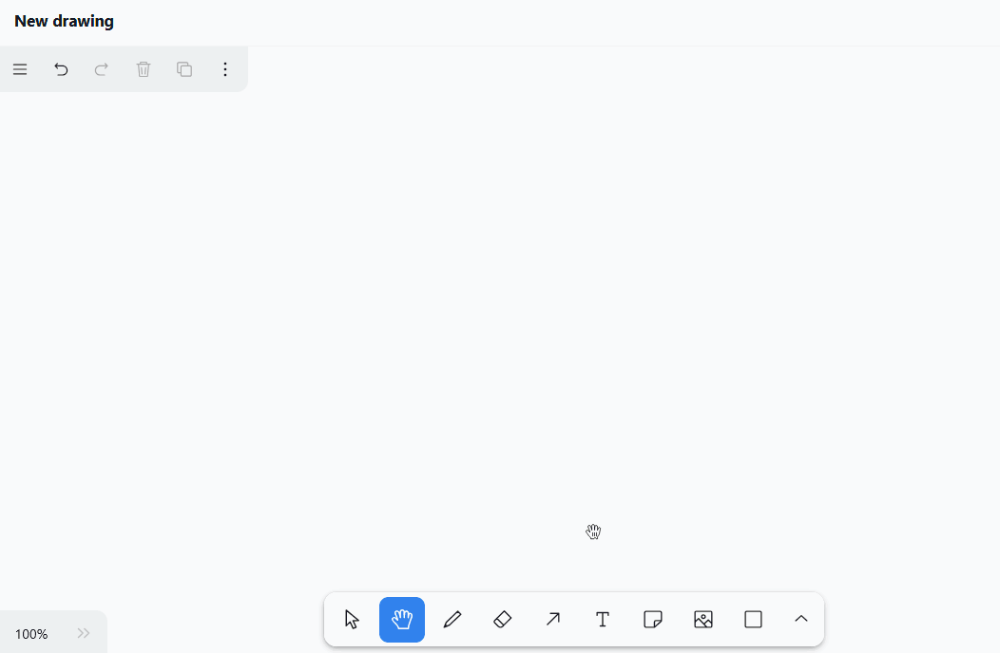
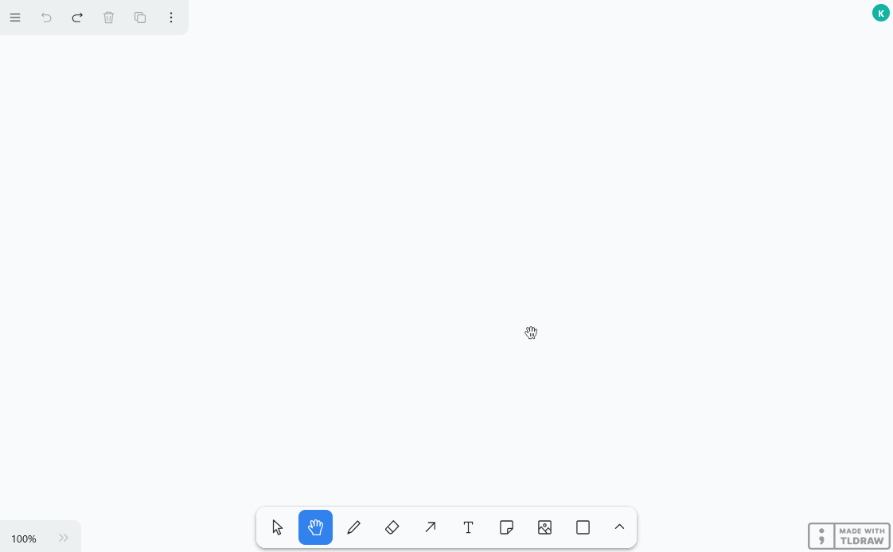
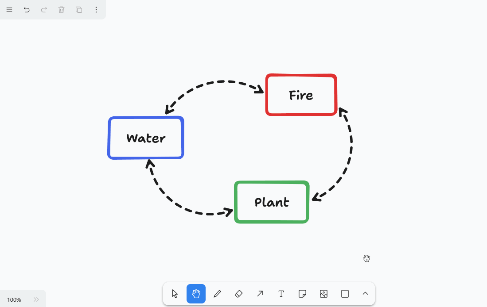
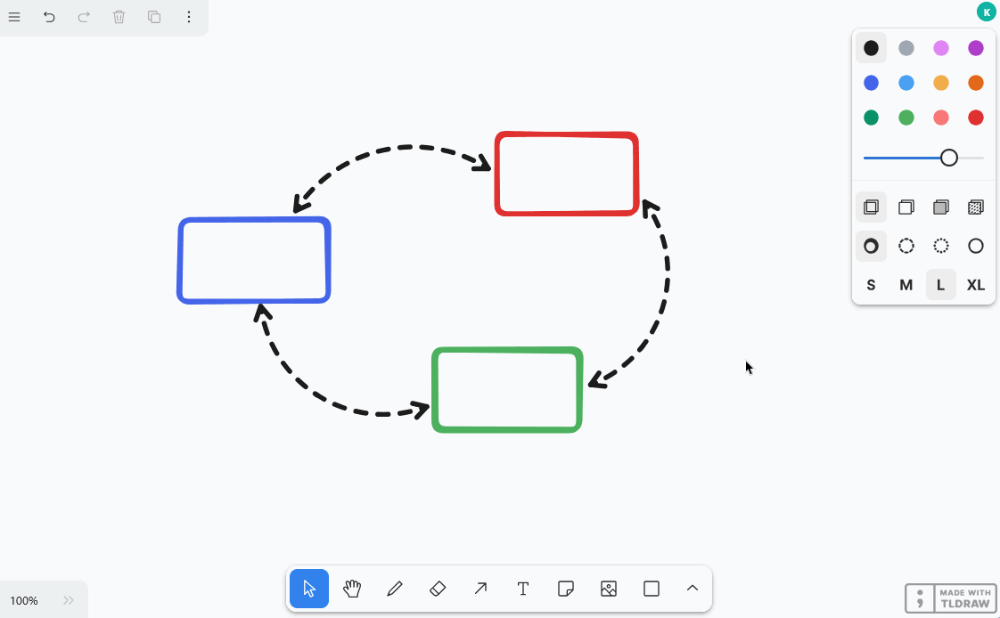
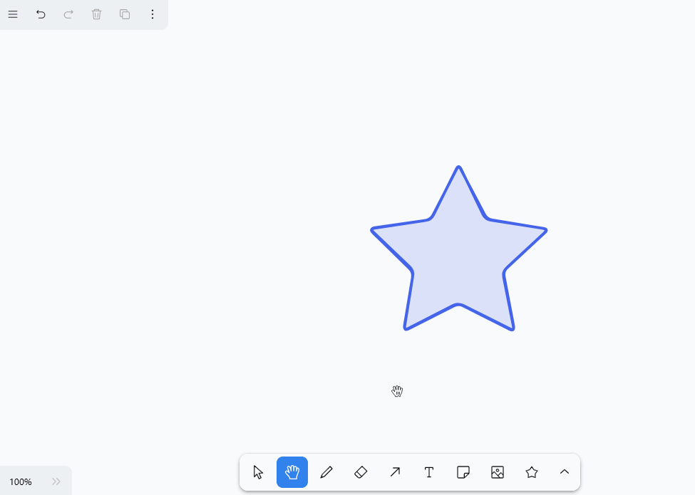

Das **Whiteboard-Plugin** gibt Ihnen die Freiheit, Prozesse und Strukturen grafisch zu visualisieren, die Sie mit den bisherigen Plugins nicht darstellen können. Ebenso können Sie Layouts und Mockups frei skizzieren. Für die Gestaltung haben Sie verschiedene **Elemente** wie Vierecke, Ellipsen und Pfeile sowie **Werkzeuge** wie Stift, Radierer und das Text-Werkzeug zur Auswahl.

Wie Sie das Plugin in einer Base aktivieren, erfahren Sie [hier](
).



## Einstellungsmöglichkeiten einer Whiteboard-Zeichnung

Standardmäßig ist beim ersten Öffnen des Whiteboard-Plugins bereits eine Zeichnung mit leerer Leinwand angelegt. Wenn Sie eine weitere Zeichnung erstellen möchten, klicken Sie auf  **Zeichnung hinzufügen**. Daraufhin öffnet sich ein Eingabefeld, in das Sie den gewünschten **Namen** tippen.

Um die **Reihenfolge der Zeichnungen zu ändern**, halten Sie die linke Maustaste an der **Greiffläche**  gedrückt und ziehen die Zeichnung **per Drag-and-Drop** an die gewünschte Stelle. Darüber hinaus können Sie die Zeichnungen **umbenennen** und **löschen**.



## Verfügbare Werkzeuge

In der **Werkzeugleiste** unterhalb der Leinwand stehen Ihnen verschiedene Werkzeuge und Elemente zur Verfügung.

### Auswahl-Werkzeug

Mit diesem Werkzeug können Sie ein Element auswählen, das Sie bearbeiten, kopieren, verschieben oder löschen möchten. Sobald das Element ausgewählt ist, erscheinen links seine jeweiligen Einstellungsoptionen.

### Hand-Werkzeug

Nutzen Sie das Hand-Werkzeug, um die Leinwand zu bewegen, ohne etwas an den Elementen zu verändern. Dies funktioniert ebenso mit dem Auswahl-Werkzeug, sobald Sie die Leertaste gedrückt halten, oder mit dem Mausrad in vertikaler Richtung.

### Zeichen-Werkzeug (Stift)

Halten Sie die linke Maustaste gedrückt, um frei Hand verschiedene Linien und Formen zu zeichnen. Immer wenn Sie mit dem Stift absetzen, entsteht ein neues Element, das Sie separat anwählen und nach Belieben anpassen können.

Sie haben die Auswahl zwischen **12 Farben**, können auf dem Regler die **Deckkraft** einstellen und den **Füllmodus** wählen. Entscheiden Sie zudem, ob die Striche gezeichnet, gestrichelt, gepunktet oder durchgezogen sein sollen. Auch die **Strichstärke** (S, M, L, XL) lässt sich anpassen.

### Radierer

Mit diesem Werkzeug können Sie auf einen Streich mehrere Elemente auf der Leinwand löschen. Halten Sie die linke Maustaste gedrückt, während Sie mit dem Radierer über die zu löschenden Elemente fahren.

### Pfeil-Werkzeug

Erstellen Sie **Pfeile**, um verschiedene Elemente auf der Leinwand miteinander in Beziehung zu setzen. Sie haben für Pfeile die gleichen Einstellungsoptionen wie bei gezeichneten Linien und Formen, können aber zusätzlich noch aus **8 Pfeilspitzen** wählen. Um den Pfeil zu **biegen**, ziehen Sie an seinem Mittelpunkt.

### Text-Werkzeug

Sie möchten einen Text oder Schriftzug auf Ihrer Leinwand platzieren? Dann fügen Sie mit diesem Werkzeug einfach ein Textelement ein! Sobald Sie die Buchstaben eingegeben haben, können Sie die **Schriftfarbe**, die **Transparenz**, die **Schriftgröße**, die **Schriftart** und die **Textausrichtung** einstellen.

### Hinweis-Werkzeug

Mit diesem Werkzeug können Sie kinderleicht **Notizzettel** auf Ihrer Leinwand platzieren, um wichtige Informationen hervorzuheben. Klicken Sie einfach auf die Leinwand, wo Sie die Notiz platzieren möchten. Beim erscheinenden Element ist bereits ein **Textfeld** integriert, sodass Sie direkt losschreiben können.

### Bild-Werkzeug

Mit dem Bild-Werkzeug können Sie **Bilder** von Ihrem Gerät in die Zeichnung einfügen. Dazu wählen Sie die gewünschte Bilddatei im Ordnersystem Ihres Geräts aus und bestätigen mit einem Klick.

**Form-Werkzeug**

Mit diesem Werkzeug können Sie vielfältige **Formen** zu Ihrer Zeichnung hinzufügen. Wählen Sie das Werkzeug aus, halten Sie die linke Maustaste auf der Leinwand gedrückt und ziehen Sie die Form auf.

Sie haben 20 Formen zur Auswahl, darunter

- Rechtecke, Rauten, Parallelogramme und Trapeze
- Dreiecke, Fünfecke, Sechsecke und Achtecke
- Ellipsen und Ovale
- Sterne, Wolken und Herzen
- Pfeile
- Checkboxen

Zudem können Sie zwischen **12 Farben** wählen, auf dem Regler die **Deckkraft** einstellen und den **Füllmodus** ändern. Entscheiden Sie ferner, ob die **Konturen** gezeichnet, gestrichelt, gepunktet oder durchgezogen sein sollen. Auch die **Strichstärke** (S, M, L, XL) lässt sich anpassen.



### Linien-Werkzeug

Dieses Werkzeug erstellt **Linien**, die zwei Punkte miteinander verbinden. Dabei haben Sie die Auswahl zwischen **12 Farben**, können auf dem Regler die **Deckkraft** einstellen und entscheiden, ob die Linien gezeichnet, gestrichelt, gepunktet oder durchgezogen sein sollen. Auch die **Strichstärke** (S, M, L, XL) lässt sich anpassen. Ziehen Sie am Mittelpunkt der Linie, um eine **Ecke** oder **Kurve** zu machen.

### Marker

Mit diesem Werkzeug können Sie dauerhaft bestimmte Stellen auf der Leinwand markieren, wie Sie es analog von einem **Textmarker** kennen. Dabei können Sie die **Farbe**, die **Transparenz** und die **Größe** der Markierung einstellen.

### Laserpointer

Dieses Werkzeug bietet sich vor allem für **Präsentationen** an. Heben Sie mit dem Laserpointer die Stellen auf der Leinwand hervor, über die Sie gerade sprechen. Er erzeugt einen roten Strich, der in Sekundenschnelle wieder verschwindet.

### Rahmen-Werkzeug

Nutzen Sie das Rahmen-Werkzeug, um einzelne Elemente zu **gruppieren**. Sobald die Elemente in einem Rahmen zu einer Gruppe zusammengefasst sind, können Sie diese gemeinsam verschieben, kopieren, sperren und löschen.

## Elemente bearbeiten

Mit den verschiedenen Elementen können Sie bestimmte Aktionen ausführen, die wir nun im Einzelnen beleuchten.

### Text in Elemente einfügen

In Formen wie Rechtecke und Ellipsen können Sie standardmäßig **Texte einfügen**. Machen Sie dazu einen Doppelklick auf das entsprechende Element und geben Sie den gewünschten Text ein. Anschließend haben Sie die gleichen Einstellungsoptionen wie beim Text-Werkzeug.

### Elemente verschieben, drehen, vergrößern oder verkleinern

Klicken Sie mit dem **Auswahl-Werkzeug** das Element an, das Sie anpassen möchten. Fahren Sie mit der Maus über den passenden **Greifpunkt** am Element und ziehen Sie mit gedrückter linker Maustaste, um das Element zu verschieben, zu drehen, zu vergrößern oder zu verkleinern.

Zudem können Sie die **Zoomstufe** der Leinwand in der unteren linken Ecke ändern. Dies verändert allerdings nur die Größe des sichtbaren Ausschnitts und nicht die Größe der Elemente.

### Elemente duplizieren, ausschneiden, kopieren und einfügen

Um ein Element zu duplizieren, gibt es drei Möglichkeiten: Entweder Sie klicken am oberen linken Rand auf das **Duplikat-Symbol** oder Sie machen einen Rechtsklick auf das Element und wählen im Kontextmenü **Duplizieren** aus oder Sie verwenden den **Shortcut** +.

Um ein Element auszuschneiden, zu kopieren oder einzufügen, können Sie einen Rechtsklick auf das Element machen und im **Kontextmenü** die entsprechende Option wählen oder die bekannten **Shortcuts** +, + und + nutzen. Des Weiteren können Sie ein Element als Bilddatei (PNG oder SVG) in den Zwischenspeicher kopieren.

### Elemente in den Vordergrund oder Hintergrund rücken

Da sich mehrere Elemente auf der Leinwand überlagern können, können Sie jedes Element je eine Ebene nach vorne oder hinten oder ganz in den Vordergrund oder Hintergrund rücken. Dafür klicken Sie entweder am oberen linken Rand auf die **drei Punkte** und eines der **vier Pfeilsymbole** oder Sie machen einen Rechtsklick auf das Element und wählen im **Kontextmenü** die gewünschte Option aus.

### Elemente verlinken

Möchten Sie Elemente (z. B. Buttons, Bilder oder Texte) zu Ihrer Zeichnung hinzufügen, die auf bestimmte Webseiten verweisen? Dann verlinken Sie die Elemente einfach, indem Sie eine URL einfügen. Klicken Sie dazu entweder am oberen linken Rand auf die **drei Punkte** und das **Ketten-Symbol** oder machen Sie einen Rechtsklick auf das Element, bevor Sie im Kontextmenü **Link bearbeiten** auswählen.

Sobald das Element verlinkt ist, erscheint ein **Verweis-Symbol** rechts oben am Element. Klicken Sie darauf, um die URL zu öffnen. Natürlich können Sie die URL nachträglich auf dem gleichen Weg bearbeiten oder aus dem Eingabefeld löschen.

### Elemente sperren

Wenn Sie auf der Leinwand arbeiten möchten, ohne bestimmte Elemente versehentlich zu verschieben oder zu verändern, können Sie die Elemente sperren. Machen Sie dazu einen Rechtsklick auf das Element und wählen Sie die Option **Sperren**. Um gesperrte Elemente wieder zu **entsperren**, gehen Sie genauso vor.

### Elemente löschen

Wenn Sie ein Element löschen möchten, gibt es mehrere Möglichkeiten: Entweder Sie klicken am oberen linken Rand auf das **Papierkorb-Symbol** oder Sie machen einen Rechtsklick auf das Element und wählen im Kontextmenü **Löschen** aus oder Sie verwenden die Tasten  oder .

Um schnell und treffsicher mehrere Elemente von der Leinwand zu entfernen, können Sie auch den **Radierer** aus der Werkzeugleiste nutzen.



Mit den Pfeilsymbolen am oberen linken Rand können Sie nur die letzten Schritte **rückgängig machen** oder **wiederherstellen**. Ebenso können Sie dafür die bekannten Shortcuts + und ++ nutzen.

## Leinwandeinstellungen

Im Whiteboard-Plugin können Sie neben den Einstellungen für die einzelnen Elemente auch Einstellungen für die gesamte Leinwand vornehmen. Nutzen Sie dazu das Burger-Menü (die drei horizontalen Striche) in der linken oberen Ecke. Im Folgenden stellen wir Ihnen einige nützliche Funktionen vor.

- Wenn Sie ein Raster einblenden möchten, um die Elemente auf der Leinwand passgenau auszurichten, wählen Sie **Gitter anzeigen**.
- Wenn Sie zusätzlich **Immer an anderen Elementen ausrichten** aktivieren, erscheinen intelligente Hilfslinien, um die Elemente aneinander auszurichten.

- Im **Fokus-Modus** werden die Werkzeugleiste sowie alle Symbole und Menüs auf der Leinwand ausgeblendet. Beim Auswählen der Elemente öffnen sich auch nicht die Elementeinstellungen, sodass Sie ungestört über die Leinwand klicken und Elemente anordnen können.
- Mit **Alle auswählen** können Sie alle Elemente auf der Leinwand gleichzeitig markieren. Das ist beispielsweise nützlich, wenn Sie vor einer Präsentationen alle Elemente sperren möchten, damit Sie nichts versehentlich verändern können. Danach können Sie wieder bequem **alle entsperren**.

### Sprache einstellen

Um Ihnen die Arbeit so leicht wie möglich zu machen, haben Sie im Whiteboard-Plugin noch deutlich mehr Sprachen als auf der SeaTable Nutzeroberfläche zur Auswahl. Klicken Sie dazu das Burger-Menü (die drei horizontalen Striche) an, stellen Sie Ihre **Sprache** ein und schon werden alle Beschriftungen übersetzt.

### Zwischen Hell- und Dunkel-Modus wechseln

Darüber hinaus können Sie selbst festlegen, ob Sie das Whiteboard im **Hell- oder Dunkel-Modus** nutzen möchten. Klicken Sie dazu das Burger-Menü (die drei horizontalen Striche) an und wählen Sie in den Einstellungen ganz unten den gewünschten Modus aus.

### Liste aller Shortcuts

Eine übersichtliche Liste mit allen Shortcuts finden Sie, wenn Sie auf das Burger-Menü (die drei horizontalen Striche) und dann auf **Tastaturkürzel** klicken.

## Elemente exportieren

Sie können eine Zeichnung auf Ihrer Festplatte speichern, indem Sie die Elemente von einer Leinwand exportieren. Klicken Sie dazu auf das Burger-Menü (die drei horizontalen Striche) und wählen Sie **Alle exportieren als**. Mit dem Regler können Sie festlegen, ob der Hintergrund **transparent** sein soll. Sobald Sie auf **SVG** oder **PNG** klicken, wird die entsprechende Bild-Datei heruntergeladen. Darüber hinaus können Sie auch einzelne Elemente auswählen und als PNG oder SVG exportieren.


