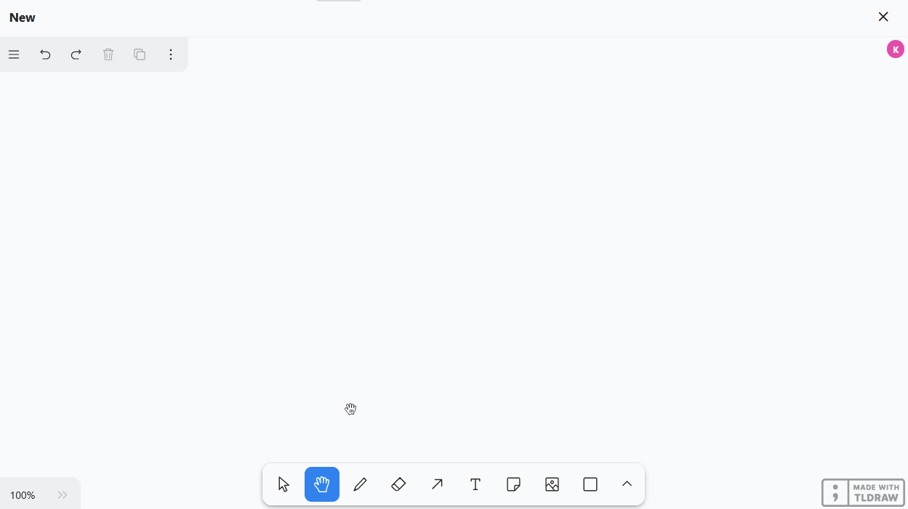
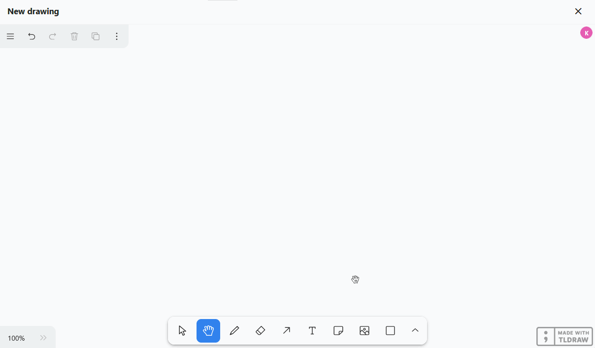
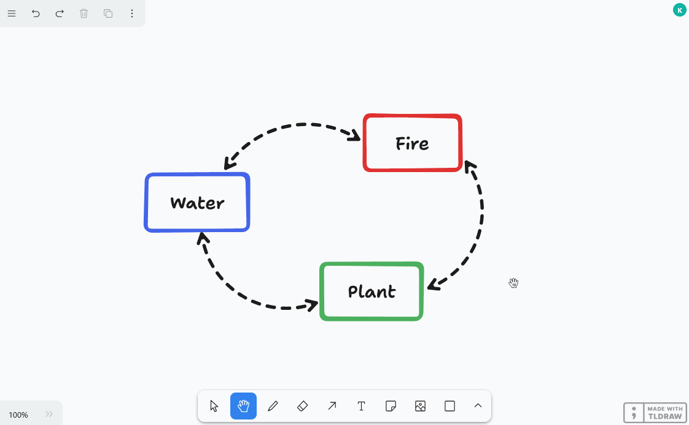

O **plugin de quadro branco** dá-lhe a liberdade de visualizar graficamente processos e estruturas que não pode apresentar com os plugins anteriores. Também pode esboçar livremente esquemas e maquetas. Para o desenho, tem vários **elementos** como quadrados, elipses e setas, bem como **ferramentas** como a caneta, o apagador e a ferramenta de texto à escolha.

Pode descobrir como ativar o plugin numa base [aqui](https://seatable.io/pt/docs/plugins/aktivieren-eines-plugins-in-einer-base/).

{{< warning  headline="Não confundir com o antigo plugin de quadro branco"  text="Existe outro **plug-in de quadro branco** no SeaTable **(obsoleto)** que se baseia no projeto de código aberto Excalidraw. A substituição do plug-in tornou-se necessária porque o antigo plug-in do quadro branco não suportava a colaboração e revelou-se propenso a erros quando utilizado por vários utilizadores ao mesmo tempo. Como parte do lançamento da versão 6.0 no verão de 2025, iremos remover o antigo plug-in do SeaTable Cloud." />}}

## Definir opções para um desenho no quadro branco

Por predefinição, já é criado um desenho com uma tela em branco quando abre o plug-in do quadro branco pela primeira vez.  Se pretender criar outro desenho, clique em **Adicionar desenho**. Isto abre um campo de entrada no qual pode introduzir o **nome** pretendido.

Para **alterar a ordem dos desenhos**, mantenha premido o botão esquerdo do rato sobre a **superfície de aperto**  e arraste **e largue** o desenho para a posição pretendida. Também é possível mudar o **nome** e **apagar** os desenhos.



## Ferramentas disponíveis

Estão disponíveis várias ferramentas e elementos na **barra de ferramentas** por baixo da tela.

### Ferramenta de seleção

Pode utilizar esta ferramenta para selecionar um elemento que pretende editar, copiar, mover ou eliminar. Assim que o elemento é selecionado, as respectivas opções de definição aparecem à esquerda.

### Ferramenta manual

Utilize a ferramenta manual para mover a tela sem alterar nada nos elementos. Isto também funciona com a ferramenta de seleção assim que mantiver premida a barra de espaços, ou com a roda do rato na direção vertical.

### Ferramenta de desenho (caneta)

Mantenha premido o botão esquerdo do rato para desenhar diferentes linhas e formas à mão livre. Sempre que soltar a caneta, é criado um novo elemento que pode selecionar separadamente e personalizar conforme necessário.

Pode escolher entre **12 cores**, definir a **opacidade** na barra deslizante e selecionar o **modo de preenchimento**. Também pode decidir se os traços devem ser desenhados, tracejados, pontilhados ou sólidos. A **largura da linha** (S, M, L, XL) também pode ser ajustada.

### Borracha

Pode utilizar esta ferramenta para apagar vários elementos da tela de uma só vez. Mantenha premido o botão esquerdo do rato enquanto move a borracha sobre os elementos a serem apagados.

### Ferramenta de seta

Crie **setas** para relacionar diferentes elementos na tela uns com os outros. Tem as mesmas opções de definição para as setas que para as linhas e formas desenhadas, mas também pode escolher entre **8 pontas de seta**. Para **dobrar** a seta, arraste o seu ponto central.

### Ferramenta de texto

Gostaria de colocar um texto ou uma letra na sua tela? Então, basta inserir um elemento de texto com esta ferramenta! Depois de introduzir as letras, pode definir a **cor da fonte**, **a transparência**, **o tamanho da fonte**, **o tipo de fonte** e o **alinhamento do texto**.

### Ferramenta de dicas

Com esta ferramenta, pode colocar facilmente **notas** na sua tela para realçar informações importantes. Basta clicar na tela onde pretende colocar a nota. Um **campo de texto** já está integrado no elemento que aparece para que possa começar a escrever de imediato.

### Ferramenta de imagem

Pode utilizar a ferramenta de imagem para inserir **imagens** do seu dispositivo no desenho. Para tal, selecione o ficheiro de imagem pretendido no sistema de pastas do seu dispositivo e confirme com um clique.

**Ferramenta de molde**

Pode utilizar esta ferramenta para adicionar uma variedade de **formas** ao seu desenho. Selecione a ferramenta, mantenha premido o botão esquerdo do rato na tela e arraste a forma.

Tem 20 formas à escolha, incluindo

- Rectângulos, losangos, paralelogramos e trapézios
- Triângulos, pentágonos, hexágonos e octógonos
- Elipses e ovais
- Estrelas, nuvens e corações
- Setas
- Caixas de verificação

Também pode escolher entre **12 cores**, definir a **opacidade** no seletor e alterar o **modo de preenchimento**. Também pode decidir se os **contornos** devem ser desenhados, tracejados, pontilhados ou sólidos. A **largura da linha** (S, M, L, XL) também pode ser ajustada.



### Ferramenta de linha

Esta ferramenta cria **linhas** que ligam dois pontos. Pode escolher entre **12 cores**, definir a **opacidade** no cursor e decidir se as linhas devem ser desenhadas, tracejadas, pontilhadas ou sólidas. A **largura da linha** (S, M, L, XL) também pode ser ajustada. Arraste o ponto central da linha para criar um **canto** ou uma **curva**.

### Marcador

Pode utilizar esta ferramenta para marcar permanentemente determinadas áreas na tela, tal como faria com um **marcador de texto**. Pode definir a **cor**, **a transparência** e **o tamanho** do marcador.

### Ponteiro laser

Esta ferramenta é particularmente útil para **apresentações**. Utilize o ponteiro laser para realçar as áreas do ecrã sobre as quais está a falar. Cria uma linha vermelha que desaparece novamente numa questão de segundos.

### Ferramenta de moldura

Utilize a ferramenta de moldura para **agrupar** elementos individuais. Assim que os elementos de uma moldura tiverem sido combinados num grupo, pode deslocá-los, copiá-los, bloqueá-los e apagá-los em conjunto.

## Editar elementos

Pode utilizar os vários elementos para realizar determinadas acções, que passaremos a analisar em pormenor.

### Inserir texto em elementos

Pode **inserir texto** em formas como rectângulos e elipses como padrão. Para o fazer, faça duplo clique no elemento correspondente e introduza o texto pretendido. Tem então as mesmas opções de configuração que a ferramenta de texto.

### Mover, rodar, ampliar ou reduzir elementos

Utilize a **ferramenta de seleção** para clicar no elemento que pretende ajustar. Mova o rato sobre o **ponto de agarrar** apropriado no elemento e arraste com o botão esquerdo do rato premido para mover, rodar, ampliar ou reduzir o elemento.

Também pode alterar o **nível de zoom** da tela no canto inferior esquerdo. No entanto, isto apenas altera o tamanho da secção visível e não o tamanho dos elementos.

### Duplicar, cortar, copiar e colar elementos

Existem três formas de duplicar um elemento: Pode clicar no botão **Símbolo duplicado** ou clicar com o botão direito do rato no elemento e selecionar **Duplicado** ou pode utilizar o **Atalho** +.

Para cortar, copiar ou colar um elemento, pode clicar com o botão direito do rato sobre o elemento e selecionar o elemento pretendido no menu **Menu de contexto** selecionar a opção adequada ou utilizar o **Atalhos** +, + e + utilização. Também pode copiar um elemento para a área de transferência como um ficheiro de imagem (PNG ou SVG).

### Mover elementos para o primeiro plano ou para o fundo

Como vários elementos se podem sobrepor na tela, pode mover cada elemento um nível para a frente ou para trás ou completamente para o primeiro ou segundo plano. Para tal, clique nos **três pontos** e num dos **quatro símbolos de seta** no canto superior esquerdo ou clique com o botão direito do rato no elemento e selecione a opção pretendida no **menu de contexto**.

### Elementos de ligação

Gostaria de adicionar elementos (por exemplo, botões, imagens ou texto) ao seu desenho que ligam a sítios Web específicos? Então, basta ligar os elementos inserindo um URL. Para o fazer, clique nos **três pontos** e no **símbolo da corrente** no canto superior esquerdo ou clique com o botão direito do rato no elemento e selecione **Editar ligação** no menu de contexto.

Assim que o elemento é ligado, aparece um **ícone de ligação** no canto superior direito do elemento. Clique nele para abrir o URL. Naturalmente, pode editar o URL mais tarde da mesma forma ou eliminá-lo do campo de entrada.

### Elementos de bloqueio

Se quiser trabalhar na tela sem mover ou alterar acidentalmente determinados elementos, pode bloquear os elementos. Para o fazer, clique com o botão direito do rato no elemento e seleccione a opção **Bloquear**. Para **desbloquear** elementos bloqueados, proceda da mesma forma.

### Eliminar elementos

Se pretender eliminar um elemento, existem várias opções: Pode clicar no botão **Ícone do lixo** ou clicar com o botão direito do rato no elemento e selecionar **Eliminar** ou utilizar os botões  ou .

Para remover vários elementos da tela de forma rápida e precisa, também pode utilizar a **borracha** da barra de ferramentas.



Pode utilizar os ícones de seta no canto superior esquerdo apenas para selecionar os últimos passos. **anular** ou **Restaurar**. Também pode utilizar os atalhos conhecidos + e ++ utilizar.

## Definições do ecrã

No plugin do quadro branco, pode efetuar definições para toda a tela, para além das definições para os elementos individuais. Para o fazer, utilize o menu de hambúrgueres (as três linhas horizontais) no canto superior esquerdo. De seguida, apresentamos-lhe algumas funções úteis.

- Se pretender apresentar uma grelha para alinhar os elementos na tela com precisão, selecione **Mostrar grelha**.
- Se também ativar **Sempre alinhar com outros elementos**, aparecem guias inteligentes para alinhar os elementos uns com os outros.

- No **modo de focagem**, a barra de ferramentas e todos os ícones e menus na tela estão ocultos. Ao selecionar elementos, as definições dos elementos também não se abrem, pelo que pode clicar na tela e organizar os elementos sem ser incomodado.
- Com **Selecionar tudo**, pode selecionar todos os elementos na tela ao mesmo tempo. Isto é útil, por exemplo, se quiser bloquear todos os elementos antes de uma apresentação, para que não possa alterar nada acidentalmente. Depois, pode **desbloquear** facilmente **todos os elementos** novamente.

### Definir língua

Para tornar o seu trabalho o mais fácil possível, o plugin do quadro branco oferece-lhe muito mais línguas à escolha do que a interface de utilizador do SeaTable. Clique no menu de hambúrgueres (as três linhas horizontais), defina **a** sua **língua** e todas as etiquetas serão traduzidas.

### Alternar entre o modo claro e escuro

Também pode especificar se pretende utilizar o quadro branco no **modo claro ou escuro**. Para o fazer, clique no menu de hambúrgueres (as três linhas horizontais) e selecione o modo pretendido na parte inferior das definições.

### Lista de todos os atalhos

Pode encontrar uma lista clara de todos os atalhos clicando no menu do hambúrguer (as três linhas horizontais) e depois em **Atalhos de teclado**.

## Elementos de exportação

Pode guardar um desenho no seu disco rígido exportando os elementos de uma tela. Para o fazer, clique no menu do hambúrguer (as três linhas horizontais) e selecione **Exportar tudo como**. Pode utilizar o cursor para especificar se o fundo deve ser **transparente**. Assim que clicar em **SVG** ou **PNG**, o ficheiro de imagem correspondente será transferido. Também pode selecionar elementos individuais e exportá-los como PNG ou SVG.


