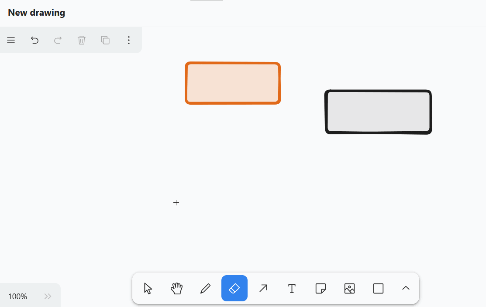
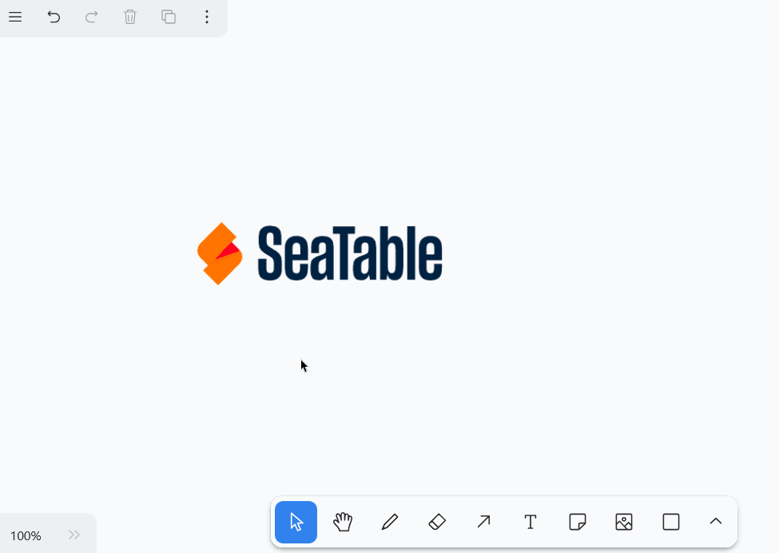
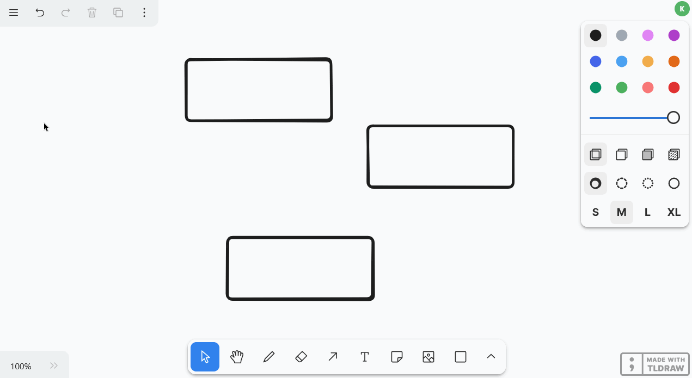

**Плагин Whiteboard** дает вам возможность графически визуализировать процессы и структуры, которые невозможно отобразить с помощью предыдущих плагинов. Вы также можете свободно создавать макеты и эскизы. Для оформления вам предлагаются различные **элементы**, такие как квадраты, эллипсы и стрелки, а также такие **инструменты**, как перо, ластик и текстовый инструмент.

О том, как активировать плагин в базе, вы можете узнать [здесь]().



## Настройка параметров для рисунка на доске

По умолчанию при первом открытии плагина доски уже создается рисунок с пустым холстом.  Если вы хотите создать еще один рисунок, нажмите на кнопку **Добавить рисунок**. Откроется поле ввода, в котором вы можете ввести желаемое **название**.

Чтобы **изменить порядок расположения рисунков**, удерживайте левую кнопку мыши на **области захвата**  и **перетащите** рисунок в нужное место. Вы также можете **переименовывать** и **удалять** рисунки.



## Доступные инструменты

Различные инструменты и элементы доступны на **панели инструментов** под холстом.

### Инструмент выбора

С помощью этого инструмента можно выбрать элемент, который нужно отредактировать, скопировать, переместить или удалить. Как только элемент выбран, слева появляются соответствующие параметры настройки.

### Ручной инструмент

Используйте инструмент "Рука", чтобы перемещать холст, не меняя ничего в элементах. Это также работает с инструментом выделения, если удерживать пробел, или с колесиком мыши в вертикальном направлении.

### Инструмент для рисования (перо)

Удерживайте левую кнопку мыши, чтобы рисовать различные линии и фигуры от руки. Каждый раз, когда вы отпускаете перо, создается новый элемент, который вы можете выбрать отдельно и настроить по своему усмотрению.

Вы можете выбрать один из **12 цветов**, установить **непрозрачность** на ползунке и выбрать **режим заливки**. Вы также можете решить, какими должны быть штрихи: рисованными, пунктирными, точечными или сплошными. Также можно настроить **ширину линии** (S, M, L, XL).

### Ластик

С помощью этого инструмента можно стереть несколько элементов на холсте за один раз. Удерживайте левую кнопку мыши, перемещая ластик над элементами, которые нужно стереть.

### Инструмент со стрелками

Создавайте **стрелки**, чтобы связать между собой различные элементы на холсте. Для стрелок доступны те же параметры, что и для нарисованных линий и фигур, но вы также можете выбрать один из **8 наконечников стрелок**. Чтобы **изогнуть** стрелку, перетащите ее центральную точку.

### Текстовый инструмент

Хотите разместить на холсте текст или надпись? Тогда просто вставьте текстовый элемент с помощью этого инструмента! После ввода букв вы можете настроить **цвет шрифта**, **прозрачность**, **размер**, **тип шрифта** и **выравнивание текста**.

### Инструмент подсказки

С помощью этого инструмента вы можете легко размещать **заметки** на холсте, чтобы подчеркнуть важную информацию. Просто щелкните на холсте, где вы хотите разместить заметку. В появившемся элементе уже встроено **текстовое поле**, так что вы можете сразу же начать писать.

### Инструмент для работы с изображениями

С помощью инструмента "Изображение" можно вставить в чертеж **изображения** с вашего устройства. Для этого выберите нужный файл изображения в системе папок вашего устройства и подтвердите его щелчком мыши.

**Формовочный инструмент**

С помощью этого инструмента можно добавлять к рисунку различные **фигуры**. Выберите инструмент, зажмите левую кнопку мыши на холсте и перетащите фигуру.

На выбор предлагается 20 форм, включая

- Прямоугольники, ромбы, параллелограммы и трапеции
- Треугольники, пятиугольники, шестиугольники и восьмиугольники
- Эллипсы и овалы
- Звезды, облака и сердца
- Стрелки
- Флажки

Вы также можете выбрать один из **12 цветов**, установить **непрозрачность** на ползунке и изменить **режим заливки**. Вы также можете решить, какими должны быть **контуры**: рисованными, пунктирными, точечными или сплошными. Также можно настроить **ширину линии** (S, M, L, XL).



### Инструмент для работы с линиями

Этот инструмент создает **линии**, соединяющие две точки. Вы можете выбрать один из **12 цветов**, установить **непрозрачность** с помощью ползунка и решить, какими должны быть линии: пунктирными, точечными или сплошными. Также можно настроить **ширину линии** (S, M, L, XL). Перетащите центральную точку линии, чтобы создать **угол** или **кривую**.

### Маркер

С помощью этого инструмента можно постоянно помечать определенные области на холсте, как это делается с помощью **ручки-выделителя**. Вы можете задать **цвет**, **прозрачность** и **размер** маркера.

### Лазерная указка

Этот инструмент особенно полезен для **презентаций**. С помощью лазерной указки выделите на экране те области, о которых вы говорите в данный момент. При этом образуется красная линия, которая исчезает через несколько секунд.

### Рамочный инструмент

Используйте инструмент "Рамка" для **группировки** отдельных элементов. Как только элементы в рамке будут объединены в группу, их можно будет перемещать, копировать, блокировать и удалять вместе.

## Редактирование элементов

С помощью различных элементов можно выполнять определенные действия, которые мы сейчас подробно рассмотрим.

### Вставка текста в элементы

Вы можете **вставлять текст** в такие фигуры, как прямоугольники и эллипсы, в стандартном режиме. Для этого дважды щелкните по соответствующему элементу и введите нужный текст. После этого у вас будут те же возможности настройки, что и при использовании инструмента "Текст".

### Перемещайте, поворачивайте, увеличивайте или уменьшайте элементы

С помощью **инструмента выделения** щелкните на элементе, который нужно настроить. Наведите курсор на соответствующую **точку захвата** на элементе и перетащите его с нажатой левой кнопкой мыши, чтобы переместить, повернуть, увеличить или уменьшить элемент.

Вы также можете изменить **уровень масштабирования** холста в левом нижнем углу. Однако при этом изменяется только размер видимой части, но не размер элементов.

### Дублирование, вырезание, копирование и вставка элементов

Существует три способа дублирования элемента: Вы можете либо щелкнуть на **Дублирующий символ** или щелкните правой кнопкой мыши на элементе и выберите **Дубликат** или вы можете использовать **Ярлык** +.

Чтобы вырезать, скопировать или вставить элемент, вы можете щелкнуть правой кнопкой мыши на элементе и выбрать нужный элемент в меню **Контекстное меню** выберите соответствующую опцию или воспользуйтесь знакомым **Ярлыки** +, + и + использовать. Вы также можете скопировать элемент в буфер обмена в виде файла изображения (PNG или SVG).

### Перемещение элементов на передний или задний план

Поскольку несколько элементов могут перекрывать друг друга на холсте, вы можете переместить каждый элемент на один уровень вперед или назад или полностью на передний или задний план. Для этого нажмите на **три точки** и один из **четырех значков со стрелками** у левого верхнего края или щелкните правой кнопкой мыши на элементе и выберите нужную опцию в **контекстном меню**.

### Элементы ссылок

Хотите добавить в свой рисунок элементы (например, кнопки, изображения или текст), которые ссылаются на определенные веб-сайты? Тогда просто соедините элементы, вставив URL-адрес. Для этого нажмите на **три точки** и **символ цепочки** в левом верхнем углу или щелкните правой кнопкой мыши на элементе и выберите в контекстном меню пункт **Редактировать ссылку**.

Как только элемент будет связан, в правом верхнем углу элемента появится **значок ссылки**. Щелкните по нему, чтобы открыть URL-адрес. Конечно, вы можете отредактировать URL позже тем же способом или удалить его из поля ввода.

### Элементы замка

Если вы хотите работать на холсте без случайного перемещения или изменения определенных элементов, вы можете заблокировать их. Для этого щелкните правой кнопкой мыши на элементе и выберите опцию " **Заблокировать"**. Чтобы **разблокировать** заблокированные элементы, действуйте аналогичным образом.

### Удаление элементов

Если вы хотите удалить элемент, у вас есть несколько вариантов: Вы можете либо нажать на **Значок корзины** или щелкните правой кнопкой мыши на элементе и выберите **Удалить** или воспользуйтесь кнопками  или .

Чтобы быстро и аккуратно удалить несколько элементов с холста, вы также можете воспользоваться **ластиком** на панели инструментов.



Значки со стрелками у левого верхнего края можно использовать только для выбора последних шагов. **отменить** или **Восстановить**. Вы также можете использовать привычные сочетания клавиш + и ++ использовать.

## Настройки экрана

В плагине "Белая доска" помимо настроек отдельных элементов можно задать настройки для всего холста. Для этого используйте меню бургера (три горизонтальные линии) в левом верхнем углу. Ниже мы познакомим вас с некоторыми полезными функциями.

- Если вы хотите отобразить сетку, чтобы точно выровнять элементы на холсте, выберите **Показать сетку**.
- Если вы также активируете опцию **Всегда выравнивать по другим элементам**, появятся интеллектуальные направляющие, выравнивающие элементы друг по другу.

- В **режиме фокусировки** панель инструментов и все значки и меню на холсте скрыты. При выборе элементов настройки элементов также не открываются, поэтому вы можете щелкать по холсту и располагать элементы без помех.
- С помощью команды **Выбрать все** можно выбрать все элементы на холсте одновременно. Это удобно, например, если вы хотите заблокировать все элементы перед презентацией, чтобы случайно ничего не изменить. Затем вы можете легко **разблокировать их** снова.

### Установите язык

Чтобы максимально упростить вашу работу, плагин для белой доски предлагает на выбор значительно больше языков, чем пользовательский интерфейс SeaTable. Нажмите на меню бургера (три горизонтальные линии), установите **язык**, и все надписи будут переведены.

### Переключение между светлым и темным режимом

Вы также можете указать, в каком **режиме** вы хотите использовать доску - **светлом или темном**. Для этого нажмите на меню бургера (три горизонтальные линии) и выберите нужный режим в нижней части настроек.

### Список всех ярлыков

Вы можете найти четкий список всех сочетаний клавиш, нажав на меню бургера (три горизонтальные линии), а затем на **"Клавиатурные сокращения"**.

## Элементы экспорта

Вы можете сохранить рисунок на жестком диске, экспортировав элементы из холста. Для этого нажмите на меню бургера (три горизонтальные линии) и выберите пункт **Экспортировать все как**. С помощью ползунка можно указать, должен ли фон быть **прозрачным**. При нажатии на **SVG** или **PNG** будет загружен соответствующий файл изображения. Вы также можете выбрать отдельные элементы и экспортировать их в PNG или SVG.


