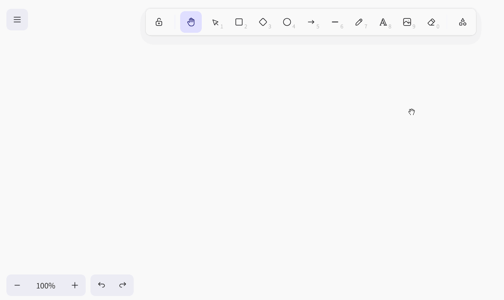
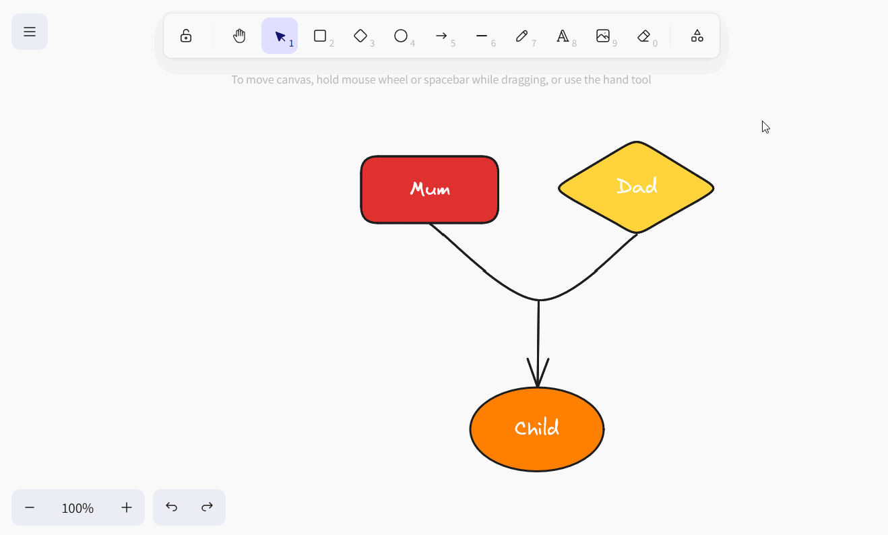
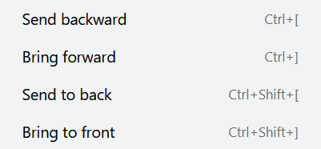
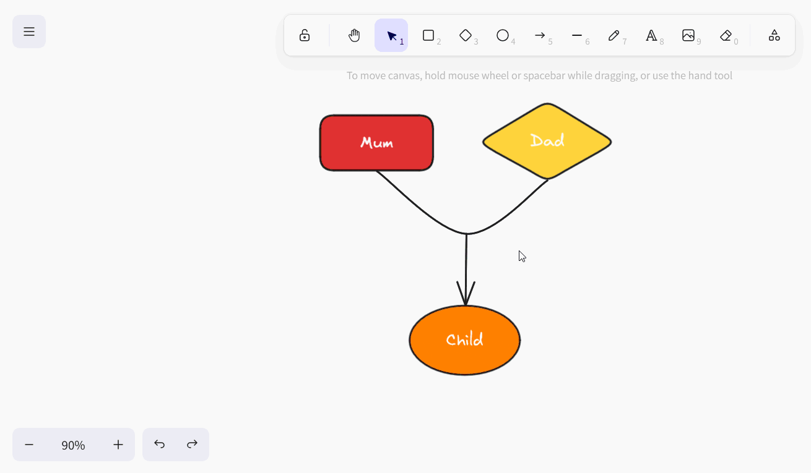
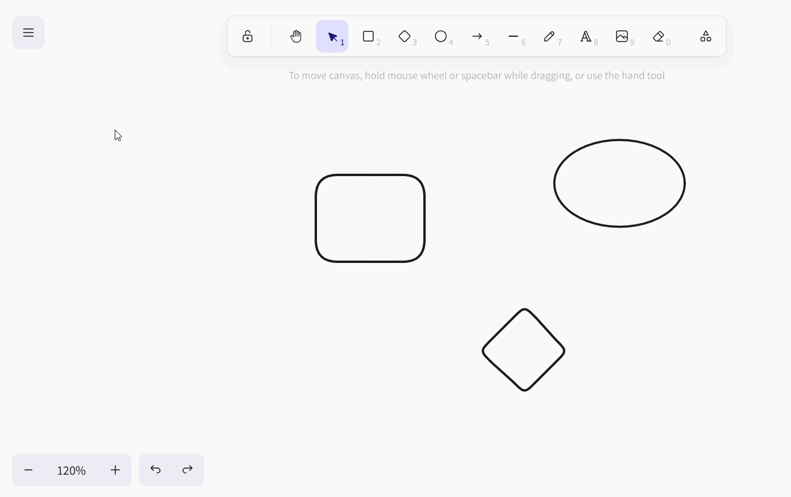
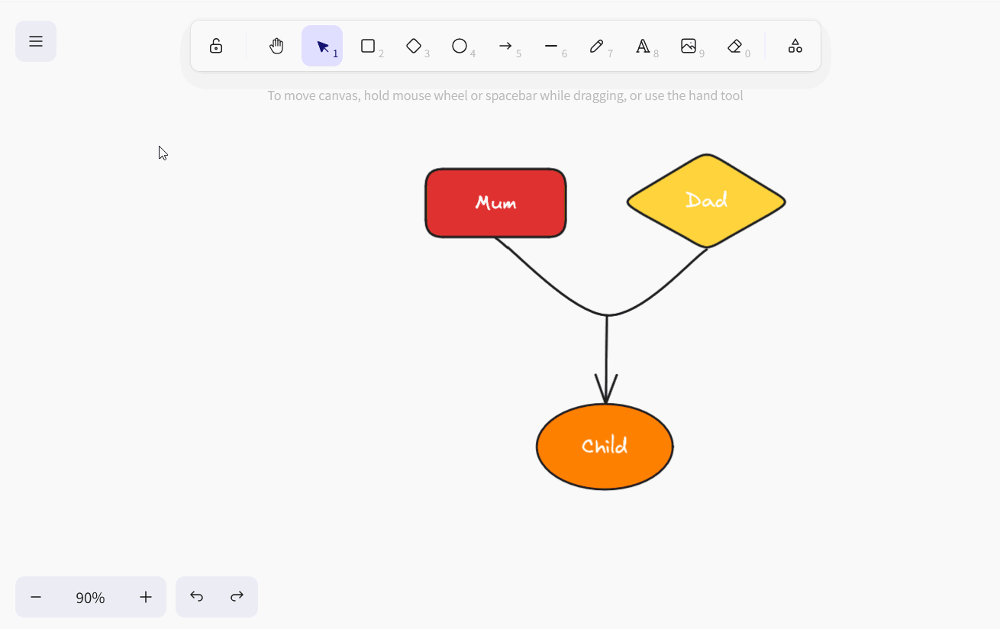

Das **Whiteboard-Plugin** gibt Ihnen die Freiheit, Prozesse und Strukturen grafisch zu visualisieren, die Sie mit den bisherigen Plugins nicht darstellen können. Ebenso können Sie Layouts und Mockups frei skizzieren. Für die Gestaltung haben Sie verschiedene **Elemente** wie Vierecke, Ellipsen und Pfeile sowie **Werkzeuge** wie Stift, Radierer und das Text-Werkzeug zur Auswahl.

Wie Sie das Plugin in einer Base aktivieren, erfahren Sie [hier](
).

{{< warning  type="warning" headline="Achtung: Dieses Plugin wird ausrangiert!"  text="Da das Whiteboard-Plugin (veraltet), das auf dem Open-Source-Projekt excalidraw basiert, keine Kollaboration unterstützt und sich bei gleichzeitiger Nutzung durch mehrere Benutzer als störanfällig erwies, werden wir es im Zuge des Release 6.0 im Sommer 2025 aus SeaTable Cloud entfernen. Alle Zeichnungen im alten Whiteboard-Plugin werden dann nicht mehr verfügbar sein. Wir empfehlen daher, so bald wie möglich zum neuen [Whiteboard-Plugin (tldraw)](\"https://seatable.io/docs/plugins/anleitung-zum-whiteboard-plugin-tldraw/\") zu wechseln und bestehende Inhalte mittels Copy-and-Paste zu übertragen." />}}

## Einstellungsmöglichkeiten einer Whiteboard-Zeichnung

Standardmäßig ist beim ersten Öffnen des Whiteboard-Plugins bereits eine Zeichnung mit leerer Leinwand angelegt. Wenn Sie eine weitere Zeichnung erstellen möchten, klicken Sie auf  **Zeichnung hinzufügen**. Daraufhin öffnet sich ein Eingabefeld, in das Sie den gewünschten **Namen** tippen.

Um die **Reihenfolge der Zeichnungen zu ändern**, halten Sie die linke Maustaste an der **Greiffläche**  gedrückt und ziehen die Zeichnung **per Drag-and-Drop** an die gewünschte Stelle. Darüber hinaus können Sie die Zeichnungen **umbenennen**, **duplizieren** oder **löschen**.



## Verfügbare Werkzeuge

In der **Werkzeugleiste** oberhalb der Leinwand stehen Ihnen verschiedene Werkzeuge und Elemente zur Verfügung.

### Hand-Werkzeug

Nutzen Sie das Hand-Werkzeug, um die Leinwand zu bewegen, ohne etwas an den Elementen zu verändern. Dies funktioniert ebenso mit dem Auswahl-Werkzeug, sobald Sie die Leertaste gedrückt halten, oder mit dem Mausrad in vertikaler Richtung.

### Auswahl-Werkzeug

Mit diesem Werkzeug können Sie ein Element auswählen, das Sie bearbeiten, kopieren, verschieben oder löschen möchten. Sobald das Element ausgewählt ist, erscheinen links seine jeweiligen Einstellungsoptionen.

### Zeichen-Werkzeug (Stift)

Halten Sie die linke Maustaste gedrückt, um frei Hand verschiedene Linien und Formen zu zeichnen. Immer wenn Sie mit dem Stift absetzen, entsteht ein neues Element, das Sie separat anwählen und nach Belieben anpassen können.

### Text-Werkzeug

Sie möchten einen Text oder Schriftzug auf Ihrer Leinwand platzieren? Dann fügen Sie mit diesem Werkzeug einfach ein Textelement ein! Sobald Sie die Buchstaben eingegeben haben, können Sie die Schriftfarbe, die Schriftgröße, die Schriftfamilie, die Textausrichtung und die Transparenz einstellen.

### Bild-Werkzeug

Mit dem Bild-Werkzeug können Sie Bilder von Ihrem Gerät in die Zeichnung einfügen. Dazu wählen Sie die gewünschte Bilddatei im sich öffnenden Ordnersystem aus. Fahren Sie mit dem geladenen Cursor über die Leinwand, bis er sich an einer passenden Stelle befindet, und platzieren Sie das Bild mit einem Klick.

### Radierer

Mit diesem Werkzeug können Sie auf einen Streich mehrere Elemente auf der Leinwand löschen. Halten Sie die linke Maustaste gedrückt, während Sie mit dem Radierer über die zu löschenden Elemente fahren. Wenn Sie hingegen über Elemente fahren, während Sie gleichzeitig  gedrückt halten, bleiben die Elemente von der Löschung verschont bzw. die Markierung zum Löschen wird aufgehoben.

### Rahmen-Werkzeug

Nutzen Sie das Rahmen-Werkzeug, um einzelne Elemente zu gruppieren. Sobald die Elemente in einem Rahmen zu einer Gruppe zusammengefasst sind, können Sie diese gemeinsam verschieben, kopieren, sperren und löschen.

### Laserpointer

Dieses Werkzeug bietet sich vor allem für Präsentationen an. Heben Sie mit dem Laserpointer die Stellen auf der Leinwand hervor, über die Sie gerade sprechen. Er erzeugt einen roten Strich, der in Sekundenschnelle wieder verschwindet.

## Verfügbare Elemente

Folgende Elemente können Sie im Whiteboard-Plugin für Ihre Zeichnung nutzen:

- Rechtecke
- Rauten
- Ellipsen
- Pfeile
- Linien

Wählen Sie das entsprechende Element in der Werkzeugleiste aus und ziehen Sie es auf der Leinwand mit gedrückter linker Maustaste auf.

## Elementeinstellungen

Für all diese Elemente haben Sie zahlreiche Einstellungsoptionen zur Auswahl:

- die Farbe des äußeren Strichs
- die Farbe und den Füllmodus des Hintergrunds
- die Strichstärke und den Strichstil
- die Schlampigkeit der Kontur
- abgerundete Ecken
- die Art der Pfeilspitzen
- die Transparenz des Elements
- die Überlagerung der Ebenen
- die Ausrichtung der Elemente

### Text in Elemente einfügen

In Rechtecke, Rauten und Ellipsen können Sie zudem standardmäßig **Texte einfügen**. Machen Sie dazu einen Doppelklick auf das entsprechende Element und geben Sie den gewünschten Text ein. Anschließend haben Sie die gleichen Einstellungsoptionen wie beim Text-Werkzeug.

Wenn Sie möchten, können Sie einen Text auch von dem jeweiligen Element loslösen. Machen Sie dazu einen Rechtsklick auf das Element und wählen Sie **Text entbinden**.

Als Ergebnis erhalten Sie ein **Textelement**, wie Sie es vom Text-Werkzeug kennen.

### Elementfarben einstellen

Für die **Einfärbung der Elemente** haben Sie eine umfangreiche Farbpalette zur Auswahl. Sie können zwischen abgestuften Farbnuancen wählen oder eine Farbe exakt per Hexadezimalcode definieren.

### Elemente verschieben, drehen, vergrößern oder verkleinern

Klicken Sie mit dem **Auswahl-Werkzeug** das Element an, das Sie anpassen möchten. Fahren Sie mit der Maus über den passenden **Greifpunkt** am Element und ziehen Sie mit gedrückter linker Maustaste so weit, wie es Ihnen gefällt, um das Element zu verschieben, zu drehen, zu vergrößern oder zu verkleinern.

Mit den Pfeilsymbolen am unteren linken Rand können Sie die letzten Schritte **rückgängig machen** oder **wiederherstellen**. Ebenso können Sie dafür die bekannten Shortcuts + und ++ nutzen.

Zudem können Sie die **Zoomstufe** der Leinwand über die Plus- und Minus-Symbole ändern. Dies verändert allerdings nur die Größe des sichtbaren Ausschnitts und nicht die Größe der Elemente.

### Elemente duplizieren, ausschneiden, kopieren und einfügen

Um ein Element zu duplizieren, gibt es drei Möglichkeiten: Entweder Sie klicken in den Elementeinstellungen auf das **Duplikat-Symbol** oder Sie machen einen Rechtsklick auf das Element und wählen im Kontextmenü **Duplizieren** aus oder Sie verwenden den **Shortcut** +.

Um ein Element auszuschneiden, zu kopieren oder einzufügen, können Sie einen Rechtsklick auf das Element machen und im **Kontextmenü** die entsprechende Option wählen oder die bekannten **Shortcuts** +, + und + nutzen.

Des Weiteren können Sie ein Element als Bilddatei (PNG oder SVG) in den Zwischenspeicher kopieren, den Text aus einem Element in den Zwischenspeicher kopieren sowie die Stileinstellungen des Elements kopieren und auf andere Elemente übertragen.

### Elemente in den Vordergrund oder Hintergrund rücken

Da sich Elemente auf der Leinwand überlagern können, gibt es drei Möglichkeiten, ein Element je eine Ebene oder ganz in den Vordergrund oder Hintergrund zu rücken.

Entweder Sie klicken in den Elementeinstellungen auf die **Ebenen-Symbole** oder Sie machen einen Rechtsklick auf das Element und wählen im **Kontextmenü** die gewünschte Option aus oder Sie verwenden die entsprechenden **Shortcuts**.

### Elemente spiegeln

Falls Sie Elemente spiegeln möchten, machen Sie einen Rechtsklick auf das Element und wählen im Kontextmenü entweder **Horizontal spiegeln** oder **Vertikal spiegeln** aus.

### Elemente verlinken

Möchten Sie Elemente (z. B. Buttons, Bilder oder Texte) zu Ihrer Zeichnung hinzufügen, die auf bestimmte Webseiten verweisen? Dann verlinken Sie die Elemente einfach, indem Sie eine URL einfügen. Klicken Sie dazu entweder in den Elementeinstellungen auf das **Ketten-Symbol** oder machen Sie einen Rechtsklick auf das Element, bevor Sie im Kontextmenü **Link erstellen** auswählen, oder verwenden Sie den Shortcut +.

Sobald das Element verlinkt ist, erscheint ein **Verweis-Symbol** rechts über dem Element. Klicken Sie darauf, um die URL zu öffnen. Natürlich können Sie die URL nachträglich über das Stift-Symbol bearbeiten oder mit einem Klick auf das Papierkorb-Symbol löschen.

### Elemente sperren

Wenn Sie auf der Leinwand arbeiten möchten, ohne bestimmte Elemente versehentlich zu verschieben oder zu verändern, können Sie die Elemente sperren. Machen Sie dazu einen Rechtsklick auf das Element und wählen Sie die Option **Sperren**. Um gesperrte Elemente wieder zu **entsperren**, gehen Sie genauso vor.

### Elemente löschen

Wenn Sie ein Element löschen möchten, gibt es mehrere Möglichkeiten: Entweder Sie klicken in den Elementeinstellungen auf das **Papierkorb-Symbol** oder Sie machen einen Rechtsklick auf das Element und wählen im Kontextmenü ganz unten **Löschen** aus oder Sie verwenden die Tasten  oder .

Um schnell und treffsicher mehrere Elemente von der Leinwand zu entfernen, können Sie auch den **Radierer** aus der Werkzeugleiste nutzen.

## Leinwandeinstellungen

Im Whiteboard-Plugin können Sie neben den Einstellungen für die einzelnen Elemente auch Einstellungen für die gesamte Leinwand vornehmen. Wenn Sie einen Rechtsklick auf eine Stelle der Leinwand machen, an der sich kein Element befindet, öffnet sich das entsprechende Kontextmenü.

- Mit **Alle auswählen** können Sie alle Elemente auf der Leinwand gleichzeitig markieren.

- Wenn Sie ein Raster einblenden möchten, um die Elemente passgenau auszurichten, wählen Sie **Gitter anzeigen**.
  

- Wenn Sie stattdessen **An Objekten einrasten** aktivieren, erscheinen intelligente Hilfslinien, um die Elemente aneinander auszurichten.
  

- Im **Zen-Modus** werden einige Symbole und Menüs auf der Leinwand ausgeblendet. Zum Beispiel öffnen sich beim Auswählen der Elemente nicht die Elementeinstellungen, sodass Sie ruhiger über die Leinwand klicken und ungestört Elemente anordnen können.

- Im **Ansichtsmodus**, der sich vor allem für Präsentationen eignet, sind zudem die Werkzeugleiste und die Kontextmenüs ausgeblendet und alle Elemente auf der Leinwand gesperrt, damit Sie nichts versehentlich verändern können. Hier bleibt Ihre Zeichnung genauso, wie sie ist.

- Die **Statistiken für Nerds** geben an, wie viele Elemente sich auf der Leinwand befinden und welche Fläche (Breite mal Höhe in Pixeln) sie einnehmen. Wenn Sie ein einzelnes Element ausgewählt haben, sehen Sie zusätzlich die Koordinaten des Elements, seine Breite und Höhe in Pixeln und den Winkel, in dem es gedreht wurde.
  

### Farbe der Leinwand

Darüber hinaus können Sie selbst die Farbe des Leinwand-Hintergrunds festlegen. Klicken Sie dazu das Burger-Menü (die drei horizontalen Striche) an und wählen Sie ganz unten die gewünschte Farbe aus. Sie können per Hexadezimalcode auch eine eigene Farbe definieren.

### Leinwand zurücksetzen

Um mit einer Zeichnung komplett von vorn anzufangen und alle Elemente auf der Leinwand zu löschen, klicken Sie auf das Burger-Menü (die drei horizontalen Striche) und dann auf **Leinwand zurücksetzen**. Daraufhin werden Sie gefragt, ob Sie sich sicher sind, und können den Vorgang abbrechen oder bestätigen. Das Zurücksetzen der Leinwand auf die Standard-Einstellungen ist **unwiderruflich**.

## Zeichnungen speichern, importieren und exportieren

Sie können eine Zeichnung **als Excalidraw-Datei speichern**, um sie später wieder in das Whiteboard-Plugin importieren und weiter bearbeiten zu können. Klicken Sie dazu auf das Burger-Menü (die drei horizontalen Striche) und wählen Sie **Speichern auf Festplatte**.

Um eine Zeichnung zu **importieren**, klicken Sie auf dem gleichen Weg auf **Öffnen** und wählen die gewünschte Excalidraw-Datei von Ihrer Festplatte aus.

Außerdem können Sie eine Zeichnung als Bilddatei (PNG oder SVG) speichern. Klicken Sie dazu auf das Burger-Menü (die drei horizontalen Striche) und wählen Sie **Bild exportieren**. In dem sich öffnenden Dialogfenster können Sie auch weitere Einstellungen vornehmen und die Datei benennen.



## Liste aller Shortcuts

Eine übersichtliche Liste mit allen Shortcuts finden Sie, wenn Sie auf das Burger-Menü (die drei horizontalen Striche) und dann auf **Hilfe** klicken.
