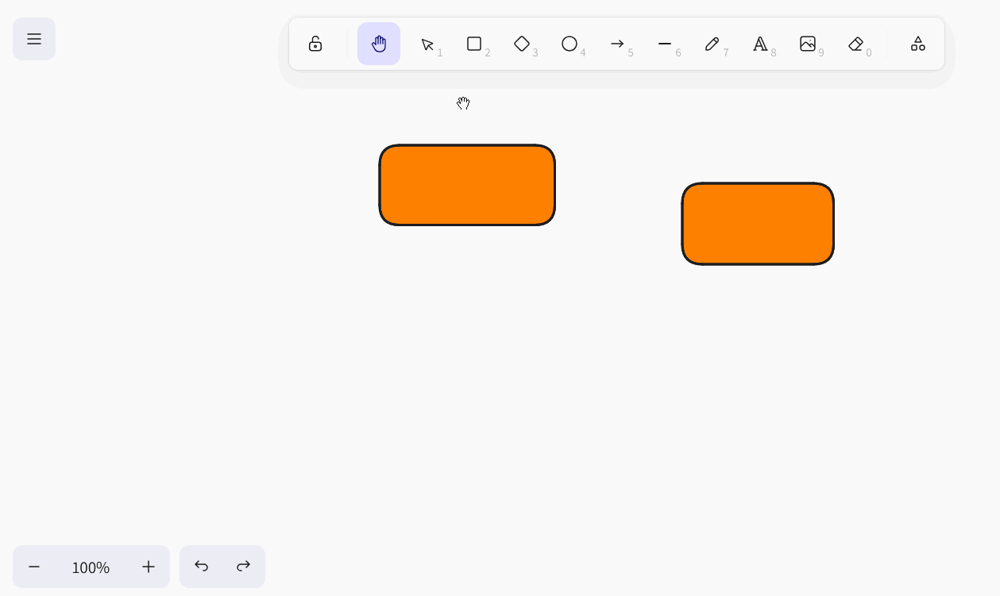
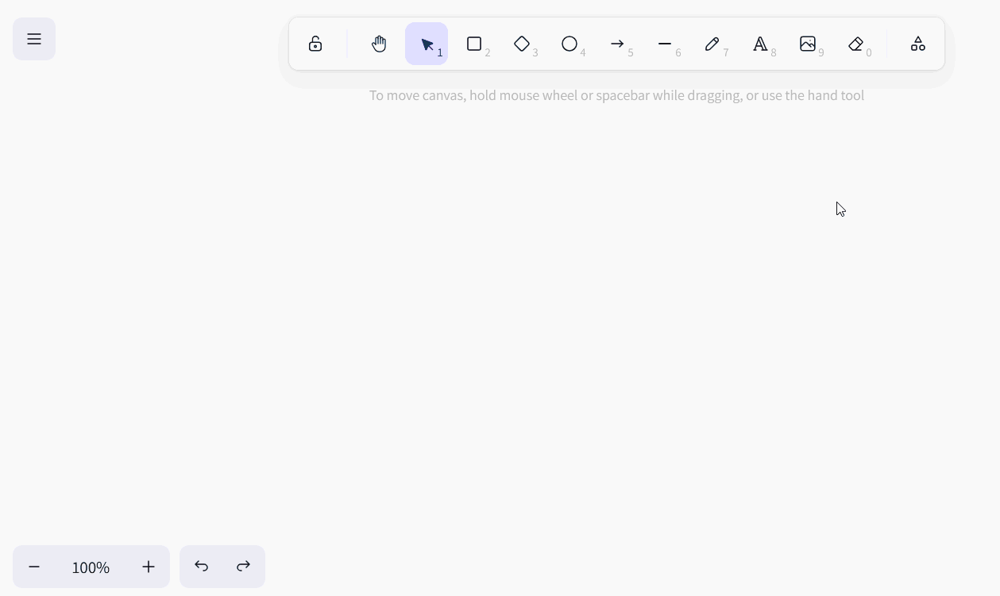
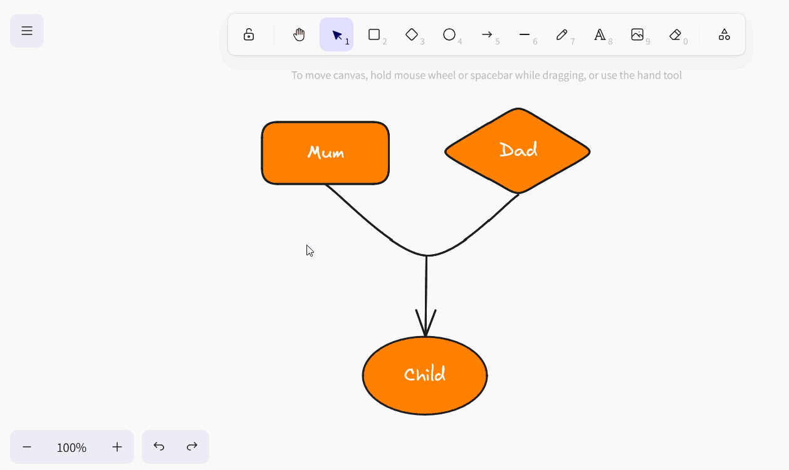
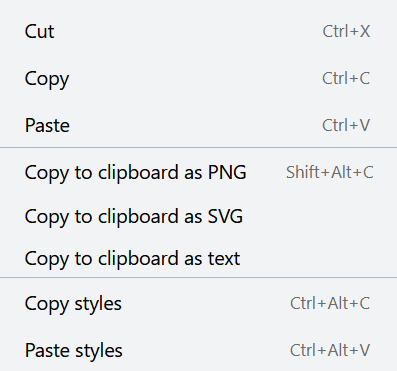
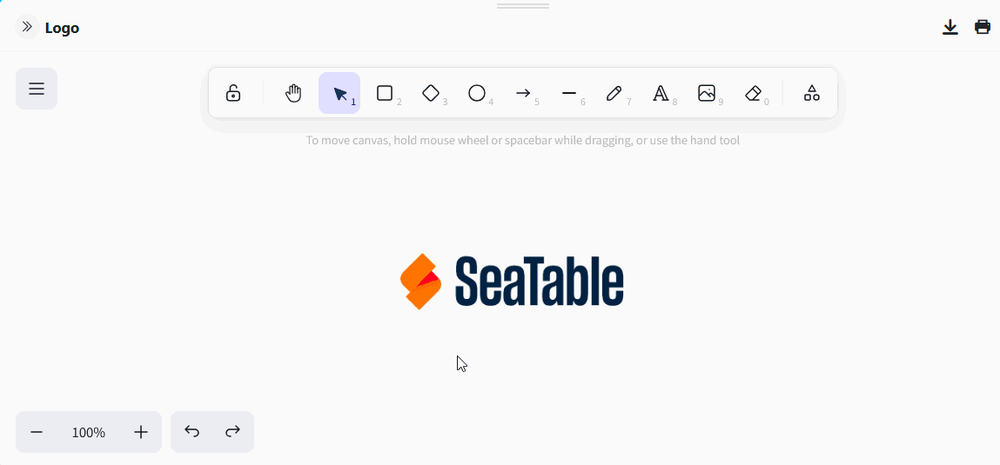
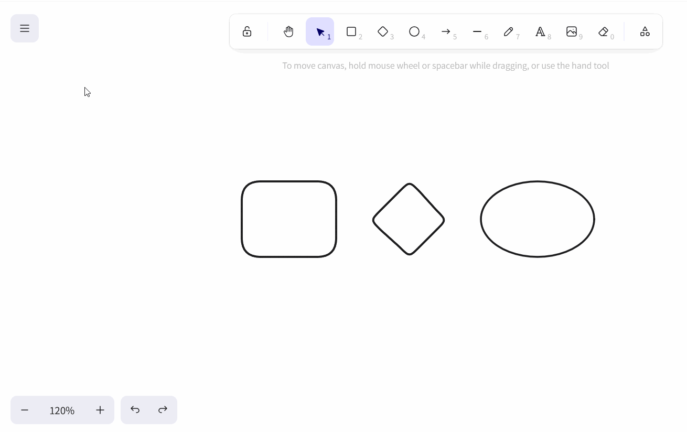

The **whiteboard plugin** gives you the freedom to graphically visualize processes and structures that you cannot display with the previous plugins. You can also freely sketch layouts and mockups. For the design, you have various **elements** such as squares, ellipses and arrows as well as **tools** such as pen, eraser and the text tool to choose from.

You can find out how to activate the plugin in a base [here](https://seatable.io/en/docs/plugins/aktivieren-eines-plugins-in-einer-base/).

{{< warning  headline="Attention: This plugin is being scrapped!"  text="As the whiteboard plugin (obsolete), which is based on the open source project excalidraw, does not support collaboration and proved to be prone to errors when used by several users at the same time, we will remove it from SeaTable Cloud as part of the 6.0 release in summer 2025. All drawings in the old whiteboard plugin will then no longer be available. We therefore recommend switching to the new [whiteboard plugin (tldraw)](https://seatable.io/en/docs/plugins/anleitung-zum-whiteboard-plugin-tldraw/) as soon as possible and transferring existing content using copy-and-paste." />}}

## Setting options for a whiteboard drawing

By default, a drawing with a blank canvas is already created when you open the whiteboard plugin for the first time. If you would like to create another drawing, click on  **Add drawing**. This opens an input field in which you can enter the desired **name**.

To **change** the **order of the drawings**, hold down the left mouse button on the **gripping surface**  and **drag and drop** the drawing to the desired position. You can also **rename**, **duplicate** or **delete** the drawings.



## Available tools

Various tools and elements are available in the **toolbar** above the canvas.

### Hand tool

Use the hand tool to move the canvas without changing anything on the elements. This also works with the selection tool as soon as you hold down the space bar, or with the mouse wheel in a vertical direction.

### Selection tool

You can use this tool to select an element that you want to edit, copy, move or delete. As soon as the element is selected, its respective setting options appear on the left.

### Drawing tool (pen)

Hold down the left mouse button to draw different lines and shapes freehand. Each time you release the pen, a new element is created that you can select separately and adjust as required.

### Text tool

Would you like to place a text or lettering on your canvas? Then simply insert a text element with this tool! Once you have entered the letters, you can set the font color, font size, font family, text alignment and transparency.

### Image tool

You can use the image tool to insert images from your device into the drawing. To do this, select the desired image file in the folder system that opens. Move the loaded cursor over the canvas until it is in a suitable position and place the image with a click.

### Eraser

You can use this tool to erase several elements on the canvas in one go. Hold down the left mouse button while moving the eraser over the elements to be erased. If, on the other hand, you move over elements while simultaneously  the elements are spared from deletion or the selection for deletion is removed.

### Frame tool

Use the frame tool to group individual elements. As soon as the elements in a frame are combined into a group, you can move, copy, lock and delete them together.

### Laser pointer

This tool is particularly useful for presentations. Use the laser pointer to highlight the areas on the screen that you are currently talking about. It creates a red line that disappears again in a matter of seconds.

## Available elements

You can use the following elements in the whiteboard plug-in for your drawing:

- Rectangles
- Rhombuses
- Ellipses
- Arrows
- Lines

Select the corresponding element in the toolbar and drag it onto the canvas by holding down the left mouse button.

## Element settings

You have numerous setting options to choose from for all these elements:

- the color of the outer stroke
- the color and fill mode of the background
- the stroke width and the stroke style
- the sloppiness of the contour
- Rounded corners
- the type of arrowheads
- the transparency of the element
- the overlapping of the levels
- the alignment of the elements

### Insert text into elements

You can also **insert text** into rectangles, diamonds and ellipses as standard. To do this, double-click on the corresponding element and enter the desired text. You then have the same setting options as with the text tool.

If you wish, you can also detach a text from the respective element. To do this, right-click on the element and select **Detach text**.

The result is a **text element** as you know it from the text tool.

### Set element colors

You have an extensive color palette to choose from for **coloring the elements**. You can choose between graduated color nuances or define a color exactly by hexadecimal code.

### Move, rotate, enlarge or reduce elements

Use the **selection tool** to click on the element you want to adjust. Move the mouse over the appropriate **grab point** on the element and, holding down the left mouse button, drag as far as you like to move, rotate, enlarge or reduce the element.

You can use the arrow icons at the bottom left-hand edge of the screen to **undo** or **Restore**. You can also use the familiar shortcuts + and ++ use.

You can also change the **zoom level** of the canvas using the plus and minus icons. However, this only changes the size of the visible section and not the size of the elements.

### Duplicate, cut, copy and paste elements

There are three ways to duplicate an element: Either you click on the **Duplicate symbol** or right-click on the element and select **Duplicate** or you can use the **Shortcut** +.

To cut, copy or paste an element, you can right-click on the element and select the desired element in the **Context menu** select the appropriate option or use the familiar **Shortcuts** +, + and + use.

You can also copy an element as an image file (PNG or SVG) to the clipboard, copy the text from an element to the clipboard and copy the style settings of the element and transfer them to other elements.

### Move elements to the foreground or background

As elements can overlap on the canvas, there are three ways to move an element one level or completely into the foreground or background.

Either click on the **layer icons** in the element settings or right-click on the element and select the desired option in the **context menu** or use the corresponding **shortcuts**.

### Mirror elements

If you want to mirror elements, right-click on the element and select either **Mirror horizontally** or **Mirror vertically** in the context menu.

### Link elements

Would you like to add elements (e.g. buttons, images or text) to your drawing that link to specific websites? Then simply link the elements by inserting a URL. To do this, either click in the element settings on the **Chain symbol** or right-click on the element before selecting **Create link** or use the shortcut +.

As soon as the element is linked, a **link icon** appears to the right above the element. Click on it to open the URL. Of course, you can edit the URL later using the pencil icon or delete it by clicking on the trash can icon.

### Locking elements

If you want to work on the canvas without accidentally moving or changing certain elements, you can lock the elements. To do this, right-click on the element and select the **Lock** option. To **unlock** locked elements, proceed in the same way.

### Delete elements

If you want to delete an element, there are several options: Either you click on the **Trash icon** or right-click on the element and select **Delete** or use the buttons  or .

To quickly and accurately remove several elements from the canvas, you can also use the **eraser** from the toolbar.

## Screen settings

In the whiteboard plugin, you can make settings for the entire canvas in addition to the settings for the individual elements. If you right-click on a position on the canvas where there is no element, the corresponding context menu opens.

- With **Select all**, you can select all elements on the canvas at the same time.
- If you want to show a grid to align the elements precisely, select **Show grid**.

- If you activate **Snap to objects** instead, intelligent guides appear to align the elements with each other.

- In **Zen mode**, some icons and menus on the screen are hidden. For example, the element settings do not open when you select elements, so you can click more quietly across the canvas and arrange elements without being disturbed.
- In **view mode**, which is particularly suitable for presentations, the toolbar and context menus are also hidden and all elements on the canvas are locked so that you cannot accidentally change anything. Here, your drawing remains exactly as it is.
- The **statistics for nerds** show how many elements are on the canvas and what area (width times height in pixels) they occupy. If you have selected an individual element, you will also see the coordinates of the element, its width and height in pixels and the angle at which it was rotated.

### Color of the canvas

You can also specify the color of the canvas background yourself. To do this, click on the burger menu (the three horizontal lines) and select the desired color at the bottom. You can also define your own color using hexadecimal code.

### Reset screen

To start a drawing from scratch and delete all elements on the canvas, click on the burger menu (the three horizontal lines) and then on **Reset canvas**. You will then be asked if you are sure and can cancel or confirm the process. Resetting the canvas to the default settings is **irreversible**.

## Save, import and export drawings

You can save a drawing **as an Excalidraw file** so that you can import it back into the whiteboard plugin later and edit it further. To do this, click on the burger menu (the three horizontal lines) and select **Save to disk**.

To **import** a drawing, click **Open** in the same way and select the desired Excalidraw file from your hard disk.

You can also save a drawing as an image file (PNG or SVG). To do this, click on the burger menu (the three horizontal lines) and select **Export image**. In the dialog box that opens, you can also make further settings and name the file.



## List of all shortcuts

You can find a clear list of all shortcuts by clicking on the burger menu (the three horizontal lines) and then on **Help**.
