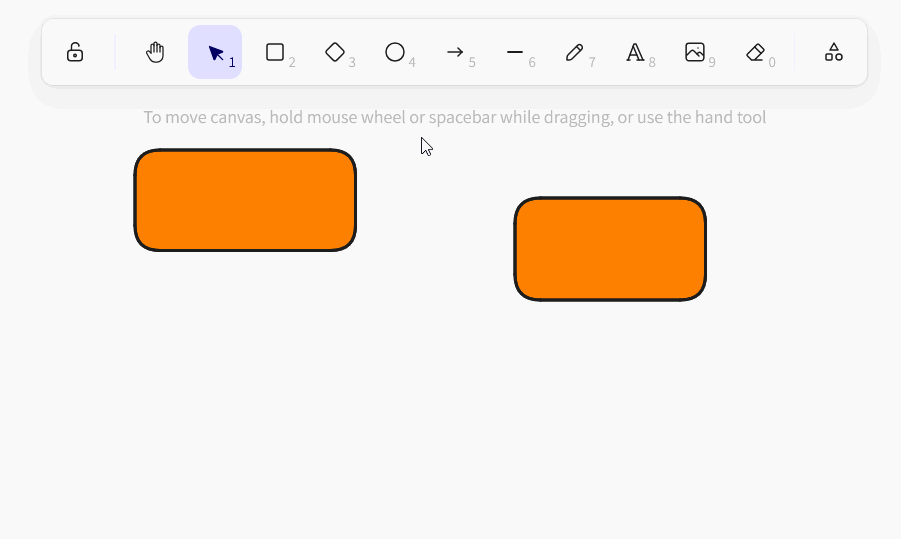
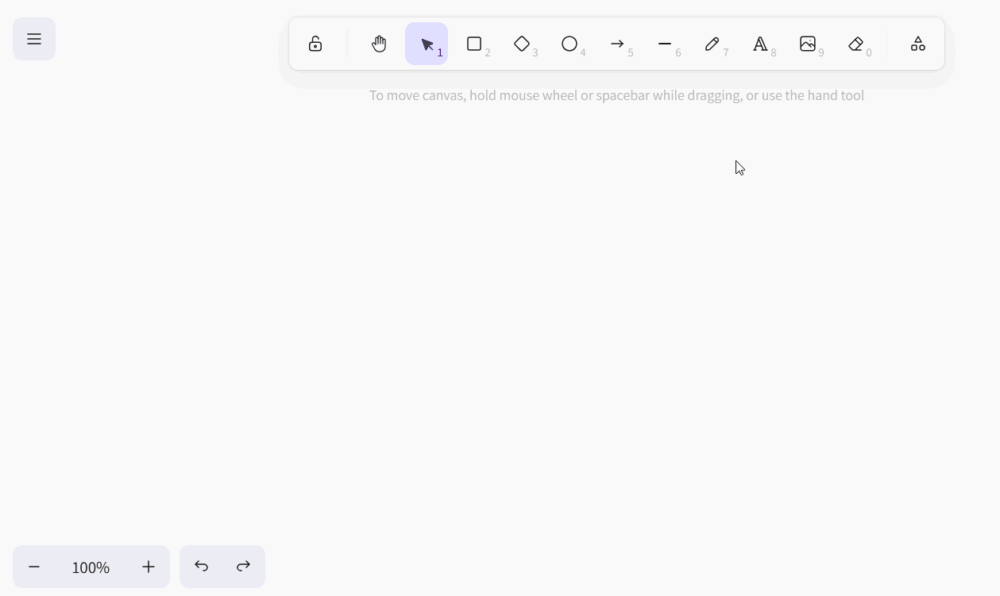
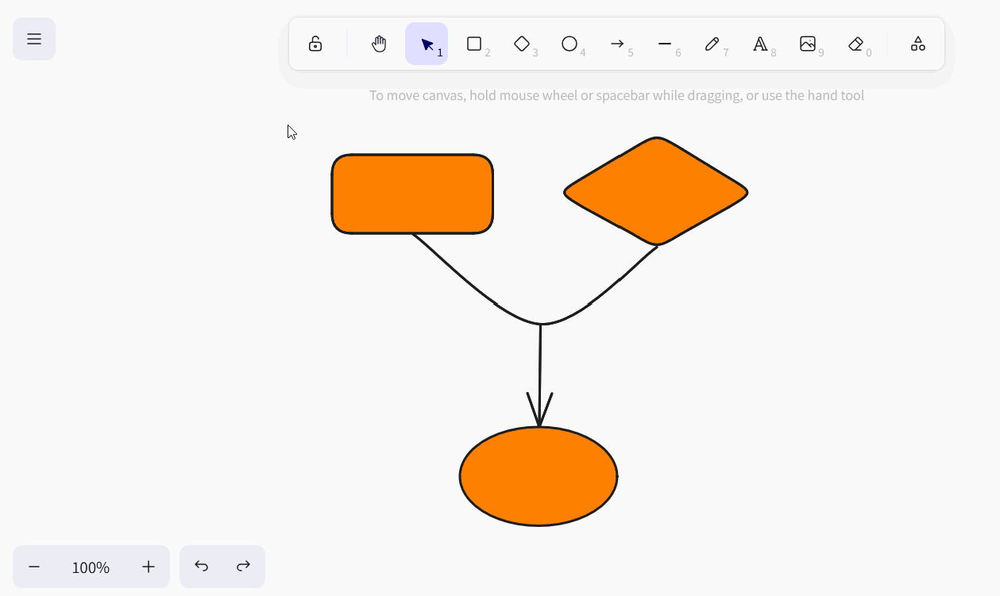
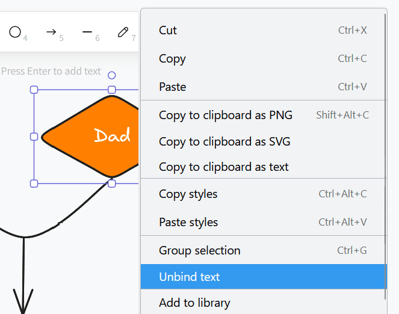

El **plugin de pizarra blanca** te da la libertad de visualizar gráficamente procesos y estructuras que no puedes mostrar con los plugins anteriores. También puedes esbozar libremente diseños y maquetas. Para el diseño, dispones de varios **elementos** como cuadrados, elipses y flechas, así como de **herramientas** como el bolígrafo, el borrador y la herramienta de texto.

Puede encontrar información sobre cómo activar el plugin en una base [aquí]().



Dado que el complemento de pizarra (obsoleto), basado en el proyecto de código abierto excalidraw, no admite la colaboración y ha demostrado ser propenso a errores cuando lo utilizan varios usuarios al mismo tiempo, lo eliminaremos de SeaTable Cloud como parte de la versión 6.0 en verano de 2025. Todos los dibujos del antiguo plugin de pizarra blanca dejarán de estar disponibles. Por lo tanto, recomendamos cambiar al nuevo [plugin]() de [pizarra (tldraw)]() tan pronto como sea posible y transferir el contenido existente usando copiar y pegar.



## Configurar las opciones de un dibujo de pizarra

Por defecto, se crea un dibujo con un lienzo en blanco cuando abre el complemento de pizarra por primera vez.  Si desea crear otro dibujo, haga clic en **Añadir dibujo**. Se abrirá un campo de entrada en el que podrá introducir el **nombre** que desee.

 Para **cambiar** el **orden de los** dibujos, mantenga pulsado el botón izquierdo del ratón sobre la **superficie de agarre** y **arrastre y suelte** el dibujo en la posición deseada. También puede **renombrar**, **duplicar** o **borrar** los dibujos.



## Herramientas disponibles

En la **barra de herramientas** situada encima del lienzo hay varias herramientas y elementos disponibles.

### Herramienta manual

Utilice la herramienta de mano para mover el lienzo sin cambiar nada en los elementos. Esto también funciona con la herramienta de selección en cuanto mantienes pulsada la barra espaciadora, o con la rueda del ratón en dirección vertical.

### Herramienta de selección

Puede utilizar esta herramienta para seleccionar un elemento que desee editar, copiar, mover o eliminar. Una vez seleccionado el elemento, aparecerán a la izquierda las opciones de configuración correspondientes.

### Herramienta de dibujo (bolígrafo)

Mantenga pulsado el botón izquierdo del ratón para dibujar diferentes líneas y formas a mano alzada. Cada vez que suelte el lápiz, se creará un nuevo elemento que podrá seleccionar por separado y personalizar como desee.

### Herramienta de texto

¿Quieres colocar un texto o una letra en tu lienzo? Entonces, ¡simplemente inserta un elemento de texto con esta herramienta! Una vez introducidas las letras, puedes configurar el color de la fuente, el tamaño de la letra, la familia tipográfica, la alineación del texto y la transparencia.

### Herramienta de imagen

Puede utilizar la herramienta de imagen para insertar imágenes de su dispositivo en el dibujo. Para ello, seleccione el archivo de imagen deseado en el sistema de carpetas que se abre. Mueva el cursor cargado sobre el lienzo hasta que se encuentre en una posición adecuada y coloque la imagen con un clic.

### Borrador

Puede utilizar esta herramienta para borrar varios elementos del lienzo de una sola vez. Mantén pulsado el botón izquierdo del ratón mientras mueves el borrador sobre los elementos que deseas borrar. Si, por el contrario, se desplaza sobre los elementos mientras simultáneamente  los elementos no se borran o se anula la selección para el borrado.

### Herramienta marco

Utilice la herramienta de marco para agrupar elementos individuales. En cuanto los elementos de un marco se hayan combinado en un grupo, podrás moverlos, copiarlos, bloquearlos y eliminarlos juntos.

### Puntero láser

Esta herramienta es especialmente útil para las presentaciones. Utiliza el puntero láser para resaltar las zonas de la pantalla sobre las que estás hablando en ese momento. Crea una línea roja que vuelve a desaparecer en cuestión de segundos.

## Elementos disponibles

Puede utilizar los siguientes elementos en el complemento de pizarra para dibujar:

- Rectángulos
- Rombos
- Elipses
- Flechas
- Líneas

Seleccione el elemento correspondiente en la barra de herramientas y arrástrelo al lienzo manteniendo pulsado el botón izquierdo del ratón.

## Configuración de los elementos

Dispone de numerosas opciones de configuración para todos estos elementos:

- el color del trazo exterior
- el color y el modo de relleno del fondo
- la anchura y el estilo del trazo
- la dejadez del contorno
- Esquinas redondeadas
- el tipo de puntas de flecha
- la transparencia del elemento
- la superposición de los niveles
- la alineación de los elementos

### Insertar texto en elementos

También puede **insertar texto** en rectángulos, rombos y elipses de forma estándar. Para ello, haga doble clic en el elemento correspondiente e introduzca el texto deseado. A continuación, dispondrá de las mismas posibilidades de ajuste que con la herramienta de texto.

Si lo desea, también puede separar un texto del elemento correspondiente. Para ello, haga clic con el botón derecho en el elemento y seleccione **Separar texto**.

El resultado es un **elemento de texto** tal y como lo conoce de la herramienta de texto.

### Definir los colores de los elementos

Dispone de una amplia paleta de colores para **colorear los elementos**. Puedes elegir entre matices de color graduados o definir un color exactamente mediante un código hexadecimal.

### Mover, girar, ampliar o reducir elementos

Utilice la **herramienta de selección** para hacer clic en el elemento que desea personalizar. Mueva el ratón sobre el **punto de agarre** correspondiente del elemento y, manteniendo pulsado el botón izquierdo del ratón, arrastre hasta donde desee para mover, girar, ampliar o reducir el elemento.

Puede utilizar los iconos de flecha situados en el borde inferior izquierdo de la pantalla para **deshacer** o **Restaurar**. También puedes utilizar los conocidos atajos + y ++ utilizar.

También puede cambiar el **nivel de zoom** del lienzo utilizando los iconos más y menos. Sin embargo, esto sólo cambia el tamaño de la sección visible y no el de los elementos.

### Duplicar, cortar, copiar y pegar elementos

Hay tres formas de duplicar un elemento: Haciendo clic en el botón **Símbolo duplicado** o haga clic con el botón derecho en el elemento y seleccione **Duplicar** o puede utilizar la función **Atajo** +.

Para cortar, copiar o pegar un elemento, puede hacer clic con el botón derecho del ratón sobre el elemento y seleccionar el elemento deseado en el menú **Menú contextual** seleccione la opción adecuada o utilice el conocido **Atajos** +, + y + utilizar.

También puede copiar un elemento como archivo de imagen (PNG o SVG) en el portapapeles, copiar el texto de un elemento en el portapapeles y copiar los ajustes de estilo del elemento y transferirlos a otros elementos.

### Mover elementos al primer o segundo plano

Como los elementos pueden solaparse en el lienzo, hay tres formas de mover un elemento un nivel o completamente al primer plano o al fondo.

Haga clic en los **iconos de las capas** en la configuración del elemento o haga clic con el botón derecho del ratón en el elemento y seleccione la opción deseada en el **menú contextual** o utilice los **accesos directos** correspondientes.

### Elementos de espejo

Si desea reflejar elementos, haga clic con el botón derecho en el elemento y seleccione **Reflejar horizontalmente** o **Reflejar verticalmente** en el menú contextual.

### Elementos de enlace

¿Quiere añadir a su dibujo elementos (botones, imágenes o texto) que enlacen a sitios web concretos? Entonces sólo tienes que enlazar los elementos insertando una URL. Para ello, haga clic en la configuración del elemento en el botón **Símbolo de cadena** o haga clic con el botón derecho en el elemento antes de seleccionar **Crear enlace** o utilice el atajo de teclado +.

En cuanto el elemento esté enlazado, aparecerá un **icono de enlace** a la derecha, encima del elemento. Haga clic en él para abrir la URL. Por supuesto, puedes editar la URL más tarde utilizando el icono del lápiz o borrarla haciendo clic en el icono de la papelera de reciclaje.

### Elementos de cierre

Si quieres trabajar en el lienzo sin mover o cambiar accidentalmente determinados elementos, puedes bloquearlos. Para ello, haga clic con el botón derecho del ratón sobre el elemento y seleccione la opción **Bloquear**. Para **desbloquear** elementos bloqueados, proceda del mismo modo.

### Eliminar elementos

Si desea eliminar un elemento, tiene varias opciones: Puede hacer clic en el icono **Icono de la papelera** o haga clic con el botón derecho en el elemento y seleccione **Borrar** o utilice los botones  o .

Para eliminar con rapidez y precisión varios elementos del lienzo, también puedes utilizar la **goma de borrar** de la barra de herramientas.

## Ajustes de pantalla

En el plugin de la pizarra blanca, además de los ajustes de los elementos individuales, puede realizar ajustes para todo el lienzo. Si haces clic con el botón derecho del ratón en una posición del lienzo en la que no hay ningún elemento, se abre el menú contextual correspondiente.

- Con **Seleccionar todo** puede seleccionar todos los elementos del lienzo al mismo tiempo.
- Si desea mostrar una cuadrícula para alinear los elementos con precisión, seleccione **Mostrar cuadrícula**.

- Si en su lugar activa **Ajustar a objetos**, aparecerán guías inteligentes para alinear los elementos entre sí.

- En el **modo Zen**, algunos iconos y menús de la pantalla están ocultos. Por ejemplo, los ajustes de los elementos no se abren cuando los seleccionas, de modo que puedes hacer clic más tranquilamente por el lienzo y organizar los elementos sin que te molesten.
- En el **modo de vista**, especialmente adecuado para presentaciones, la barra de herramientas y los menús contextuales también están ocultos y todos los elementos del lienzo están bloqueados para que no puedas cambiar nada accidentalmente. Aquí, tu dibujo permanece exactamente como está.
- Las **estadísticas para nerds** muestran cuántos elementos hay en el lienzo y qué área (anchura por altura en píxeles) ocupan. Si has seleccionado un elemento individual, también verás las coordenadas del elemento, su anchura y altura en píxeles y el ángulo con el que se ha girado.

### Color del lienzo

También puedes especificar tú mismo el color del fondo del lienzo. Para ello, haz clic en el menú hamburguesa (las tres líneas horizontales) y selecciona el color deseado en la parte inferior. También puedes definir tu propio color mediante código hexadecimal.

### Reiniciar pantalla

Para empezar un dibujo desde cero y borrar todos los elementos del lienzo, haz clic en el menú de la hamburguesa (las tres líneas horizontales) y luego en **Restablecer lienzo**. A continuación se le preguntará si está seguro y podrá cancelar o confirmar el proceso. El restablecimiento del lienzo a la configuración por defecto es **irreversible**.

## Guardar, importar y exportar dibujos

Puedes guardar un dibujo **como un archivo Excalidraw** para poder importarlo de nuevo al plugin de pizarra más tarde y editarlo de nuevo. Para ello, haga clic en el menú de la hamburguesa (las tres líneas horizontales) y seleccione **Guardar en disco**.

Para **importar** un dibujo, haga clic en **Abrir** del mismo modo y seleccione el archivo Excalidraw deseado de su disco duro.

También puede guardar un dibujo como archivo de imagen (PNG o SVG). Para ello, haga clic en el menú de la hamburguesa (las tres líneas horizontales) y seleccione **Exportar imagen**. En la ventana de diálogo que se abre, también puede realizar otros ajustes y asignar un nombre al archivo.



## Lista de todos los accesos directos

Puedes encontrar una lista clara de todos los atajos pulsando en el menú hamburguesa (las tres líneas horizontales) y luego en **Ayuda**.
