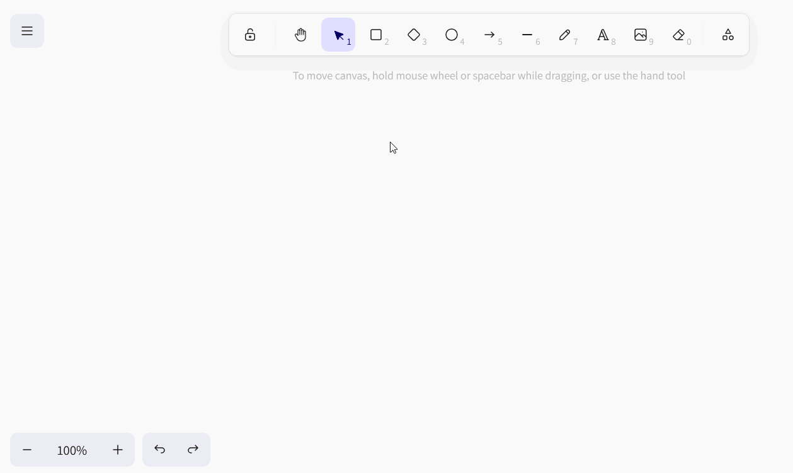
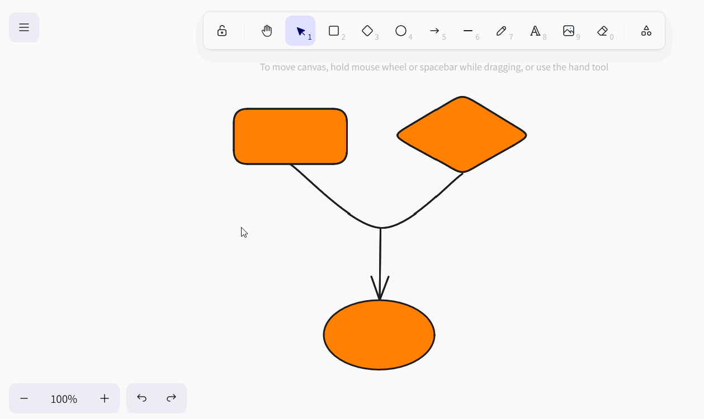
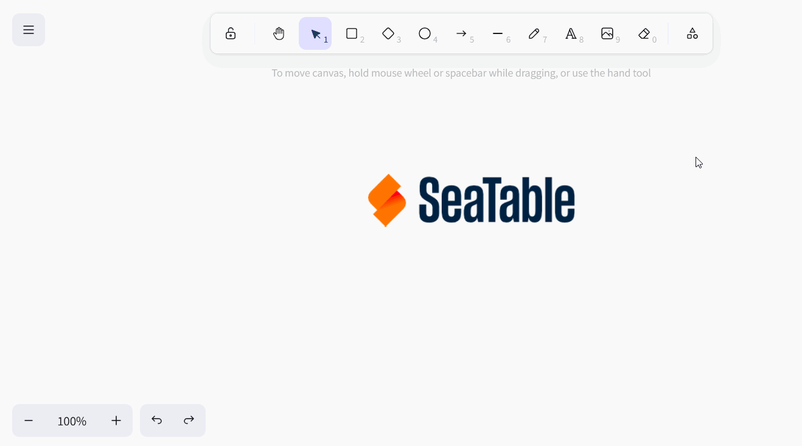
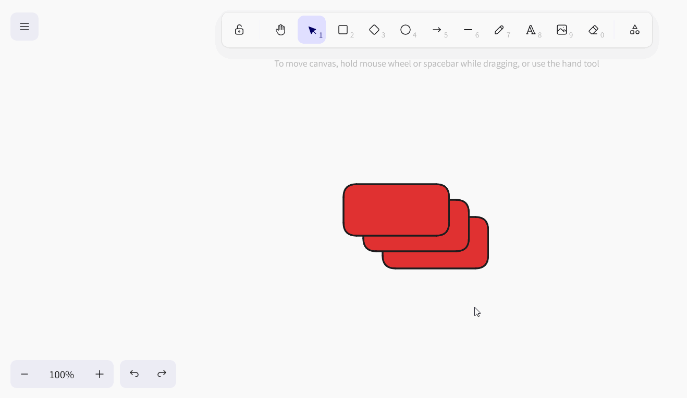
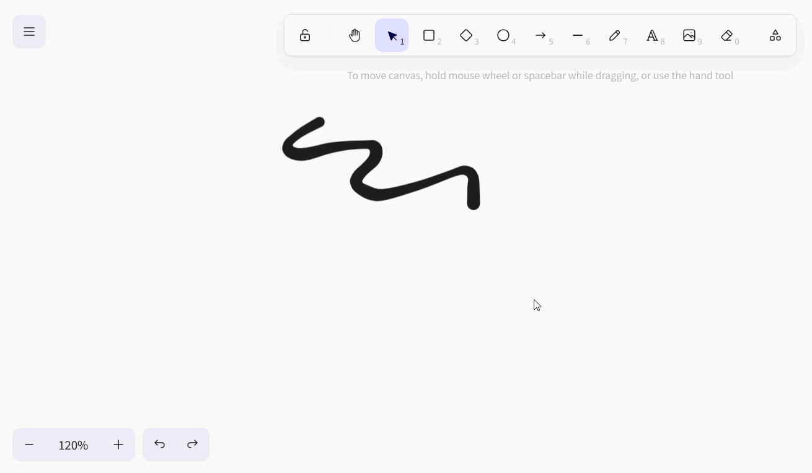

Le **plug-in Whiteboard** vous donne la liberté de visualiser graphiquement des processus et des structures que vous ne pouvez pas représenter avec les plug-ins précédents. De même, vous pouvez esquisser librement des mises en page et des mockups. Pour la conception, vous avez le choix entre différents **éléments** tels que des carrés, des ellipses et des flèches ainsi que **des outils** tels que le stylo, la gomme et l'outil de texte.

Pour savoir comment activer le plugin dans une base, [cliquez ici](https://seatable.io/fr/docs/plugins/aktivieren-eines-plugins-in-einer-base/).

{{< warning  headline="Attention : ce plugin va être retiré !"  text="Étant donné que le plug-in de tableau blanc (obsolète), basé sur le projet open source excalidraw, ne prend pas en charge la collaboration et s'est avéré sujet à des dysfonctionnements lorsque plusieurs utilisateurs l'utilisaient simultanément, nous le supprimerons de SeaTable Cloud dans le cadre de la version 6.0 prévue pour l'été 2025. Tous les dessins de l'ancien plug-in de tableau blanc ne seront alors plus disponibles. Nous vous recommandons donc de passer dès que possible au nouveau [plug-in de tableau blanc (tldraw)](https://seatable.io/fr/docs/plugins/anleitung-zum-whiteboard-plugin-tldraw/) et de transférer les contenus existants par copier-coller." />}}

## Possibilités de réglage d'un dessin sur tableau blanc

Par défaut, un dessin avec un canevas vide est déjà créé lors de la première ouverture du plugin de tableau blanc. Si vous souhaitez créer un autre dessin, cliquez sur  **Ajouter un dessin**. Un champ de saisie s'ouvre alors, dans lequel vous tapez le **nom** souhaité.

Pour modifier l'**ordre des dessins**, il suffit de maintenir le bouton gauche de la souris enfoncé au niveau de la **zone de préhension**  et de **glisser-déposer** le dessin à l'endroit souhaité. En outre, vous pouvez **renommer**, **dupliquer** ou **supprimer** les dessins.



## Outils disponibles

Dans la **barre d'outils** située au-dessus du canevas, vous disposez de différents outils et éléments.

### Outillage à main

Utilisez l'outil Main pour déplacer le canevas sans rien changer aux éléments. Cela fonctionne également avec l'outil Sélection, dès que vous maintenez la barre d'espacement enfoncée, ou avec la molette de la souris dans le sens vertical.

### Outil de sélection

Cet outil vous permet de sélectionner un élément que vous souhaitez modifier, copier, déplacer ou supprimer. Une fois l'élément sélectionné, ses options de configuration respectives apparaissent à gauche.

### Outil de dessin (stylo)

Maintenez le bouton gauche de la souris enfoncé pour dessiner à main levée différentes lignes et formes. Chaque fois que vous posez le crayon, un nouvel élément apparaît, que vous pouvez sélectionner séparément et adapter à votre guise.

### Outil texte

Vous souhaitez placer un texte ou une inscription sur votre toile ? Alors, insérez simplement un élément de texte à l'aide de cet outil ! Une fois que vous avez saisi les lettres, vous pouvez régler la couleur de la police, la taille de la police, la famille de police, l'alignement du texte et la transparence.

### Outil d'image

L'outil Image vous permet d'insérer des images de votre appareil dans le dessin. Pour ce faire, sélectionnez le fichier image souhaité dans le système de dossiers qui s'ouvre. Déplacez le curseur chargé sur le canevas jusqu'à ce qu'il se trouve à l'endroit approprié et placez l'image en cliquant dessus.

### Gomme

Cet outil permet d'effacer d'un seul coup plusieurs éléments sur le canevas. Maintenez le bouton gauche de la souris enfoncé pendant que vous passez la gomme sur les éléments à effacer. En revanche, si vous passez sur des éléments tout en appuyant sur la touche  maintenue, les éléments restent épargnés par la suppression ou sont désélectionnés pour être supprimés.

### Outil de cadre

Utilisez l'outil Cadre pour regrouper des éléments individuels. Dès que les éléments d'un cadre sont réunis en un groupe, vous pouvez les déplacer, les copier, les verrouiller et les supprimer ensemble.

### Pointeur laser

Cet outil est particulièrement utile pour les présentations. Utilisez le pointeur laser pour mettre en évidence les endroits de l'écran dont vous êtes en train de parler. Il crée un trait rouge qui disparaît en quelques secondes.

## Éléments disponibles

Vous pouvez utiliser les éléments suivants dans le plug-in de tableau blanc pour votre dessin :

- Rectangles
- Losanges
- Ellipses
- Flèches
- Lignes

Sélectionnez l'élément correspondant dans la barre d'outils et faites-le glisser sur le canevas en maintenant le bouton gauche de la souris enfoncé.

## Paramètres des éléments

Pour tous ces éléments, vous avez le choix entre de nombreuses options de réglage :

- la couleur du trait extérieur
- la couleur et le mode de remplissage de l'arrière-plan
- l'épaisseur et le style du trait
- le caractère bâclé du contour
- coins arrondis
- le type de pointes de flèches
- la transparence de l'élément
- la superposition des niveaux
- l'orientation des éléments

### Insérer du texte dans des éléments

Dans les rectangles, les losanges et les ellipses, vous pouvez en outre **insérer des textes** par défaut. Pour ce faire, double-cliquez sur l'élément correspondant et saisissez le texte souhaité. Vous disposez ensuite des mêmes options de réglage que pour l'outil Texte.

Si vous le souhaitez, vous pouvez également détacher un texte de l'élément correspondant. Pour ce faire, faites un clic droit sur l'élément et sélectionnez **Délier le texte**.

Vous obtenez ainsi un **élément de texte** tel que vous le connaissez avec l'outil Texte.

### Régler les couleurs des éléments

Pour la **coloration des éléments**, vous avez le choix entre une vaste palette de couleurs. Vous pouvez choisir entre des nuances de couleurs graduelles ou définir une couleur exacte par code hexadécimal.

### Déplacer, faire pivoter, agrandir ou réduire des éléments

Avec l'**outil de sélection**, cliquez sur l'élément que vous souhaitez adapter. Passez la souris sur le **point de préhension** approprié de l'élément et, tout en maintenant le bouton gauche de la souris enfoncé, faites glisser l'élément aussi loin que vous le souhaitez pour le déplacer, le faire pivoter, l'agrandir ou le réduire.

Les icônes de flèches en bas à gauche vous permettent d'accéder aux dernières étapes de la procédure. **annuler** ou **restaurer**. Vous pouvez également utiliser les raccourcis bien connus + et ++ utiliser.

En outre, vous pouvez modifier le **niveau de zoom** du canevas à l'aide des symboles plus et moins. Toutefois, cela ne modifie que la taille de la partie visible et non la taille des éléments.

### Dupliquer, couper, copier et coller des éléments

Pour dupliquer un élément, il existe trois possibilités : Soit vous cliquez dans les paramètres de l'élément sur le **Icône de duplication** ou faites un clic droit sur l'élément et choisissez dans le menu contextuel **Dupliquer** ou vous pouvez utiliser le **Raccourci** +.

Pour couper, copier ou coller un élément, vous pouvez faire un clic droit sur l'élément et cliquer sur le bouton "Couper" dans le menu contextuel. **Menu contextuel** sélectionner l'option correspondante ou utiliser les fameux **Raccourcis** +, + et + utiliser.

En outre, vous pouvez copier un élément dans le presse-papiers sous forme de fichier image (PNG ou SVG), copier le texte d'un élément dans le presse-papiers et copier les paramètres de style de l'élément pour les appliquer à d'autres éléments.

### Mettre des éléments au premier plan ou à l'arrière-plan

Comme les éléments peuvent se superposer sur le canevas, il existe trois possibilités pour placer un élément au premier plan ou à l'arrière-plan, un niveau à la fois ou complètement.

Soit vous cliquez sur les **icônes des calques** dans les paramètres de l'élément, soit vous faites un clic droit sur l'élément et sélectionnez l'option souhaitée dans le **menu contextuel**, soit vous utilisez les **raccourcis** correspondants.

### Miroir des éléments

Si vous souhaitez retourner des éléments, faites un clic droit sur l'élément et sélectionnez soit **Retourner horizontalement**, soit Retourner **verticalement** dans le menu contextuel.

### Lier des éléments

Vous souhaitez ajouter à votre dessin des éléments (par exemple des boutons, des images ou du texte) qui renvoient à des pages web spécifiques ? Il vous suffit alors d'insérer un lien URL vers ces éléments. Pour ce faire, cliquez soit sur le bouton **Symbole de la chaîne** ou faites un clic droit sur l'élément avant de choisir dans le menu contextuel **Créer un lien** ou utilisez le raccourci +.

Dès que l'élément est lié, une **icône de référence** apparaît à droite au-dessus de l'élément. Cliquez dessus pour ouvrir l'URL. Vous pouvez bien sûr modifier l'URL ultérieurement en utilisant l'icône en forme de crayon ou la supprimer en cliquant sur l'icône en forme de corbeille.

### Verrouiller des éléments

Si vous souhaitez travailler sur le canevas sans déplacer ou modifier certains éléments par inadvertance, vous pouvez verrouiller les éléments. Pour ce faire, faites un clic droit sur l'élément et sélectionnez l'option **Verrouiller**. Pour **déverrouiller** les éléments verrouillés, procédez de la même manière.

### Supprimer des éléments

Si vous souhaitez supprimer un élément, vous avez plusieurs possibilités : Soit vous cliquez sur le bouton "Supprimer" dans les paramètres de l'élément. **Icône de la corbeille** ou faites un clic droit sur l'élément et sélectionnez dans le menu contextuel tout en bas **Supprimer** ou utilisez les boutons  ou .

Pour supprimer rapidement et avec précision plusieurs éléments du canevas, vous pouvez également utiliser la **gomme** de la barre d'outils.

## Réglages de l'écran

Dans le plugin pour tableau blanc, vous pouvez effectuer des réglages pour l'ensemble du canevas en plus des réglages pour les différents éléments. Si vous faites un clic droit sur un endroit du canevas où il n'y a pas d'élément, le menu contextuel correspondant s'ouvre.

- **Sélectionner tout** permet de sélectionner simultanément tous les éléments du canevas.
- Si vous souhaitez afficher une grille afin d'aligner les éléments de manière précise, sélectionnez **Afficher la grille**.

- Si vous activez l'option **S'accrocher aux objets**, des lignes d'aide intelligentes apparaissent pour aligner les éléments les uns par rapport aux autres.

- En **mode Zen**, certaines icônes et certains menus sont masqués sur le canevas. Par exemple, les paramètres des éléments ne s'ouvrent pas lorsque vous les sélectionnez, ce qui vous permet de cliquer plus tranquillement sur le canevas et d'organiser les éléments sans être dérangé.
- En **mode Affichage**, qui convient surtout aux présentations, la barre d'outils et les menus contextuels sont en outre masqués et tous les éléments du canevas sont verrouillés afin que vous ne puissiez rien modifier par inadvertance. Ici, votre dessin reste exactement tel qu'il est.
- Les **statistiques pour les nuls** indiquent le nombre d'éléments présents sur le canevas et la surface (largeur par hauteur en pixels) qu'ils occupent. Si vous avez sélectionné un seul élément, vous verrez en plus les coordonnées de l'élément, sa largeur et sa hauteur en pixels et l'angle auquel il a été tourné.

### Couleur de la toile

En outre, vous pouvez définir vous-même la couleur de l'arrière-plan de la toile. Pour ce faire, cliquez sur le menu Burger (les trois traits horizontaux) et choisissez tout en bas la couleur souhaitée. Vous pouvez également définir votre propre couleur par code hexadécimal.

### Réinitialiser l'écran

Pour recommencer complètement un dessin et effacer tous les éléments du canevas, cliquez sur le menu Burger (les trois traits horizontaux), puis sur **Réinitialiser le canevas**. Il vous sera alors demandé si vous êtes sûr de vous et vous pourrez annuler ou confirmer l'opération. La réinitialisation du canevas aux paramètres par défaut est **irréversible**.

## Enregistrer, importer et exporter des dessins

Vous pouvez **enregistrer** un dessin **en tant que fichier Excalidraw** afin de pouvoir le réimporter plus tard dans le plugin pour tableau blanc et continuer à le modifier. Pour ce faire, cliquez sur le menu Burger (les trois traits horizontaux) et sélectionnez **Enregistrer sur disque**.

Pour **importer** un dessin, suivez la même procédure en cliquant sur **Ouvrir** et en sélectionnant le fichier Excalidraw souhaité sur votre disque dur.

En outre, vous pouvez enregistrer un dessin en tant que fichier image (PNG ou SVG). Pour ce faire, cliquez sur le menu Burger (les trois traits horizontaux) et sélectionnez **Exporter l'image**. Dans la boîte de dialogue qui s'ouvre, vous pouvez également effectuer d'autres réglages et donner un nom au fichier.



## Liste de tous les raccourcis

Vous trouverez une liste claire de tous les raccourcis en cliquant sur le menu Burger (les trois traits horizontaux), puis sur **Aide**.
