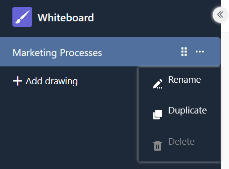

O **plugin de quadro branco** dá-lhe a liberdade de visualizar graficamente processos e estruturas que não pode apresentar com os plugins anteriores. Também pode esboçar livremente esquemas e maquetas. Para o desenho, tem vários **elementos** como quadrados, elipses e setas, bem como **ferramentas** como a caneta, o apagador e a ferramenta de texto à escolha.

Pode descobrir como ativar o plugin numa base [aqui](https://seatable.io/pt/docs/plugins/aktivieren-eines-plugins-in-einer-base/).

{{< warning  headline="Atenção: Este plugin está a ser eliminado!"  text="Uma vez que o plug-in do quadro branco (obsoleto), que se baseia no projeto de código aberto excalidraw, não suporta a colaboração e provou ser propenso a erros quando utilizado por vários utilizadores ao mesmo tempo, iremos removê-lo do SeaTable Cloud como parte da versão 6.0 no verão de 2025. Todos os desenhos no antigo plug-in do quadro branco deixarão então de estar disponíveis. Por conseguinte, recomendamos que mude para o novo [plug-in](https://seatable.io/pt/docs/plugins/anleitung-zum-whiteboard-plugin-tldraw/) de [quadro branco (tldraw)](https://seatable.io/pt/docs/plugins/anleitung-zum-whiteboard-plugin-tldraw/) o mais rapidamente possível e que transfira o conteúdo existente utilizando copiar e colar." />}}

## Definir opções para um desenho no quadro branco

Por predefinição, já é criado um desenho com uma tela em branco quando abre o plug-in do quadro branco pela primeira vez.  Se pretender criar outro desenho, clique em **Adicionar desenho**. Isto abre um campo de entrada no qual pode introduzir o **nome** pretendido.

 Para **alterar a ordem dos desenhos**, mantenha premido o botão esquerdo do rato na **superfície de aperto** e arraste **e largue** o desenho para a posição pretendida. Também é possível mudar o **nome**, **duplicar** ou **apagar** os desenhos.



## Ferramentas disponíveis

Estão disponíveis várias ferramentas e elementos na **barra de ferramentas** por cima da tela.

### Ferramenta manual

Utilize a ferramenta manual para mover a tela sem alterar nada nos elementos. Isto também funciona com a ferramenta de seleção assim que mantiver premida a barra de espaços, ou com a roda do rato na direção vertical.

### Ferramenta de seleção

Pode utilizar esta ferramenta para selecionar um elemento que pretende editar, copiar, mover ou eliminar. Assim que o elemento é selecionado, as respectivas opções de definição aparecem à esquerda.

### Ferramenta de desenho (caneta)

Mantenha premido o botão esquerdo do rato para desenhar diferentes linhas e formas à mão livre. Sempre que soltar a caneta, é criado um novo elemento que pode selecionar separadamente e personalizar conforme necessário.

### Ferramenta de texto

Gostaria de colocar um texto ou uma letra na sua tela? Então, basta inserir um elemento de texto com esta ferramenta! Depois de introduzir as letras, pode definir a cor do tipo de letra, o tamanho do tipo de letra, a família do tipo de letra, o alinhamento do texto e a transparência.

### Ferramenta de imagem

Pode utilizar a ferramenta de imagem para inserir imagens do seu dispositivo no desenho. Para isso, seleccione o ficheiro de imagem pretendido no sistema de pastas que se abre. Mova o cursor carregado sobre a tela até que esteja numa posição adequada e coloque a imagem com um clique.

### Borracha

Pode utilizar esta ferramenta para apagar vários elementos da tela de uma só vez. Mantenha premido o botão esquerdo do rato enquanto move a borracha sobre os elementos a apagar. Se, por outro lado, se deslocar sobre os elementos e simultaneamente  os elementos são poupados à eliminação ou a seleção para eliminação é anulada.

### Ferramenta de moldura

Utilize a ferramenta de moldura para agrupar elementos individuais. Assim que os elementos de uma moldura tiverem sido combinados num grupo, pode deslocá-los, copiá-los, bloqueá-los e apagá-los em conjunto.

### Ponteiro laser

Esta ferramenta é particularmente útil para apresentações. Utilize o ponteiro laser para realçar as áreas do ecrã sobre as quais está a falar. Cria uma linha vermelha que desaparece novamente numa questão de segundos.

## Elementos disponíveis

Pode utilizar os seguintes elementos no plug-in do quadro branco para o seu desenho:

- Rectângulos
- Losangos
- Elipses
- Setas
- Linhas

Seleccione o elemento correspondente na barra de ferramentas e arraste-o para a tela, mantendo premido o botão esquerdo do rato.

## Definições de elementos

Existem várias opções de definição para escolher para todos estes elementos:

- a cor do traço exterior
- a cor e o modo de preenchimento do fundo
- a largura do traço e o estilo do traço
- o desleixo do contorno
- Cantos arredondados
- o tipo de pontas de seta
- a transparência do elemento
- a sobreposição dos níveis
- o alinhamento dos elementos

### Inserir texto em elementos

Também pode **inserir texto** em rectângulos, losangos e elipses como padrão. Para o fazer, faça duplo clique no elemento correspondente e introduza o texto pretendido. Tem então as mesmas opções de configuração que a ferramenta de texto.

Se desejar, também pode separar um texto do respetivo elemento. Para tal, clique com o botão direito do rato no elemento e seleccione **Separar texto**.

O resultado é um **elemento de texto** tal como o conhece da ferramenta de texto.

### Definir as cores dos elementos

Dispõe de uma vasta paleta de cores para **colorir os elementos**. Pode escolher entre nuances de cor graduadas ou definir uma cor com exatidão utilizando um código hexadecimal.

### Mover, rodar, ampliar ou reduzir elementos

Utilize a **ferramenta de seleção** para clicar no elemento que pretende personalizar. Mova o rato sobre o **ponto de agarrar** apropriado no elemento e, mantendo premido o botão esquerdo do rato, arraste até onde quiser para mover, rodar, aumentar ou reduzir o elemento.

Pode utilizar os ícones de seta no canto inferior esquerdo do ecrã para **anular** ou **Restaurar**. Também pode utilizar os atalhos conhecidos + e ++ utilizar.

Também pode alterar o **nível de zoom** da tela utilizando os ícones de mais e menos. No entanto, isto apenas altera o tamanho da secção visível e não o tamanho dos elementos.

### Duplicar, cortar, copiar e colar elementos

Existem três formas de duplicar um elemento: Ou clica no botão **Símbolo duplicado** ou clicar com o botão direito do rato no elemento e selecionar **Duplicado** ou pode utilizar o **Atalho** +.

Para cortar, copiar ou colar um elemento, pode clicar com o botão direito do rato sobre o elemento e selecionar o elemento pretendido no menu **Menu de contexto** selecionar a opção adequada ou utilizar o **Atalhos** +, + e + utilizar.

Também pode copiar um elemento como um ficheiro de imagem (PNG ou SVG) para a área de transferência, copiar o texto de um elemento para a área de transferência e copiar as definições de estilo do elemento e transferi-las para outros elementos.

### Mover elementos para o primeiro plano ou para o fundo

Como os elementos se podem sobrepor na tela, existem três formas de mover um elemento um nível ou completamente para o primeiro ou segundo plano.

Clique nos **ícones de camada** nas definições do elemento ou clique com o botão direito do rato no elemento e seleccione a opção pretendida no **menu de contexto** ou utilize os **atalhos** correspondentes.

### Elementos de espelho

Se pretender espelhar elementos, clique com o botão direito do rato no elemento e seleccione **Espelhar horizontalmente** ou **Espelhar verticalmente** no menu de contexto.

### Elementos de ligação

Gostaria de adicionar elementos (por exemplo, botões, imagens ou texto) ao seu desenho que ligam a sítios Web específicos? Então, basta ligar os elementos inserindo um URL. Para o fazer, clique nas definições do elemento no ecrã **Símbolo de corrente** ou clicar com o botão direito do rato no elemento antes de selecionar **Criar ligação** ou utilizar o atalho +.

Assim que o elemento é ligado, aparece um **ícone de ligação** à direita por cima do elemento. Clique nele para abrir o URL. Naturalmente, pode editar o URL mais tarde utilizando o ícone do lápis ou eliminá-lo clicando no ícone da reciclagem.

### Elementos de bloqueio

Se quiser trabalhar na tela sem mover ou alterar acidentalmente determinados elementos, pode bloquear os elementos. Para o fazer, clique com o botão direito do rato no elemento e seleccione a opção **Bloquear**. Para **desbloquear** elementos bloqueados, proceda da mesma forma.

### Eliminar elementos

Se pretender eliminar um elemento, existem várias opções: Ou clica no botão **Ícone do lixo** ou clicar com o botão direito do rato no elemento e selecionar **Eliminar** ou utilizar os botões  ou .

Para remover vários elementos da tela de forma rápida e precisa, também pode utilizar a **borracha** da barra de ferramentas.

## Definições do ecrã

No plugin do quadro branco, pode efetuar definições para toda a tela, para além das definições para os elementos individuais. Se clicar com o botão direito do rato numa posição da tela onde não existe qualquer elemento, abre-se o menu de contexto correspondente.

- Com a opção **Selecionar tudo**, pode selecionar todos os elementos da tela ao mesmo tempo.
- Se pretender mostrar uma grelha para alinhar os elementos com precisão, seleccione **Mostrar grelha**.

- Se, em vez disso, ativar **Encaixar em objectos**, aparecem guias inteligentes para alinhar os elementos uns com os outros.

- No **modo Zen**, alguns ícones e menus do ecrã estão ocultos. Por exemplo, as definições de elementos não abrem quando selecciona elementos, pelo que pode clicar mais calmamente na tela e organizar elementos sem ser incomodado.
- No **modo de visualização**, que é particularmente adequado para apresentações, a barra de ferramentas e os menus de contexto também estão ocultos e todos os elementos na tela estão bloqueados para que não possa alterar nada acidentalmente. Aqui, o seu desenho permanece exatamente como está.
- As **estatísticas para nerds** mostram quantos elementos estão na tela e qual a área (largura vezes altura em pixéis) que ocupam. Se tiver selecionado um elemento individual, verá também as coordenadas do elemento, a sua largura e altura em pixels e o ângulo a que foi rodado.

### Cor da tela

Também pode especificar a cor do fundo da tela. Para o fazer, clique no menu de hambúrgueres (as três linhas horizontais) e seleccione a cor pretendida na parte inferior. Também pode definir a sua própria cor utilizando o código hexadecimal.

### Reiniciar o ecrã

Para começar um desenho do zero e apagar todos os elementos da tela, clique no menu do hambúrguer (as três linhas horizontais) e depois em **Reiniciar tela**. Ser-lhe-á perguntado se tem a certeza e pode cancelar ou confirmar o processo. A reposição das predefinições da tela é **irreversível**.

## Guardar, importar e exportar desenhos

Pode guardar um desenho **como um ficheiro Excalidraw**, de modo a poder importá-lo novamente para o plug-in do quadro branco e editá-lo mais tarde. Para o fazer, clique no menu do hambúrguer (as três linhas horizontais) e seleccione **Guardar no disco**.

Para **importar** um desenho, clique em **Abrir** da mesma forma e seleccione o ficheiro Excalidraw desejado no seu disco rígido.

Também pode guardar um desenho como um ficheiro de imagem (PNG ou SVG). Para o fazer, clique no menu do hambúrguer (as três linhas horizontais) e seleccione **Exportar imagem**. Na janela de diálogo que se abre, também pode fazer outras configurações e dar um nome ao ficheiro.



## Lista de todos os atalhos

Pode encontrar uma lista clara de todos os atalhos clicando no menu hambúrguer (as três linhas horizontais) e depois em **Ajuda**.
