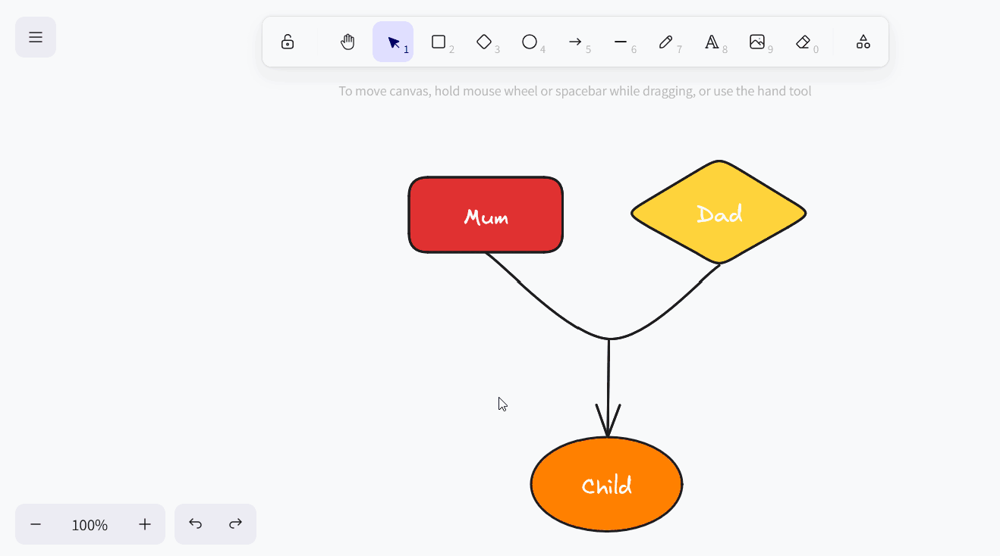

**Плагин Whiteboard** дает вам возможность графически визуализировать процессы и структуры, которые невозможно отобразить с помощью предыдущих плагинов. Вы также можете свободно создавать макеты и эскизы. Для оформления вам предлагаются различные **элементы**, такие как квадраты, эллипсы и стрелки, а также такие **инструменты**, как перо, ластик и текстовый инструмент.

О том, как активировать плагин в базе, вы можете узнать [здесь]().



Поскольку плагин для белой доски (устаревший), основанный на проекте с открытым исходным кодом excalidraw, не поддерживает совместную работу и оказался склонен к ошибкам при одновременном использовании несколькими пользователями, мы удалим его из SeaTable Cloud в рамках релиза 6.0 летом 2025 года. После этого все рисунки в старом плагине для белых досок будут недоступны. Поэтому мы рекомендуем как можно скорее перейти на новый [плагин для досок (tldraw)]() и перенести существующий контент с помощью копирования и вставки.



## Настройка параметров для рисунка на доске

По умолчанию при первом открытии плагина доски уже создается рисунок с пустым холстом.  Если вы хотите создать еще один рисунок, нажмите на кнопку **Добавить рисунок**. Откроется поле ввода, в котором вы можете ввести желаемое **название**.

 Чтобы **изменить порядок расположения рисунков**, удерживайте левую кнопку мыши на **поверхности захвата** и **перетащите** рисунок в нужное место. Вы также можете **переименовывать**, **дублировать** или **удалять** рисунки.



## Доступные инструменты

Различные инструменты и элементы доступны на **панели инструментов** над холстом.

### Ручной инструмент

Используйте инструмент "Рука", чтобы перемещать холст, не меняя ничего в элементах. Это также работает с инструментом выделения, если удерживать пробел, или с колесиком мыши в вертикальном направлении.

### Инструмент выбора

С помощью этого инструмента можно выбрать элемент, который нужно отредактировать, скопировать, переместить или удалить. Как только элемент выбран, слева появляются соответствующие параметры настройки.

### Инструмент для рисования (перо)

Удерживайте левую кнопку мыши, чтобы рисовать различные линии и фигуры от руки. Каждый раз, когда вы отпускаете перо, создается новый элемент, который вы можете выбрать отдельно и настроить по своему усмотрению.

### Текстовый инструмент

Хотите разместить на холсте текст или надпись? Тогда просто вставьте текстовый элемент с помощью этого инструмента! После ввода букв вы можете задать цвет шрифта, размер шрифта, семейство шрифтов, выравнивание текста и прозрачность.

### Инструмент для работы с изображениями

С помощью инструмента "Изображение" можно вставить в чертеж изображения с вашего устройства. Для этого выберите нужный файл изображения в открывшейся системе папок. Переместите загруженный курсор на холст, пока он не займет нужное положение, и поместите изображение щелчком мыши.

### Ластик

С помощью этого инструмента можно стереть несколько элементов на холсте за один раз. Удерживайте левую кнопку мыши, перемещая ластик над элементами, которые нужно стереть. Если же вы перемещаете ластик над элементами, одновременно  элементы избавлены от удаления или выбор для удаления отменен.

### Рамочный инструмент

Используйте инструмент "Рамка" для группировки отдельных элементов. Как только элементы в рамке будут объединены в группу, их можно будет перемещать, копировать, блокировать и удалять вместе.

### Лазерная указка

Этот инструмент особенно полезен для презентаций. С помощью лазерной указки выделите на экране те области, о которых вы говорите в данный момент. При этом образуется красная линия, которая исчезает через несколько секунд.

## Доступные элементы

Вы можете использовать следующие элементы в плагине для белой доски для рисования:

- Прямоугольники
- Ромбы
- Эллипсы
- Стрелки
- Линии

Выберите соответствующий элемент на панели инструментов и перетащите его на холст, удерживая левую кнопку мыши.

## Настройки элементов

У вас есть множество вариантов настройки всех этих элементов:

- цвет внешнего штриха
- цвет и режим заливки фона
- ширина обводки и стиль обводки
- неаккуратность контура
- Скругленные углы
- тип наконечников стрел
- прозрачность элемента
- перекрытие уровней
- выравнивание элементов

### Вставка текста в элементы

Вы также можете **вставлять текст** в прямоугольники, ромбы и эллипсы в стандартном режиме. Для этого дважды щелкните по соответствующему элементу и введите нужный текст. После этого у вас будут те же возможности настройки, что и при использовании инструмента "Текст".

При желании вы можете отделить текст от соответствующего элемента. Для этого щелкните правой кнопкой мыши на элементе и выберите **Отсоединить текст**.

В результате вы получите **текстовый элемент**, как вы его знаете из текстового инструмента.

### Установите цвета элементов

У вас есть обширная палитра цветов для **окрашивания элементов**. Вы можете выбрать один из градуированных цветовых оттенков или точно определить цвет с помощью шестнадцатеричного кода.

### Перемещайте, поворачивайте, увеличивайте или уменьшайте элементы

С помощью **инструмента выделения** щелкните на элементе, который нужно настроить. Наведите курсор на соответствующую **точку захвата** на элементе и, удерживая левую кнопку мыши, перетащите ее на нужное расстояние, чтобы переместить, повернуть, увеличить или уменьшить элемент.

Вы можете использовать значки со стрелками в левом нижнем углу экрана, чтобы **отменить** или **Восстановить**. Вы также можете использовать привычные сочетания клавиш + и ++ использовать.

Вы также можете изменить **уровень масштабирования** холста с помощью значков "плюс" и "минус". Однако при этом изменяется только размер видимой части, но не размер элементов.

### Дублирование, вырезание, копирование и вставка элементов

Существует три способа дублирования элемента: Либо вы нажимаете на **Дублирующий символ** или щелкните правой кнопкой мыши на элементе и выберите **Дубликат** или вы можете использовать **Ярлык** +.

Чтобы вырезать, скопировать или вставить элемент, вы можете щелкнуть правой кнопкой мыши на элементе и выбрать нужный элемент в меню **Контекстное меню** выберите соответствующую опцию или воспользуйтесь знакомым **Ярлыки** +, + и + использовать.

Вы также можете скопировать элемент в виде файла изображения (PNG или SVG) в буфер обмена, скопировать текст из элемента в буфер обмена, а также скопировать настройки стиля элемента и перенести их на другие элементы.

### Перемещение элементов на передний или задний план

Поскольку элементы могут перекрываться на холсте, есть три способа переместить элемент на один уровень или полностью на передний или задний план.

Либо щелкните на **значках слоев** в настройках элемента, либо щелкните правой кнопкой мыши на элементе и выберите нужную опцию в **контекстном меню**, либо воспользуйтесь соответствующими **ярлыками**.

### Зеркальные элементы

Если вы хотите зеркально отобразить элементы, щелкните правой кнопкой мыши на элементе и выберите в контекстном меню пункт **Зеркало по горизонтали** или **Зеркало по вертикали**.

### Элементы ссылок

Хотите добавить в свой рисунок элементы (например, кнопки, изображения или текст), которые ссылаются на определенные веб-сайты? Тогда просто соедините элементы, вставив URL-адрес. Для этого в настройках элемента нажмите кнопку **Символ цепи** или щелкните правой кнопкой мыши на элементе, прежде чем выбрать **Создать ссылку** или воспользуйтесь ярлыком +.

Как только элемент будет связан, справа над ним появится **значок ссылки**. Щелкните по нему, чтобы открыть URL-адрес. Конечно, позже вы можете отредактировать URL с помощью значка карандаша или удалить его, нажав на значок корзины.

### Элементы замка

Если вы хотите работать на холсте без случайного перемещения или изменения определенных элементов, вы можете заблокировать их. Для этого щелкните правой кнопкой мыши на элементе и выберите опцию " **Заблокировать"**. Чтобы **разблокировать** заблокированные элементы, действуйте аналогичным образом.

### Удаление элементов

Если вы хотите удалить элемент, есть несколько вариантов: Либо вы нажимаете на **Значок корзины** или щелкните правой кнопкой мыши на элементе и выберите **Удалить** или воспользуйтесь кнопками  или .

Чтобы быстро и аккуратно удалить несколько элементов с холста, вы также можете воспользоваться **ластиком** на панели инструментов.

## Настройки экрана

В плагине для белой доски помимо настроек для отдельных элементов можно задать настройки для всего холста. Если щелкнуть правой кнопкой мыши по месту на холсте, где нет ни одного элемента, откроется соответствующее контекстное меню.

- С помощью функции **Select all** вы можете выбрать все элементы на холсте одновременно.
- Если вы хотите показать сетку, чтобы точно выровнять элементы, выберите **Показать сетку**.

- Если вместо этого активировать функцию **Привязка к объектам**, появятся интеллектуальные направляющие для выравнивания элементов друг относительно друга.

- В **режиме Zen** некоторые значки и меню на экране скрыты. Например, настройки элементов не открываются при выборе элементов, поэтому вы можете более спокойно щелкать по холсту и расставлять элементы без помех.
- В **режиме просмотра**, который особенно подходит для презентаций, панель инструментов и контекстные меню также скрыты, а все элементы на холсте заблокированы, чтобы вы не могли случайно что-то изменить. Здесь ваш рисунок остается таким, какой он есть.
- **Статистика для ботаников** показывает, сколько элементов находится на холсте и какую площадь (ширина умноженная на высоту в пикселях) они занимают. Если вы выделили отдельный элемент, вы также увидите координаты элемента, его ширину и высоту в пикселях и угол, на который он был повернут.

### Цвет холста

Вы также можете самостоятельно задать цвет фона холста. Для этого нажмите на меню бургера (три горизонтальные линии) и выберите нужный цвет в нижней части. Вы также можете задать свой собственный цвет с помощью шестнадцатеричного кода.

### Экран сброса

Чтобы начать рисунок с нуля и удалить все элементы на холсте, нажмите на меню бургера (три горизонтальные линии), а затем на кнопку **Сбросить холст**. После этого вас спросят, уверены ли вы, и вы сможете отменить или подтвердить процесс. Сброс холста к настройкам по умолчанию **необратим**.

## Сохранение, импорт и экспорт чертежей

Вы можете сохранить рисунок **в виде файла Excalidraw**, чтобы позже импортировать его обратно в плагин для досок и отредактировать. Для этого нажмите на меню бургера (три горизонтальные линии) и выберите **Сохранить на диск**.

Чтобы **импортировать** чертеж, нажмите кнопку **Открыть** и выберите нужный файл Excalidraw на жестком диске.

Вы также можете сохранить рисунок в виде файла изображения (PNG или SVG). Для этого нажмите на меню бургера (три горизонтальные линии) и выберите **Экспорт изображения**. В открывшемся диалоговом окне вы также можете задать дополнительные настройки и имя файла.



## Список всех ярлыков

Вы можете найти четкий список всех ярлыков, нажав на меню бургера (три горизонтальные линии), а затем на **Help**.
