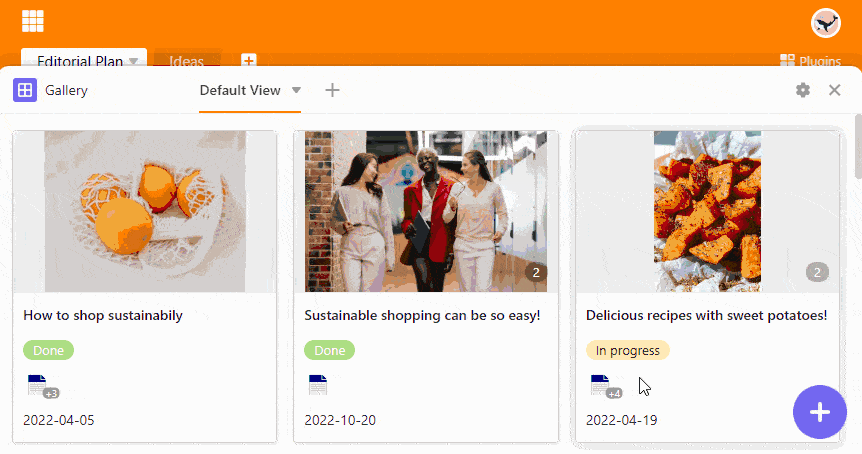

You would normally [create]() new rows in the **table view**. However, in the **Gallery plugin**, you also have this option. The newly created row will be displayed in the gallery as an **album** and will be added to the table below all other rows .

## Adding a row in the gallery

1. Open the **gallery plugin**.
2. Click on the **purple circle with the plus symbol**.
3. A new window opens. Create a new record in the **row details** and maintain the desired information and images.
4. The changes are automatically saved when you close the window with .

