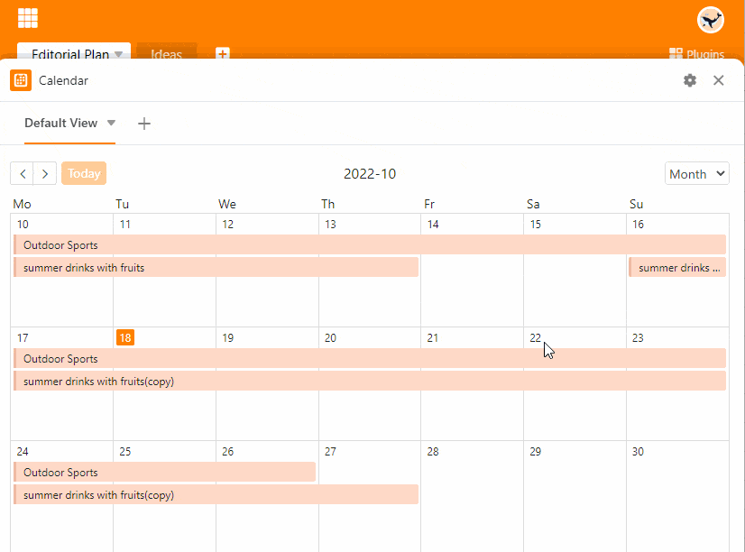

Indem Sie **mehrere Kalender** in einer Base anlegen, können Sie spezifische Termine in unterschiedlichen Kalendern speichern. Beispielsweise können Sie einzelne Kalender für unterschiedliche Projekte anlegen. Wenn Sie in einer Base mit mehreren Personen zusammenarbeiten, kann jedes Teammitglied individuelle Kalender erstellen.

Um mehrere Kalender anzulegen, benötigen Sie entweder **mehrere Tabellen** oder eine Tabelle mit verschiedenen [Ansichten]() oder eine Tabelle mit verschiedenen [Datum-Spalten]().

## Wie Sie im Kalender-Plugin weitere Kalender anlegen

1. Klicken Sie auf das **Plus-Symbol** rechts neben dem Titel Ihres ersten Kalenders.
2. Geben Sie dem Kalender einen **Namen** und bestätigen Sie mit **Abschicken**.
3. Legen Sie in den **Einstellungen**  fest, auf welche Tabellenansicht und welche Datum-Spalte(n) sich der neue Kalender beziehen soll.

