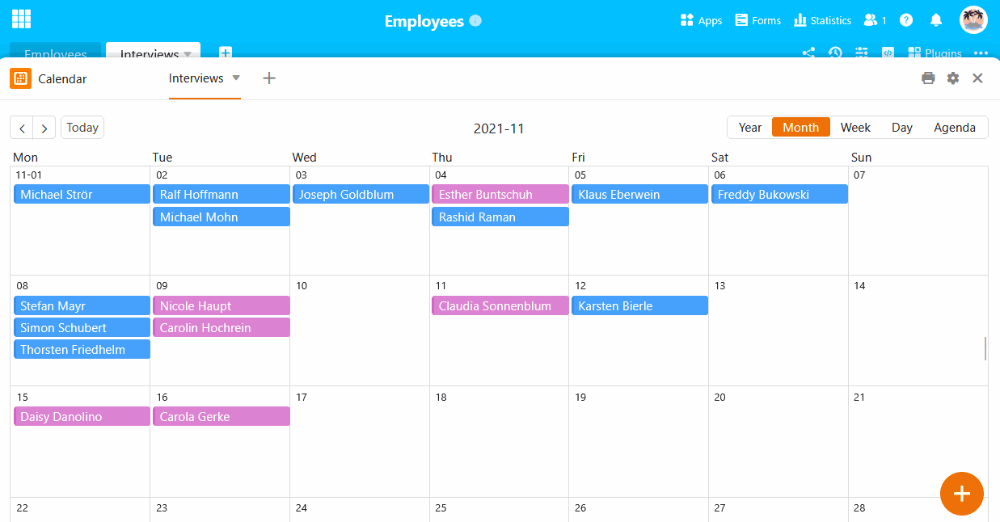
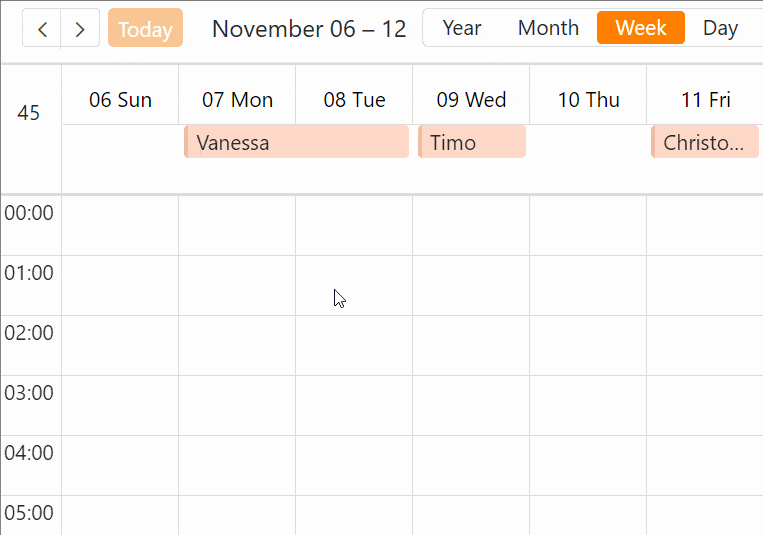

Um **neue Einträge** im Kalender hinzuzufügen, haben Sie verschiedene Möglichkeiten. Sie können das **in der zugrundeliegenden Tabelle** tun, indem Sie dort eine neue Zeile anlegen und einen Termin in die [Datum-Spalte]() eintragen, der dann auch im Kalender-Plugin angezeigt wird.

Aber auch direkt **im Kalender-Plugin** ist es kinderleicht, neue Einträge vorzunehmen. Dort hängt es von der gewählten Darstellung (**Jahr**, **Monat**, **Woche**, **Tag** oder **Agenda**) ab, wie Sie einen Termin eintragen können.

## Neue Einträge über die Zeilendetails erstellen

### Neue Einträge über ein Tagesfeld erstellen

1. Öffnen Sie das **Kalender-Plugin** und wählen Sie die Darstellungsoption **Monat** oder **Woche**.
2. Fahren Sie mit dem Mauszeiger über ein **Feld** im Kalender und klicken Sie auf das **Plus-Symbol**, welches in der rechten oberen Ecke erscheint.
3. Legen Sie in den **Zeilendetails** einen neuen Eintrag an und bestätigen Sie durch **Schließen** des Fensters mit .



### Neue Einträge per Doppelklick erstellen

Machen Sie in der Tages-, Wochen- oder Monatsübersicht einen **Doppelklick** auf eine Stelle im Kalender und die **Zeilendetails** öffnen sich ebenfalls. Ansonsten legen Sie den Eintrag genauso an, wie in der obigen Anleitung beschrieben. 

### Neue Einträge über das große Plus-Symbol anlegen

Am unteren rechten Rand befindet sich ein **großes Plus-Symbol in einem orangen Kreis**. Wenn Sie darauf klicken, öffnen sich die **Zeilendetails** ebenfalls. Ansonsten legen Sie den Eintrag genauso an, wie in der obigen Anleitung beschrieben. 

## Termine in der Wochen- und Tagesübersicht aufziehen

Für diese Funktion benötigen Sie **zwei Datum-Spalten**, die **Uhrzeiten** erfassen können.

1. Erstellen Sie eine Datum-Spalte für den **Startzeitpunkt** und schalten Sie dabei die Option **Minutengenau** an.
2. Erstellen Sie eine Datum-Spalte für den **Endzeitpunkt** und schalten Sie die Option **Minutengenau** an.
3. Öffnen Sie das **Kalender-Plugin** und wählen Sie die **Wochen- oder Tagesübersicht** aus.
4. Legen Sie in den **Einstellungen** (erreichbar über das Zahnrad-Symbol ) die beiden Datum-Spalten für den Kalender fest.
5. Klicken Sie im Kalender auf den Zeitpunkt, an dem der Termin starten soll, halten Sie die **Maustaste** gedrückt und ziehen Sie den Kasten bis zur Uhrzeit auf, zu der der Termin enden soll.

 

## Termine per Drag-and-Drop verschieben

Sie können die erstellten Termine im Kalender-Plugin bequem **per Drag-and-Drop verschieben**. Dadurch ändern sich automatisch die entsprechenden Einträge in den Datum-Spalten Ihrer Tabelle. Diese Funktion ist für die **Monats-**, **Wochen-** und **Tagesübersicht** verfügbar.

