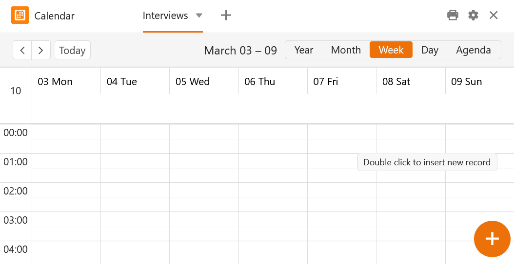
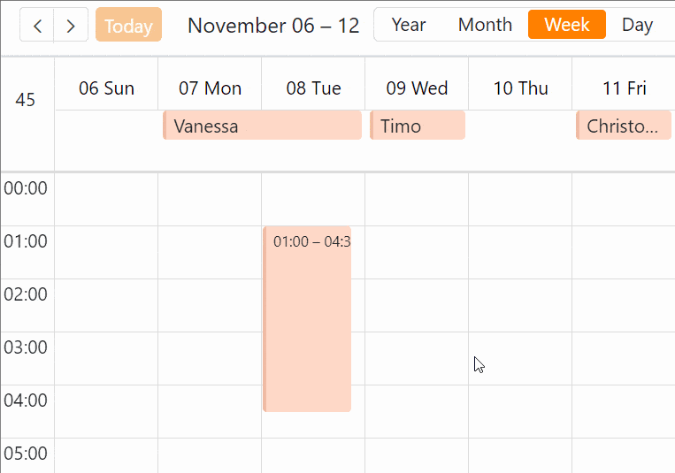

Dispone de varias opciones para añadir **nuevas entradas** al calendario. Puede hacerlo **en la tabla subyacente**, creando allí una nueva fila e introduciendo una cita en la [columna de fecha](), que se mostrará también en el complemento de calendario.

Pero también es muy fácil hacer nuevas entradas directamente **en el plugin de calendario**. La forma de introducir una cita depende de la visualización seleccionada**(año**, **mes**, **semana**, **día** o **agenda**).

## Crear nuevas entradas a través de los detalles de la fila

### Crear nuevas entradas mediante un campo de día

1. Abra el **complemento de calendario** y seleccione la opción de visualización del **mes** o **la semana**.
2. Sitúe el puntero del ratón sobre un **campo** del calendario y haga clic en el **símbolo más** que aparece en la esquina superior derecha.
3. Cree una nueva entrada en los **detalles de la línea** y confirme **cerrando** la ventana con .



### Crear nuevas entradas haciendo doble clic

Haga una selección en el resumen diario, semanal o mensual. **Haga doble clic en** a un lugar del calendario y el **Detalles de la línea** también se abrirá. De lo contrario, cree la entrada del mismo modo que se describe en las instrucciones anteriores.



### Crear nuevas entradas con el signo más grande

En el borde inferior derecho hay un **Símbolo más grande en un círculo naranja**. Si pulsa sobre él, aparecerá el **Detalles de la línea** también. De lo contrario, cree la entrada del mismo modo que se describe en las instrucciones anteriores.



## Extracción de citas en los resúmenes semanal y diario

Para esta función necesita **dos columnas de fecha** que puedan registrar **horas de reloj**.

1. Cree una columna de fecha para la **hora de inicio y** active la opción **Exacto al minuto**.
2. Cree una columna de fecha para la **hora final** y active la opción al **minuto**.
3. Abra el **complemento de calendario** y seleccione la **vista general semanal o diaria**.
4. Configure las dos columnas de fecha para el calendario en los **ajustes** (accesibles a través del símbolo de la rueda dentada ).
5. En el calendario, haga clic en la hora de inicio de la cita, mantenga pulsado el **botón del ratón** y arrastre el cuadro abierto hasta la hora de finalización de la cita.



## Mover citas mediante arrastrar y soltar

Puede **mover** cómodamente las citas creadas en el complemento de calendario **arrastrando y soltando**. Esto modifica automáticamente las entradas correspondientes en las columnas de fecha de su tabla. Esta función está disponible para los **resúmenes** **mensual**, **semanal** y **diario**.

