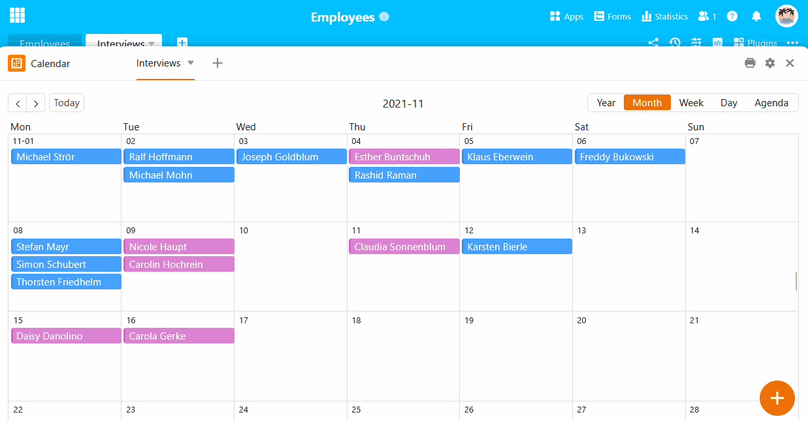
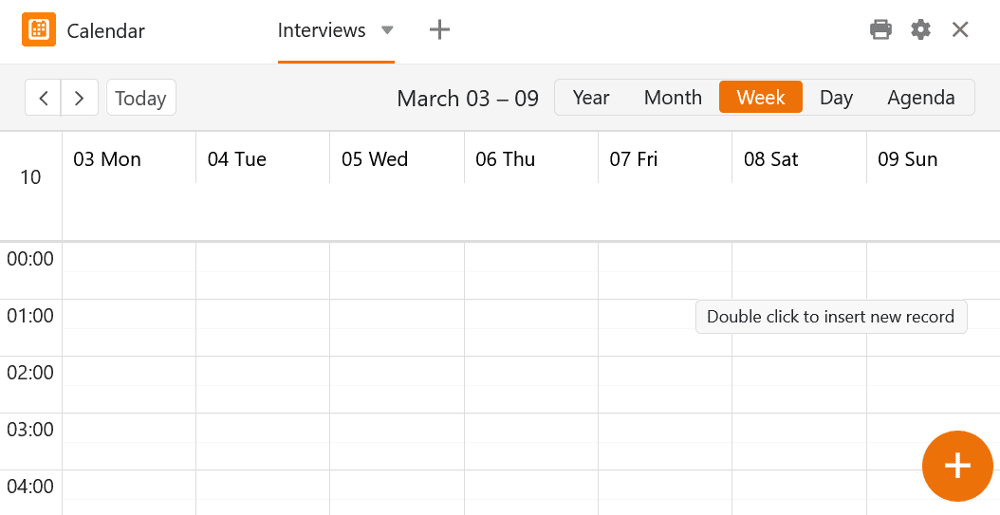
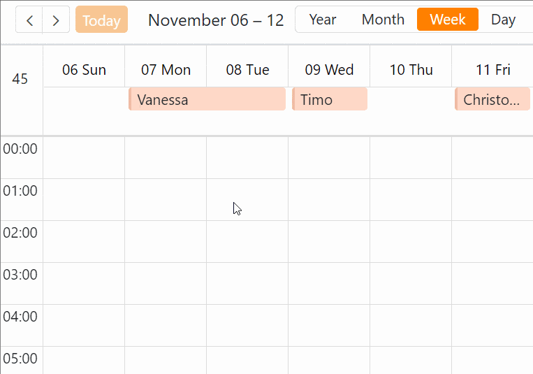
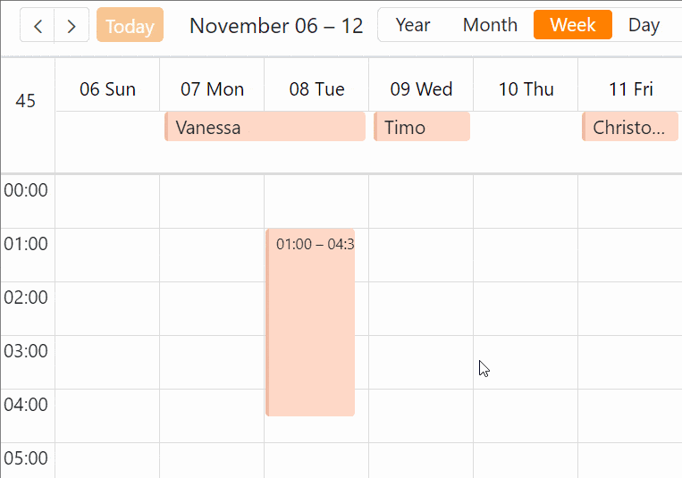

Pour ajouter **de nouvelles entrées** dans le calendrier, vous avez plusieurs possibilités. Vous pouvez le faire **dans le tableau sous-jacent** en y créant une nouvelle ligne et en inscrivant une date dans la [colonne des dates](), qui sera ensuite également affichée dans le plug-in de calendrier.

Mais il est également très facile d'effectuer de nouvelles entrées directement **dans le plug-in de calendrier**. La manière dont vous pouvez saisir un rendez-vous dépend de la présentation choisie**(année**, **mois**, **semaine**, **jour** ou **agenda**).

## Créer de nouvelles entrées via les détails de la ligne

### Créer de nouvelles entrées via un champ journalier

1. Ouvrez le **plugin de calendrier** et choisissez l'option d'affichage **Mois** ou **Semaine**.
2. Passez le curseur de la souris sur un **champ** du calendrier et cliquez sur le **symbole plus** qui apparaît dans le coin supérieur droit.
3. Créez une nouvelle entrée dans les **détails de la ligne** et confirmez en **fermant** la fenêtre avec .



### Créer de nouvelles entrées par double-clic

Faites une recherche dans l'aperçu quotidien, hebdomadaire ou mensuel. **Double clic** à un endroit du calendrier et la **Détails des lignes** s'ouvrent également. Sinon, créez l'entrée de la même manière que celle décrite dans les instructions ci-dessus.



### Créer de nouvelles entrées via le grand symbole plus

En bas à droite se trouve un **grand symbole plus dans un cercle orange**. Si vous cliquez dessus, les **Détails des lignes** également. Sinon, créez l'entrée de la même manière que celle décrite dans les instructions ci-dessus.



## Élever les rendez-vous dans l'aperçu hebdomadaire et journalier

Pour cette fonction, vous avez besoin de **deux colonnes de dates** qui peuvent saisir **des heures**.

1. Créez une colonne de date pour l'**heure de début** et activez l'option **à la minute près**.
2. Créez une colonne de date pour l'**heure de fin** et activez l'option **à la minute près**.
3. Ouvrez le **plug-in de calendrier** et sélectionnez l'**aperçu hebdomadaire ou quotidien**.
4. Définissez dans les **paramètres** (accessibles via l'icône en forme de roue dentée ) les deux colonnes de date pour le calendrier.
5. Dans le calendrier, cliquez sur l'heure à laquelle le rendez-vous doit commencer, maintenez le **bouton de la souris** enfoncé et faites glisser la boîte jusqu'à l'heure à laquelle le rendez-vous doit se terminer.



## Déplacer les rendez-vous par glisser-déposer

Vous pouvez facilement **déplacer** les dates créées dans le plug-in de calendrier **par glisser-déposer**. Cela modifie automatiquement les entrées correspondantes dans les colonnes de dates de votre tableau. Cette fonction est disponible pour l'**aperçu** **mensuel**, **hebdomadaire** et **journalier**.

