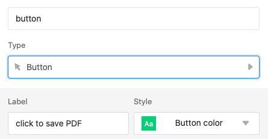
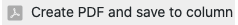
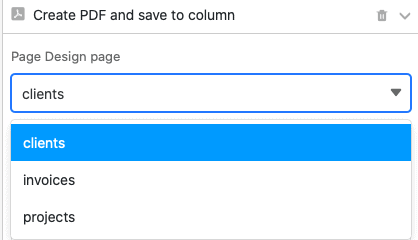
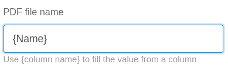
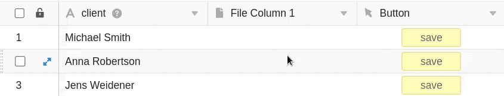
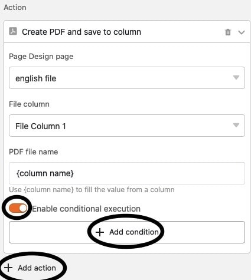

Con la ayuda de un **botón** puedes guardar documentos PDF en columnas de archivos. El requisito previo para ello es la configuración del **complemento de diseño de página** a través de las opciones básicas.

## Guardar documentos PDF mediante un botón en una columna

Los botones permiten guardar documentos PDF en las [columnas de archivo de]() las mesas. La acción está disponible al crear un botón en cuanto haya configurado el [complemento de diseño de página](https://seatable.io/es/?post_type=docs&p=19223) en la tabla correspondiente.

En el primer paso, nombra la **columna** y establece la **etiqueta** y el **color** del botón que quieres añadir a tus filas.

A continuación, configure la acción como **"Guardar archivo PDF en columna"**.

A continuación, seleccione una **página** del complemento de diseño de páginas para guardarla como archivo PDF. Puede elegir entre las páginas existentes o [añadir](https://seatable.io/es/?post_type=docs&p=19223) primero una nueva.



Seleccione ahora la **columna de archivos** en la que desea guardar la página como PDF.

Por último, **asigne un nombre a** los archivos PDF que se añadirán a la tabla. Utilice **{nombre de columna}**, es decir, el nombre de una columna entre llaves, para dar al fichero el nombre del valor de esa columna.

Tras pulsar el botón, el **archivo PDF** seleccionado se añade a la línea correspondiente.

## Ejecución condicional de las acciones de los botones

Tiene la opción de definir la acción **Guardar archivo PDF en** columna **varias veces** en un botón. Para cada acción individual, puede definir una **condición** específica que debe cumplirse para que se guarde un archivo PDF en la columna al hacer clic en el botón. Además, puede seleccionar una **página** diferente del complemento de diseño de páginas para guardarla como PDF en cada acción.

Con ayuda de esta función podrá, por ejemplo, guardar un documento en diferentes idiomas con un solo botón. Cree varias acciones, para cada una de las cuales seleccione una plantilla en distintos **idiomas**, y defina la condición de que, en función del idioma del cliente, se guarde la **plantilla adecuada** como PDF en la columna.

Esta sería la acción para adjuntar un documento alemán:

Y esta la acción para adjuntar un documento en inglés:

