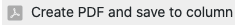
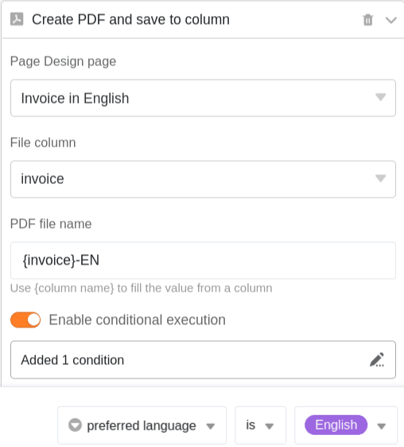

Un **bouton** permet d'enregistrer des documents PDF dans des colonnes de fichiers. Pour cela, il est nécessaire de configurer le **plug-in de conception de page** via les options de base.

## Enregistrer les documents PDF par un bouton dans une colonne

Les boutons vous permettent d'enregistrer des documents PDF dans [les colonnes de fichiers]() de vos tableaux. Cette action est disponible lors de la création d'un bouton, dès que vous avez configuré le [plugin de conception de page]() dans le tableau correspondant.

La première étape consiste à nommer la **colonne** et à définir le **libellé** et **la couleur** du bouton que vous souhaitez ajouter à vos lignes.

Vous définissez ensuite **l'** action **"Enregistrer le fichier PDF dans la colonne"**.

Ensuite, vous choisissez une **page** dans le plug-in de conception de page qui doit être enregistrée en tant que fichier PDF. Vous pouvez choisir parmi les pages existantes ou en [ajouter]() une nouvelle.



Sélectionnez maintenant la **colonne de fichiers** dans laquelle la page doit être enregistrée au format PDF.

Enfin, **donnez un nom** aux fichiers PDF qui seront ajoutés à votre tableau. Utilisez **{column name}**, c'est-à-dire le nom d'une colonne entre parenthèses, pour nommer le fichier d'après la valeur de cette colonne.

Après avoir cliqué sur le bouton, le **fichier PDF** sélectionné est ajouté à la ligne correspondante.

## Exécution conditionnelle des actions des boutons

Vous avez la possibilité de définir **plusieurs fois** l'action **Enregistrer le fichier PDF dans la colonne** dans un bouton. Pour chaque action, vous pouvez définir une **condition** particulière qui doit être remplie pour qu'un fichier PDF soit enregistré dans la colonne lorsque vous cliquez sur le bouton. En outre, pour chaque action, vous pouvez sélectionner une autre **page** du plug-in de conception de page pour l'enregistrer au format PDF.

Cette fonction vous permet par exemple d'enregistrer un document dans différentes langues à l'aide d'un seul bouton. Créez plusieurs actions pour chacune desquelles vous sélectionnez un modèle dans différentes **langues** et définissez la condition selon laquelle, en fonction de la langue du client, le **modèle approprié** doit être enregistré en tant que PDF dans la colonne.

Ce serait l'action de créer un document allemand :

Et voici l'action de créer un document en anglais :

