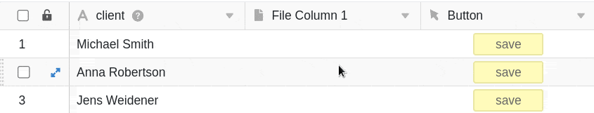

Com a ajuda de um **botão**, pode guardar documentos PDF em colunas de ficheiro. O pré-requisito para tal é a configuração do **plug-in de design da página** através das opções de base.

## Guardar documentos PDF através de um botão numa coluna

Os botões permitem-lhe guardar documentos PDF nas [colunas de arquivo das]() suas tabelas. A acção está disponível quando se cria um botão, logo que se tenha configurado o [plug-in de desenho de página](https://seatable.io/pt/?post_type=docs&p=19223) na tabela correspondente.

No primeiro passo, nomeia a **coluna** e define o **rótulo** e a **cor do** botão que deseja adicionar às suas linhas.

Em seguida, defina a ação para **"Guardar ficheiro PDF na coluna"**.

Depois seleccionar uma **página** do plug-in de concepção de página para ser guardada como um ficheiro PDF. Pode escolher a partir de páginas existentes ou [adicionar](https://seatable.io/pt/?post_type=docs&p=19223) uma nova página primeiro.



Agora seleccione a **coluna de ficheiro** em que a página deve ser guardada como PDF.

Finalmente, **nomeie** os ficheiros PDF que serão adicionados à sua mesa. Utilizar **{nome da coluna}**, ou seja, o nome de uma coluna entre parênteses rectos, para dar ao ficheiro o nome do valor dessa coluna.

Depois de clicar no botão, o **ficheiro PDF** seleccionado é adicionado à linha correspondente.

## Execução condicional de acções de botão

Tem a opção de definir a acção **Guardar ficheiro PDF na coluna** **várias vezes** num botão. Para cada acção individual, pode definir uma **condição** específica que deve ser cumprida para que um ficheiro PDF seja guardado na coluna quando o botão é clicado. Além disso, pode seleccionar uma **página** diferente do plug-in de design de página para guardar como PDF para cada acção.

Esta função permite-lhe, por exemplo, guardar um documento em diferentes línguas com um único botão. Crie várias acções, para cada uma das quais seleccione um modelo em diferentes **línguas**, e defina a condição de que, dependendo da língua do cliente, o **modelo adequado** seja guardado como PDF na coluna.

Esta seria a acção para anexar um documento alemão:

E esta é a acção para anexar um documento inglês:

